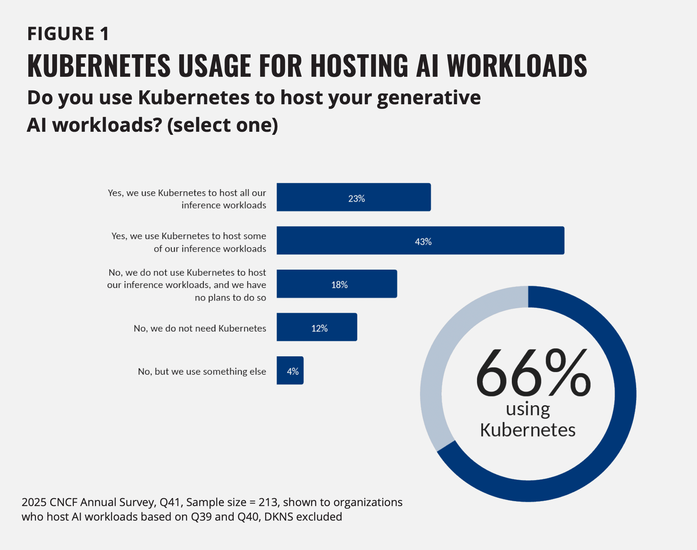
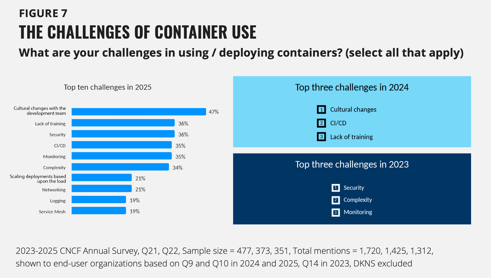
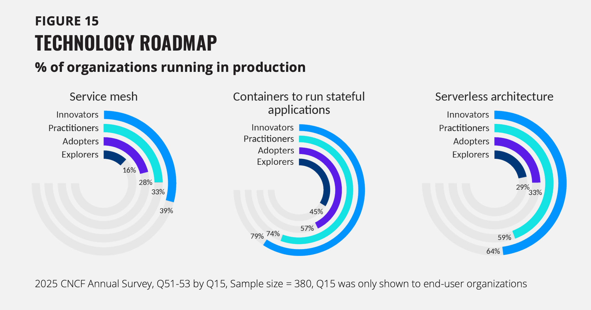
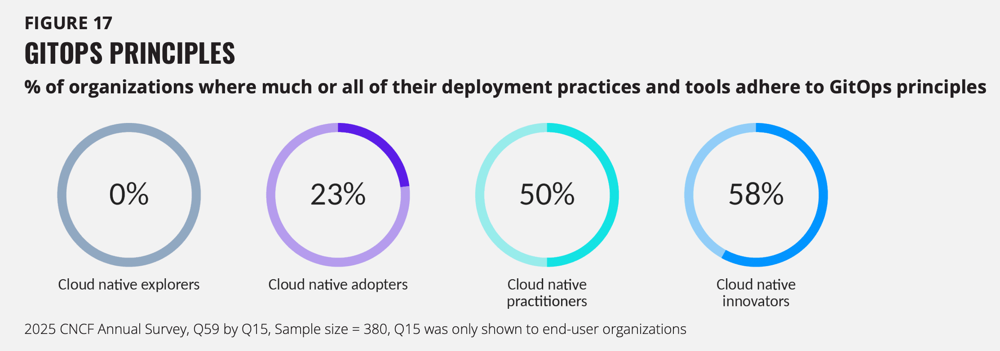

The [2025 CNCF Annual Survey](https://www.cncf.io/reports/the-cncf-annual-cloud-native-survey/) results have arrived, and they show an industry dealing with a major shift. While Kubernetes adoption has reached a massive 82% in production, the focus has changed. We’re no longer just talking about "moving to the cloud"—the real challenge now is managing the complexity of AI and the strain it puts on shared infrastructure.

At [OpenEverest](https://openeverest.io), we focus on simplifying data management on Kubernetes and everywhere. The data in this report confirms that our goal is exactly where the industry needs to go.

Here are the five biggest takeaways from the report and how we’re thinking about them at OpenEverest.

### 1. Kubernetes is the "Operating System" for AI

The survey shows that 66% of organizations are now running generative AI workloads on Kubernetes. However, there’s a big difference between testing AI and actually using it: only 7% of organizations are deploying AI models daily.

Success in AI isn't just about the model itself; it’s about the underlying data layer. To move from experimentation to daily production, teams need the kind of automated, private DBaaS that we’ve built OpenEverest to provide.

---

### 2. Culture, Not Code, is the Biggest Blocker

For the first time, "Cultural changes within the development team" (47%) has overtaken technical complexity as the top challenge for deploying containers.

This is why we built OpenEverest as an abstraction layer. Developers shouldn't have to be experts in every single Kubernetes Operator. By offering a unified interface for provisioning databases, we help teams avoid "YAML fatigue" and reduce the friction that usually slows down cloud-native adoption.

---

### 3. Stateful is Now Standard

The report shows a steady rise in using containers for stateful applications, with 79% of "Innovators" running them in production. The idea that containers are only for stateless apps is finally over.

Managing stateful workloads is often the last hurdle for teams trying to move away from expensive managed cloud services. At OpenEverest, we focus on the "Data on Kubernetes" space to make running a database as resilient and simple as running a web server—including the point-in-time recovery and scaling that production workloads require.

---

### 4. Avoiding Vendor Lock-In is No Longer Optional

The report warns that as AI usage grows, infrastructure costs are climbing and proprietary platforms are becoming more restrictive. In response, the data shows that "innovators" are moving toward standardized automation.

We believe that keeping control of your own infrastructure is essential. OpenEverest is designed as an open-source platform for automated database management. We want to provide the ease of use you expect from a managed service, but with the transparency and control of a vendor-neutral project.

---

### 5. GitOps Defines Maturity

The data shows a clear divide: 0% of "Explorers" use GitOps, while 58% of "Innovators" do. It has become the clearest sign of whether an organization is truly cloud native.

Maturing in the cloud means treating infrastructure as code. OpenEverest fits into this by providing a management layer that plugs directly into modern CI/CD and GitOps workflows. This allows for the frequent, daily code check-ins that the report identifies as a key indicator of success.

---

### Get Involved with OpenEverest

The CNCF survey makes it clear: the future is cloud-native, but the main hurdle is complexity. We’re building tools to solve that, and we’d love for you to join us.

* **Try the Self-Hosted RDS Replacement:** Take control of your databases without the cloud lock-in. Check out the code and installation guides on [GitHub](https://github.com/openeverest/openeverest).
* **Get Involved:** Whether it’s code, documentation, or just a "hello," we value your input. Jump into the conversation on [Slack](https://cloud-native.slack.com/archives/C09RRGZL2UX) or check out our [community section](https://openeverest.io/#community).
* **Are you an early adopter?** If you’re already running OpenEverest (formerly Percona Everest), let the world know! Make your first contribution by adding yourself to the [ADOPTERS.md list](https://github.com/openeverest/openeverest/blob/main/ADOPTERS.md).
