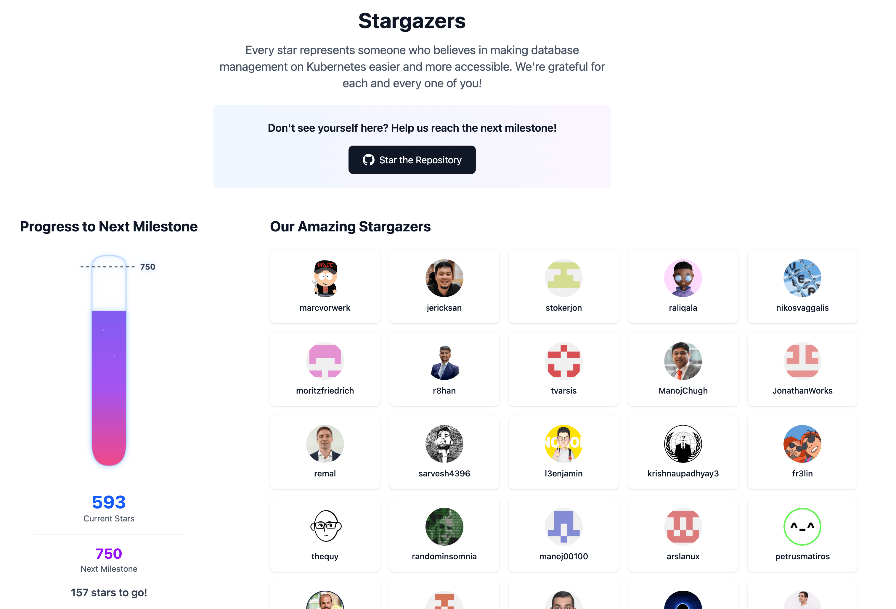

Just last week, OpenEverest reached a significant milestone: **500 stars on GitHub.**

While we aren't chasing the viral 100,000-star-in-a-week trajectory of projects like [OpenClaw (MoltBot)](https://openclaw.ai/), this achievement is a powerful signal for our mission. We understand that stars aren't the only indicator of community health, but they are the most visible pulse check of our growing ecosystem.

### Meet the Stargazers
To celebrate this milestone, we’ve introduced a new **[Stargazers Page](https://openeverest.io/stargazers/)**. 

*A screenshot from [openeverest.io/stargazers](https://openeverest.io/stargazers)*

It’s our way of saying thank you. The page features the GitHub handlers and avatars of the people supporting our journey, along with a "geeky" milestone flask to track our progress. 

**The current status:** We’ve already surged past the 500 mark and are currently sitting at 593 stars! The flask is bubbling toward our next goal of 750.

> *"Every star represents someone who believes in making database management on Kubernetes easier and more accessible. We're grateful for each and every one of you!"*

### Join the Climb
Don't see yourself on the wall yet? Help us reach the next milestone! Every bit of support helps us move closer to our mission: *Simplifying database management. Everywhere.*

**Check out the repo and the new page:**
* **GitHub:** [github.com/openeverest/openeverest](https://github.com/openeverest/openeverest)
* **Stargazers:** [openeverest.io/stargazers/](https://openeverest.io/stargazers/)

Onward to 750! 🏔️