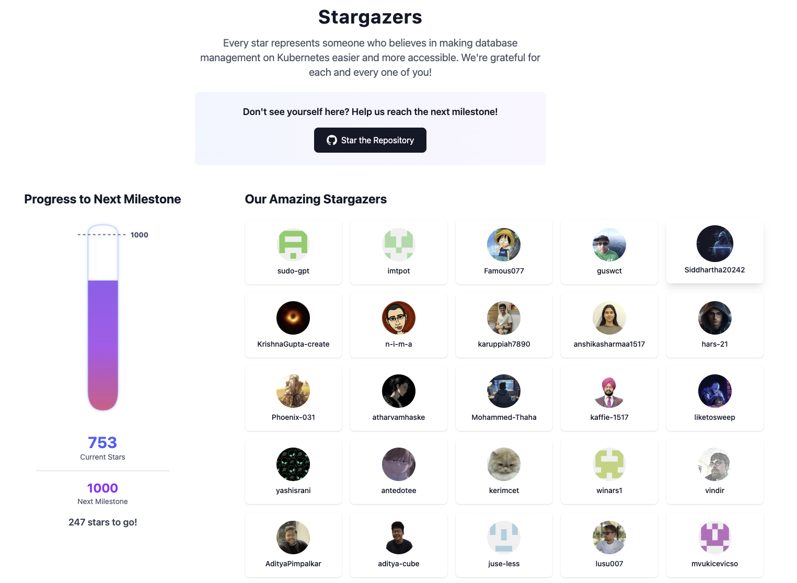
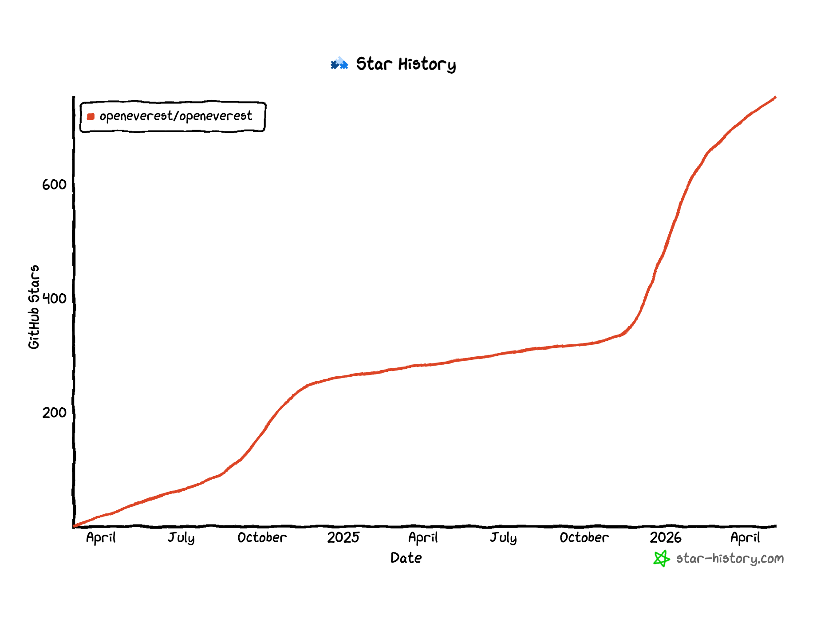

Just last week, OpenEverest reached a significant milestone: **750 stars on GitHub.**

[Three months ago we were celebrating hitting the first milestone: 500 stars](https://openeverest.io/blog/500-stars-milestone/). Today, we are seeing constant and stable growth that allows us to reach the next one: 750 stars! Recently, OpenEverest became a CNCF Sandbox project, so we can expect even more community traction and interest in the future.  As the stars can be interpreted as pulse checks of the growing project ecosystem, we are seeing that we are on the right track. 

### Meet the Stargazers
We are grateful for all the people who gave a star to the project! You can meet them at the **[Stargazers Page](https://openeverest.io/stargazers/)**. 

*A screenshot from [openeverest.io/stargazers](https://openeverest.io/stargazers)*

The page features the GitHub handlers and avatars of the people supporting our journey, along with a “geeky” milestone flask to track our progress.

**The current status:** We’ve already surged past the 750 and we’re heading to reach our first 1000!

> *"Every star represents someone who believes in making database management on Kubernetes easier and more accessible. We're grateful for each and every one of you!"*

### Do you want to help?
Don't see yourself on the wall yet? Help us reach the next milestone! Every bit of support helps us move closer to our mission: *Simplifying database management. Everywhere.*

**Check out the repo, LFX mentorship program and the stargazers page, or join our Community Slack:**
* [GitHub](https://github.com/openeverest/openeverest)
* [LFX mentorship program](https://mentorship.lfx.linuxfoundation.org/project/42dff370-4958-4ec4-959c-4aaf6740698c)
* [Stargazers](https://openeverest.io/stargazers/)
* [Community Slack] [openeverest.io/stargazers/](https://cloud-native.slack.com/archives/C09RRGZL2UX)
Let's hit 1000 now! 🏔️