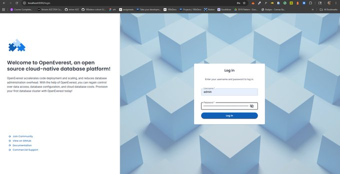
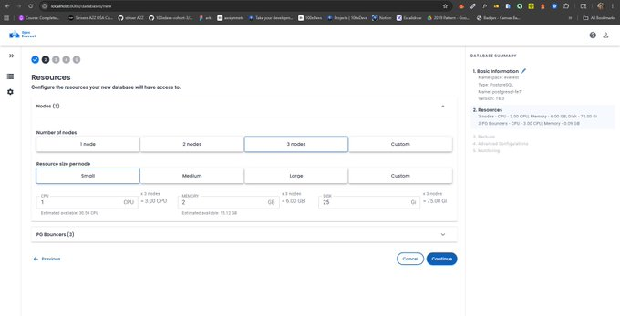
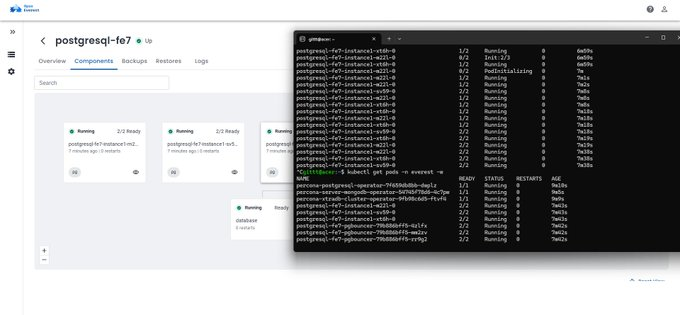
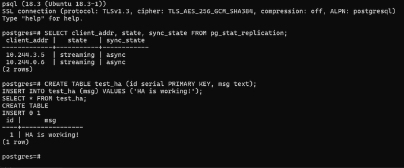
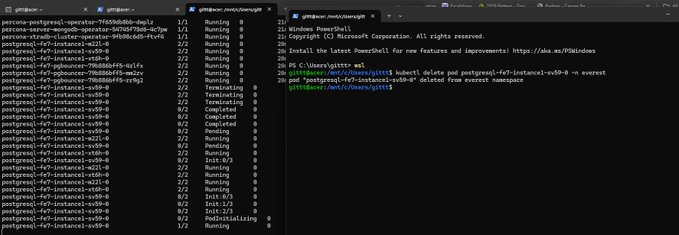
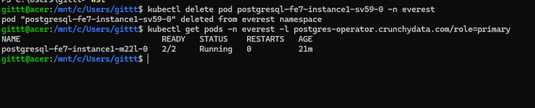
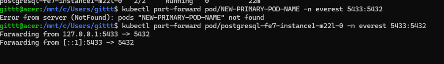
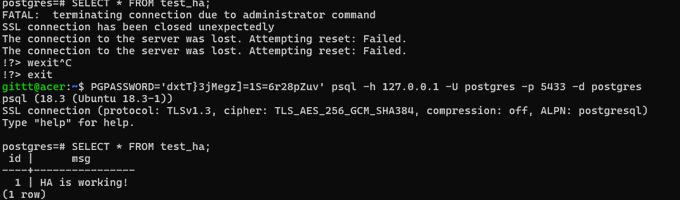
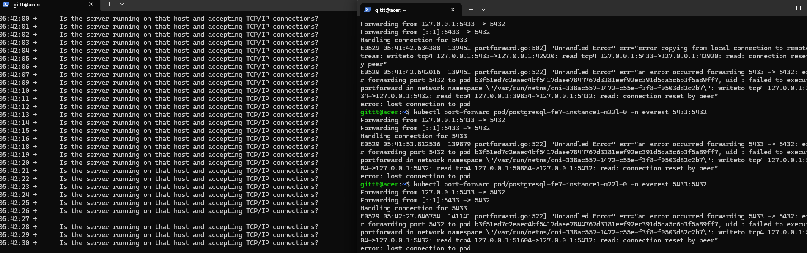

Here's the full story: from zero to a running 3-node HA Postgres cluster with automatic failover, all on a local Kubernetes setup on Linux.

---

## What is High Availability PostgreSQL?

Before jumping in HA in plain terms:

A **normal Postgres setup** is one server. It goes down, your app goes down.

An **HA setup** runs multiple nodes: a **primary** (handles reads + writes) and **replicas** (copies). If the primary dies, a replica automatically promotes itself. Your app recovers in seconds.

OpenEverest handles all the orchestration: replication, health checks, failover. You just describe what you want.

---

## Prerequisites

Here's what I installed:

```bash
# Docker
sudo apt update
sudo apt install -y docker.io
sudo service docker start
sudo usermod -aG docker $USER
# close and reopen terminal after this

# kind (Kubernetes IN Docker)
curl -Lo ./kind https://kind.sigs.k8s.io/dl/v0.23.0/kind-linux-amd64
chmod +x ./kind
sudo mv ./kind /usr/local/bin/kind

# kubectl
curl -LO "https://dl.k8s.io/release/$(curl -s https://dl.k8s.io/release/stable.txt)/bin/linux/amd64/kubectl"
chmod +x kubectl
sudo mv kubectl /usr/local/bin/

# Helm
curl https://raw.githubusercontent.com/helm/helm/main/scripts/get-helm-3 | bash

# psql client
sudo apt install -y postgresql-client

# OpenEverest CLI
curl -sSL -o everestctl-linux-amd64 https://github.com/openeverest/openeverest/releases/latest/download/everestctl-linux-amd64
sudo install -m 555 everestctl-linux-amd64 /usr/local/bin/everestctl
rm everestctl-linux-amd64
```

---

## Step 1: Deploy Spin Up the Kubernetes Cluster

I used `kind` (Kubernetes IN Docker) with 3 worker nodes so each Postgres pod gets its own node:

```bash
cat > ~/kind-config.yaml << 'EOF'
kind: Cluster
apiVersion: kind.x-k8s.io/v1alpha4
nodes:
  - role: control-plane
  - role: worker
  - role: worker
  - role: worker
EOF

kind create cluster --name pg-demo --config ~/kind-config.yaml
```

Remove the control-plane taint so pods can schedule freely:

```bash
kubectl taint nodes pg-demo-control-plane node-role.kubernetes.io/control-plane:NoSchedule-
```

Verify all 4 nodes are Ready:

```bash
kubectl get nodes
```

```
NAME                    STATUS   ROLES           AGE   VERSION
pg-demo-control-plane   Ready    control-plane   2m    v1.34.0
pg-demo-worker          Ready    <none>          90s   v1.34.0
pg-demo-worker2         Ready    <none>          90s   v1.34.0
pg-demo-worker3         Ready    <none>          90s   v1.34.0
```

Now install OpenEverest with just the PostgreSQL operator:

```bash
everestctl install \
  --namespaces everest \
  --operator.postgresql=true \
  --operator.mongodb=false \
  --operator.mysql=false \
  --skip-wizard
```

Wait for all green checkmarks. Then verify:

```bash
kubectl get pods -n everest-system
```

```
NAME                                READY   STATUS    RESTARTS   AGE
everest-operator-5b59d5b889-vm7dp   1/1     Running   0          3m
everest-server-bf4979c6d-md4bb      1/1     Running   0          3m
```

---

## Step 2: Configure Create the PostgreSQL Cluster

Port-forward the OpenEverest UI:

```bash
kubectl port-forward svc/everest -n everest-system 8080:8080
```

Open `http://localhost:8080` in your browser. Get the admin password:

```bash
kubectl get secret everest-accounts -n everest-system \
  -o jsonpath='{.data.users\.yaml}' | base64 --decode
```



Log in and click **Add Database**. Here's exactly what I configured:

- **Type:** PostgreSQL
- **Version:** 17.7
- **Name:** `postgresql-ha`
- **Namespace:** everest
- **Nodes:** 3 nodes
- **Resource size:** Small (1 CPU, 2GB RAM per node)
- **Storage:** 25Gi per node
- **Backups:** Disabled (for this demo)
- **Monitoring:** Disabled


Why 3 nodes? With 3 nodes, even if 1 dies during failover you still have 2 running: the cluster stays healthy. 2 nodes is the bare minimum; 3 is proper HA.

Hit **Create database** and watch it provision. Confirm in terminal:


```bash
kubectl get pods -n everest -w
```


Wait until all 3 instances show `2/2 Running`:

```
postgresql-ha-instance1-m22l-0   2/2   Running   0   3m
postgresql-ha-instance1-sv59-0   2/2   Running   0   3m
postgresql-ha-instance1-xt6h-0   2/2   Running   0   3m
```



---

## Step 3: Verify HA — Connect to the Database

First find the primary pod:

```bash
kubectl get pods -n everest \
  -l postgres-operator.crunchydata.com/role=primary
```

Port-forward directly to the primary:

```bash
kubectl port-forward pod/postgresql-fe7-instance1-sv59-0 -n everest 5433:5432
```

Get the credentials:

```bash
kubectl get secret everest-secrets-postgresql-fe7 -n everest \
  -o go-template='{{range $k,$v := .data}}{{$k}}={{$v | base64decode}}{{"\n"}}{{end}}'
```

Connect:

```bash
PGPASSWORD='your-password' psql -h 127.0.0.1 -U postgres -p 5433 -d postgres
```

Check that replication is live:

```sql
SELECT client_addr, state, sync_state FROM pg_stat_replication;
```

Both replicas are streaming. Every write to the primary is being continuously replicated to 2 other nodes in real time. **That's HA working.**

Now insert some test data:

```sql
CREATE TABLE test_ha (id serial PRIMARY KEY, msg text);
INSERT INTO test_ha (msg) VALUES ('HA is working!');
SELECT * FROM test_ha;
```



The cluster is healthy. Time to break it.

---

## Step 4: Chaos — Kill the Primary

Open two terminals side by side.

**Terminal 1** — watch pods live:

```bash
kubectl get pods -n everest -w
```

**Terminal 2** — delete the primary pod:

```bash
kubectl delete pod postgresql-fe7-instance1-sv59-0 -n everest
```

Watch Terminal 1. The primary goes through:
`Terminating` → `Completed` → `Pending` → `Init:0/3` → `Init:1/3` → `Init:2/3` → `PodInitializing` → `Running`

While this happens, the other two pods stay `Running` and one gets promoted automatically.



After a short while, check who the new primary is:

```bash
kubectl get pods -n everest \
  -l postgres-operator.crunchydata.com/role=primary
```

**Different pod.** `m22l` is now the primary — OpenEverest automatically elected a new leader.



Reconnect to the new primary and check the data:

```bash
kubectl port-forward pod/postgresql-fe7-instance1-m22l-0 -n everest 5433:5432
```


```bash
PGPASSWORD='your-password' psql -h 127.0.0.1 -U postgres -p 5433 -d postgres
```

```sql
SELECT * FROM test_ha;
```

**Data intact. Nothing lost.**

The psql session showed the exact moment of failover — `FATAL: terminating connection due to administrator command` — then came right back on the new primary with all data preserved.



---

## What Does the App Actually See?

I ran a continuous query loop hitting the database every second while the primary was killed — simulating a real app under load.

The result is exactly what you'd expect: the moment the primary pod is deleted, active connections drop. The app sees connection errors during the election window.



**Yes, the app loses the connection briefly.** The length of that window depends on your cluster setup. On a managed cloud cluster (EKS/GKE/AKS) with tuned health check intervals, this is significantly faster than a local kind setup.

The good news: OpenEverest ships **PgBouncer out of the box** as a connection pooler — you can see the pgbouncer pods running alongside the pg instances. Apps connecting through PgBouncer instead of directly to the pod get transparent reconnection — the pooler retries automatically. No code change needed on the app side.

---

## What Just Happened?

When I deleted the primary pod:

1. OpenEverest detected the primary was gone
2. It ran a leader election among the remaining replicas
3. `m22l` was promoted to primary
4. The old pod (`sv59`) came back as a replica
5. Everything reconnected automatically

No manual intervention. No data loss.

---

## Key Settings I Used

| Setting | Value | Why |
|---|---|---|
| PostgreSQL version | 17.7 | Latest stable |
| Nodes | 3 | Minimum for proper HA |
| Resource size | Small (1 CPU, 2GB) | Sufficient for local demo |
| Storage | 25Gi per node | Comfortable for testing |
| Replication | Async streaming | Default, works out of the box |

---

## For Production

A few things I'd add before using this in production:

- **Enable backups** : OpenEverest supports S3-compatible storage for WAL archiving
- **Enable monitoring** : Prometheus metrics are built in, wire them to Grafana
- **Increase resources** : bump CPU and memory based on actual query load
- **Use a cloud cluster** : EKS/GKE/AKS instead of kind for persistent, production-grade nodes
- **Connect through PgBouncer** : always use the pgbouncer service in production, not direct pod connection

---

## Conclusion

PostgreSQL HA has a reputation for being complex to set up custom replication configs, manual failover scripts, connection pooling wired up separately. OpenEverest collapses all of that into a single operator and a UI form.

The chaos test speaks for itself primary deleted, new leader elected, data intact, reconnection. No scripts. No manual intervention. Just the operator doing its job.

For anyone running stateful workloads on Kubernetes, this is worth evaluating seriously. The operational complexity that usually comes with HA Postgres doesn't have to be your problem anymore.

## Join the Community

If you ran into something different, found a better config, or just want to talk databases on Kubernetes:

- **Slack**: find us in `#openeverest-users` on the [CNCF Slack](https://cloud-native.slack.com/archives/C09RRGZL2UX). 
  Active community, maintainers respond fast.
- **GitHub**: [openeverest/openeverest](https://github.com/openeverest) 
  if you want to dig into the code or report issues.
- **Good First Issues** if you want to contribute, 
  [the project board](https://github.com/orgs/openeverest/projects/2) has well-labeled starting points.

Worth following if you're running databases on Kubernetes.