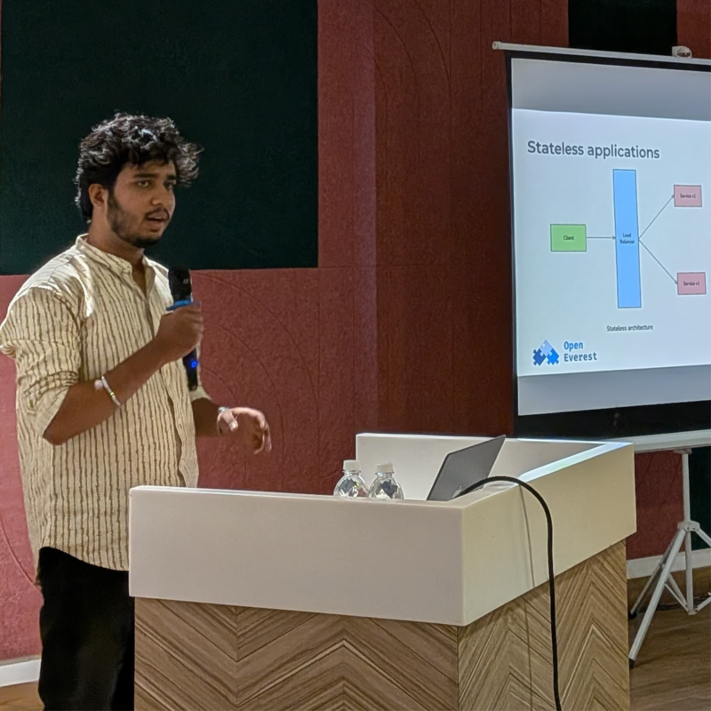

Some contributors show up with production scars. Atharva Mhaske showed up with questions — the kind that don't leave you alone until you go read the code.

He's a pre-final year engineering student at Pune University, working primarily in Go, and a Google Summer of Code 2026 contributor at Open Science Labs.

### The rabbit hole started with Go

"I picked Go as my main language about a year ago and just stuck with it," Atharva says. "The more backend stuff I built, the more I kept running into the same wall: my services were fine, but the moment a database was involved, I had no real idea what was happening underneath."

So he went looking. *Build Your Own Database From Scratch in Go* became regular evening reading, followed by engineering blogs from teams running databases at scale, and a lot of time in threads arguing about WAL designs and replication. Disaggregated databases and key-value storage systems became the specific itch — not because they're trendy, but because they force you to think about storage and compute as two different problems.

### How he found OpenEverest

Atharva applied for LFX Mentorship Term 1, 2026 at a different CNCF project and didn't get in. Rather than wait for the next cycle, he went looking for projects where the work itself was interesting enough to contribute to regardless of whether a mentorship slot came with it. OpenEverest turned out to be a better fit than the original plan.

"What pulled me in was that it doesn't treat database operations as separate problems for each database. It tries to build consistency across the whole space," he says. "That matched everything I'd been reading about, except here I could actually go read the code and open a PR against it."

### From reading issues to giving talks

He started the way most people do: reading issues he didn't fully understand, asking questions in Slack, slowly figuring out where the hard problems lived. Pull requests came next, then regular attendance at community meetings.

Earlier this year, Atharva spoke about OpenEverest at a [CNCF Pune meetup](https://ocgroups.dev/cncf/group/p5hsakp/event/pwn6dht), and last month he gave a talk diving into the OpenEverest v2 spec. "Walking through the specification details forced me to actually understand the architectural decisions, the reconciliation patterns, the failure modes." A few weeks later, he was on booth duty at [KubeCon + CloudNativeCon India 2026](https://openeverest.io/events/kubecon-india-2026/). "Reading a GitHub issue is one kind of understanding. Standing at a booth while a platform engineer asks a pointed question about reconciliation behavior, with no time to go look it up, is another kind entirely."

In parallel, his GSoC project — building a Docker Swarm plugin in Go with HashiCorp Vault and OpenBao integrations — keeps rhyming with the work here: how do you manage state safely, how do you make infrastructure declarative, how do you make sure things recover correctly when they fail.

---

Welcome to the OpenEverest community, Atharva. Connect with him on [GitHub](https://github.com/atharvamhaske), [LinkedIn](https://www.linkedin.com/in/atharvaxdevs/), or [X](https://x.com/atharvaxdevs).

To get involved with OpenEverest yourself:

  <a href="https://cloud-native.slack.com/archives/C09RRGZL2UX" target="_blank" rel="noopener noreferrer" style="display:inline-flex;align-items:center;gap:8px;background-color:#4A154B;color:#fff;text-decoration:none;padding:10px 20px;border-radius:6px;font-weight:600;font-size:15px;">
    <svg xmlns="http://www.w3.org/2000/svg" width="20" height="20" viewBox="0 0 122.8 122.8"><path d="M25.8 77.6c0 7.1-5.8 12.9-12.9 12.9S0 84.7 0 77.6s5.8-12.9 12.9-12.9h12.9v12.9zm6.5 0c0-7.1 5.8-12.9 12.9-12.9s12.9 5.8 12.9 12.9v32.3c0 7.1-5.8 12.9-12.9 12.9s-12.9-5.8-12.9-12.9V77.6z" fill="#e01e5a"/><path d="M45.2 25.8c-7.1 0-12.9-5.8-12.9-12.9S38.1 0 45.2 0s12.9 5.8 12.9 12.9v12.9H45.2zm0 6.5c7.1 0 12.9 5.8 12.9 12.9s-5.8 12.9-12.9 12.9H12.9C5.8 58.1 0 52.3 0 45.2s5.8-12.9 12.9-12.9h32.3z" fill="#36c5f0"/><path d="M97 45.2c0-7.1 5.8-12.9 12.9-12.9s12.9 5.8 12.9 12.9-5.8 12.9-12.9 12.9H97V45.2zm-6.5 0c0 7.1-5.8 12.9-12.9 12.9s-12.9-5.8-12.9-12.9V12.9C64.7 5.8 70.5 0 77.6 0s12.9 5.8 12.9 12.9v32.3z" fill="#2eb67d"/><path d="M77.6 97c7.1 0 12.9 5.8 12.9 12.9s-5.8 12.9-12.9 12.9-12.9-5.8-12.9-12.9V97h12.9zm0-6.5c-7.1 0-12.9-5.8-12.9-12.9s5.8-12.9 12.9-12.9h32.3c7.1 0 12.9 5.8 12.9 12.9s-5.8 12.9-12.9 12.9H77.6z" fill="#ecb22e"/></svg>
    Join Slack
  </a>
  <a href="https://github.com/openeverest/openeverest" target="_blank" rel="noopener noreferrer" style="display:inline-flex;align-items:center;gap:8px;background-color:#24292f;color:#fff;text-decoration:none;padding:10px 20px;border-radius:6px;font-weight:600;font-size:15px;">
    <svg xmlns="http://www.w3.org/2000/svg" width="20" height="20" viewBox="0 0 16 16" fill="#fff"><path d="M8 .25a7.75 7.75 0 1 0 0 15.5A7.75 7.75 0 0 0 8 .25zm0 1.5a6.25 6.25 0 0 1 1.97 12.18c-.31.06-.42-.13-.42-.3v-1.05c0-.36-.01-1.02-.49-1.4 1.62-.18 2.5-.88 2.5-2.57 0-.57-.2-1.1-.53-1.49.05-.14.23-.7-.05-1.47 0 0-.44-.14-1.44.54a5.02 5.02 0 0 0-2.62 0C5.93 6.6 5.49 6.74 5.49 6.74c-.28.77-.1 1.33-.05 1.47-.33.39-.53.92-.53 1.49 0 1.69.88 2.39 2.5 2.57-.31.27-.43.67-.47 1.04-.42.19-1.5.52-2.16-.62 0 0-.39-.71-1.13-.76 0 0-.72-.01-.05.45 0 0 .48.23.82 1.08 0 0 .43 1.32 2.49.87v.75c0 .17-.11.36-.42.3A6.25 6.25 0 0 1 8 1.75z"/></svg>
    Star the Repo
  </a>

