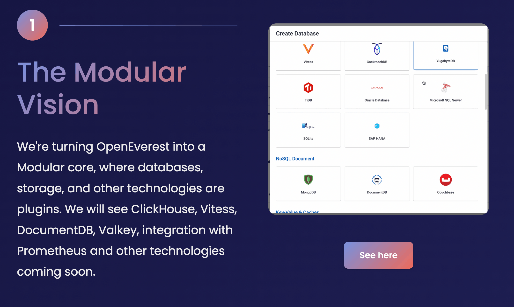

When we started building what was then Percona Everest, our mission was straightforward: simplify database management everywhere. We wanted to bridge the gap between cloud native tooling and deep database expertise, giving you a production-ready solution out of the box.

But here's the thing: as a project born inside a company, we made some early choices for speed and compatibility with existing Percona products. The Percona Operators for MySQL, PostgreSQL, and MongoDB are excellent, but our architecture became tightly coupled to them.

### The Challenge: The "Weeks vs. Days" Problem

We asked ourselves: *What if a community member wants to add a new technology, like Valkey?*

The answer was not good enough. Under the old architecture, adding a single new database technology could take weeks or even months. A developer would have to:

1.  Modify the Everest Operator core logic.
2.  Manually ensure builds landed in the Operator Lifecycle Manager (OLM).
3.  Hardcode new UI fields into the React-based frontend.
4.  Force integration with specific monitoring tools like PMM.

This high barrier to entry wasn't just a technical hurdle; it was a threat to our core value of being Community First. We realized that to truly eliminate vendor lock-in and foster a neutral ecosystem, we had to move beyond just [changing our name to OpenEverest](https://solanica.io/tpost/solanica-future-of-openeverest).

### Introducing the Modular Core

We are excited to share our draft specification for a [Modular Core and Plugin Architecture](https://github.com/openeverest/specs/blob/plugin-init-spec/specs/001-plugins-architecture.md). This is the foundation that will allow us to transition from a fixed set of supported databases to a truly extensible platform where new technologies can be integrated in days, not months.

*A screenshot from [vision.openeverest.io](https://vision.openeverest.io)*

#### 1. The "Provider" Abstraction
We are introducing a new cluster-scoped Custom Resource Definition (CRD) called a `Provider`. Think of this as the "blueprint" for a database technology. It describes:
* **Components:** What makes up the DB (e.g., the engine, proxy, backup agent).
* **Topologies:** Supported configurations (e.g., standard vs. sharded).
* **Versions:** Available images and versions for each component.

#### 2. The Provider Go SDK
To make building these plugins easier, we are developing a Provider Go SDK. This toolkit provides the scaffolding and "guard rails" for developers. Instead of writing complex Kubernetes reconciliation logic from scratch, developers can use our SDK to:
* Define reconciliation steps.
* Register validation webhooks.
* Expose OpenAPI schemas that the OpenEverest UI can understand.

#### 3. Dynamic UI Form Generation
One of the biggest pain points was the frontend. Our new UI Form Generator allows a plugin to define its interface via a YAML manifest.
* **`uiType`**: Simply tell the UI to display a "Toggle," "Number," or "Group."
* **Advanced Validation**: Use CEL (Common Expression Language) for complex logic, such as ensuring `Limits.CPU` is always greater than `Requests.CPU` and so on.

### Unlocking the Roadmap: Choice and Variety

A modular core means we can finally deliver on the massive variety of technologies our community is asking for. If you look at our [Public Roadmap](https://github.com/orgs/openeverest/projects/1), the demand is clear. Users don't just want one type of database; they want the right tool for the job.

With this new architecture, we are clearing the path to support:
* **Analytical Powerhouses:** Like ClickHouse.
* **Modern Caching & Key-Value Stores:** Like Redis or Valkey.
* **Enterprise Standards:** Like MSSQL and MariaDB.
* **Specialized Engines:** Like Elasticsearch or Milvus.

But it isn't just about adding *new* names; it's about providing the *best* solutions for existing ones. In the PostgreSQL ecosystem, for example, there are several excellent operators like [CloudNativePG](https://cloudnative-pg.io/). We want both the Percona Operator for PostgreSQL and CloudNativePG in OpenEverest. Our goal is to give you the freedom to choose the specific operator and technology that fits your workload, without being forced into a single vendor's opinion.

### Our Commitment to Radical Transparency

We believe that a healthy open-source community is built on Radical Transparency. This isn't just a blog post; it’s an invitation. Our plugin specification is currently a draft, and we want your feedback.

* **View the Spec:** [Plugin Architecture Proposal](https://github.com/openeverest/specs/blob/plugin-init-spec/specs/001-plugins-architecture.md)
* **Join the Conversation:** We discuss these changes during our [bi-weekly community meetings](https://github.com/openeverest/#openeverest-community-meetings) or in [Slack](https://cloud-native.slack.com/archives/C09RRGZL2UX).
* **Read the Vision:** Learn more about our journey toward [donating the project to the CNCF and being modular](https://vision.openeverest.io).

OpenEverest is evolving from a tool into a platform. Whether you want to add support for a new NoSQL engine, an AI copilot, or local inference and LLM hosting, the door is now open. Let’s build the future of open-source platform together.