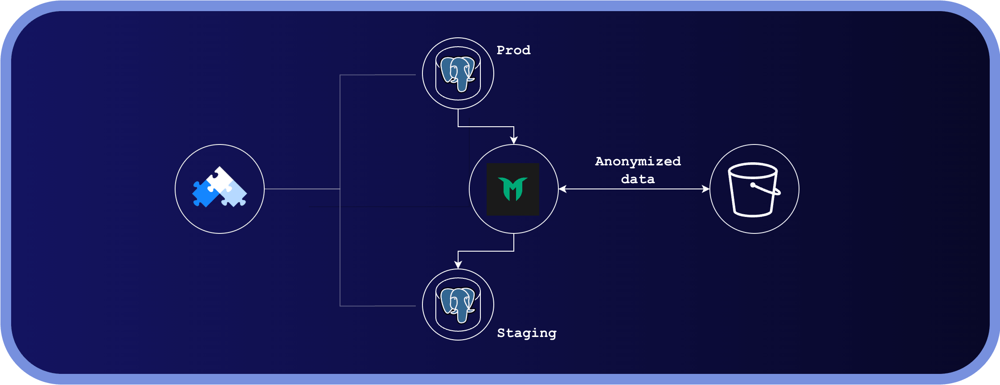

When working with sensitive data — financial records, healthcare information, or legal documents — you must ensure that data never leaves a controlled environment or gets copied somewhere unintended. At the same time, analysts, developers, and QA teams need realistic data to do their jobs effectively. Not every team needs raw production data; having the same schema and data volume is often enough. That is exactly where data anonymization comes in.

In this post we will look at how OpenEverest integrates with [Greenmask](https://www.greenmask.io/), an open-source data anonymization tool for PostgreSQL.

## Goal

We want to simulate the following scenario:

- A production PostgreSQL database contains a table with Personally Identifiable Information (PII).
- A staging database should have the same schema and data volume, but with all sensitive fields anonymized.



Let's see how Greenmask and OpenEverest can solve this together.

## Setting Up Databases with OpenEverest

Deploy OpenEverest using your preferred method. Helm is the simplest option:

```bash
helm install everest openeverest/openeverest --namespace everest-system --create-namespace
```

Next, create two PostgreSQL clusters — one for production and one for staging. You can provision them through the OpenEverest UI, the API, Custom Resources, or via the [OpenClaw integration](https://solanica.io/tpost/openclaw-and-openeverest-skills).

## Generate Sample Data

Create a table with sensitive data in the production cluster:

```sql
CREATE TABLE IF NOT EXISTS app_user (
    id SERIAL PRIMARY KEY,
    first_name VARCHAR(100) NOT NULL,
    last_name VARCHAR(100) NOT NULL,
    email VARCHAR(255) NOT NULL UNIQUE,
    username VARCHAR(100) NOT NULL UNIQUE,
    created_at TIMESTAMP DEFAULT CURRENT_TIMESTAMP,
    updated_at TIMESTAMP DEFAULT CURRENT_TIMESTAMP CHECK (updated_at >= created_at),
    is_active BOOLEAN DEFAULT true
);
```

Populate it using the [faker-db.py](faker-db.py) script included in this blog's folder.

## Configuring Greenmask

With both PostgreSQL clusters running, it is time to configure Greenmask. The goal is to produce an anonymized dump, store it in an S3 bucket, and automatically restore it to the staging cluster on a schedule.

We need three Kubernetes resources (examples are in the blog folder):

- **Secret** — holds credentials for the databases and S3 bucket
- **ConfigMap** — contains the full Greenmask configuration
- **CronJob** — orchestrates the dump and restore cycle

### Secret

```bash
kubectl apply -f secret.yaml
```

### ConfigMap

A few important sections in `configmap.yaml`:

- **`common.pg_bin_path`** — make sure this points to the correct PostgreSQL binary version.
- **`storage`** — configures the S3 backend. See the [Greenmask storage docs](https://docs.greenmask.io/latest/configuration/#storage-section) for details.
- **`dump.transformation`** — defines which columns to anonymize and how. Greenmask provides a rich set of [built-in transformers](https://docs.greenmask.io/latest/built_in_transformers/).

    The following example uses the `RandomEmail` transformer with a hash engine. By referencing other columns like `first_name` and `last_name` in the template, we can generate logically correct data that remains consistent across the entire record. We also leverage Greenmask's [dynamic parameters](https://docs.greenmask.io/latest/built_in_transformers/dynamic_parameters/) capability for the `updated_at` column. By using `dynamic_params`, we can ensure that the generated `updated_at` value always stays after `created_at`, automatically satisfying our database's check constraint during the transformation:
    
    ```yaml
    transformers:
      - name: "RandomEmail"
        params:
          column: "email"
          engine: "hash"
          keep_original_domain: true
          local_part_template: "{{ first_name | lower }}.{{ last_name | lower }}.{{ .random_string | trunc 10 }}"
    
      - name: "RandomDate"
        params:
          column: "updated_at"
          max: "{{ now | .EncodeValue }}"
        # Ensure updated_at > created_at to satisfy DB check constraint
        dynamic_params:
          min:
            column: "created_at"
    ```

- **`restore`** — defines the rules Greenmask follows when restoring from the anonymized dump.

Apply the ConfigMap:

```bash
kubectl apply -f configmap.yaml
```

### CronJob

The CronJob uses two containers in a single job — one for the dump and one for the restore — both using the standard `greenmask` CLI:

```bash
# Dump and anonymize production data
greenmask --config=/config/config.yml dump

# Restore the latest anonymized dump to staging
greenmask --config=/config/config.yml restore latest
```

Apply the CronJob:

```bash
kubectl apply -f cronjob.yaml
```

## How It All Works

Once deployed, the CronJob runs on a schedule (every hour by default). It dumps the production database, applies the anonymization transformers defined in the ConfigMap, and uploads the result to S3. The restore step then loads that anonymized dump into the staging cluster.

The result: developers always have up-to-date, realistic data to work with — without any risk of exposing production PII.

## Healthcare: A Natural Fit

The scenario above maps cleanly onto one of the most regulated data domains: healthcare. Electronic Health Records (EHRs) contain quasi-identifiers — dates, diagnoses, demographics — that make anonymization both a legal obligation (HIPAA, GDPR) and a technical challenge.

A [2025 academic study](https://doi.org/10.1145/3743093.3770973) from the University of Koblenz evaluated several open-source anonymization tools against structured medical datasets. Greenmask was recognized for its strong usability, DevOps-readiness, and direct PostgreSQL integration — making it a practical choice for development and testing pipelines where clinical teams need realistic but de-identified data fast. The study also recommended pairing Greenmask's operational masking with a more compliance-focused tool like ARX for formal risk assessment — a hybrid approach that fits naturally with OpenEverest's modular, operator-based architecture.

In practice, this means you could run the exact setup described in this post against a healthcare database, swap in healthcare-specific column transformers (names, dates, ICD codes), and have a GDPR-safe staging environment ready for developers and data scientists — without touching production PII.

## What's Next

The setup described here works well, but it still requires manual wiring — deploying Greenmask separately, managing its configuration, and keeping it in sync with your database clusters. The natural next step is deeper integration: making Greenmask a first-class provisioning method inside OpenEverest, so that spinning up a staging database with anonymized data is as simple as checking a box when creating a cluster.

Concretely, this could look like:

- **Anonymized clones** — provision a staging cluster pre-seeded from the latest anonymized production dump, with no separate CronJob required.
- **Policy-driven transformers** — define anonymization rules at the database level in OpenEverest, applied automatically on every refresh.
- **Scheduled refresh** — let OpenEverest manage the dump/restore cycle natively, using Greenmask as the anonymization engine under the hood.

Follow our [roadmap](https://github.com/orgs/openeverest/projects/1) and [GitHub](https://github.com/openeverest/openeverest) to track progress and weigh in on priorities.
