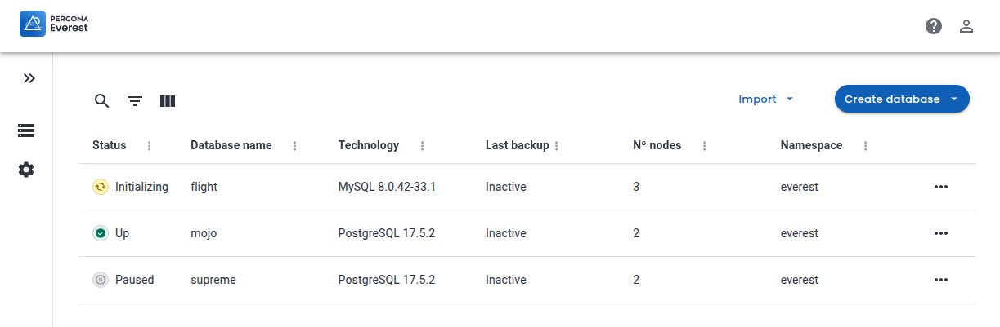
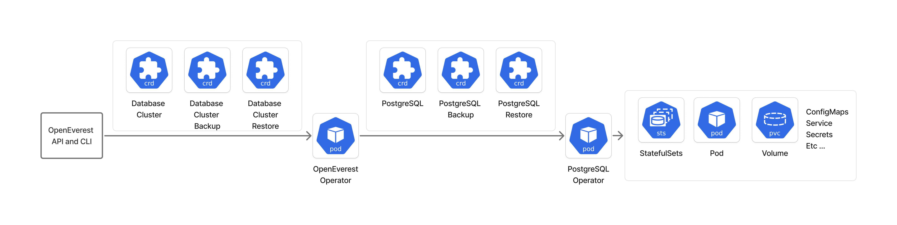

OpenEverest is a cloud-native database platform that simplifies database provisioning and management on Kubernetes. It provides a unified interface for managing databases, including PostgreSQL, MySQL, and MongoDB.

# Components of OpenEverest

OpenEverest consists of several key components that work together to provide a powerful experience for users. Read on to learn about each component and how they interact.

## OpenEverest UI

The OpenEverest UI is a web-based interface that provides a user-friendly way to manage database deployments. It communicates with the OpenEverest API Server to display information about databases and perform management tasks. Provisioning a new database is as simple as filling out a form in the UI. Scaling a database, configuring backups, and setting up monitoring can all be done with a few clicks.



## OpenEverest API Server

The OpenEverest API Server is the central component that exposes a RESTful API for managing database deployments. It handles requests from the UI and interacts with the OpenEverest Operator to perform actions such as database provisioning, scaling, and configuring monitoring.


## OpenEverest CLI

The OpenEverest CLI is used to perform Kubernetes administrative tasks such as user account management, RBAC, and namespace management. It also provisions and upgrades OpenEverest.

```
$ bin/everestctl
CLI for managing Percona Everest

Usage:
  everestctl [command]

Available Commands:
  accounts    Manage Everest accounts
  completion  Generate the autocompletion script for the specified shell
  help        Help about any command
  install     Install Percona Everest using Helm
  namespaces  Manage Everest database namespaces
  settings    Configure Everest settings
  uninstall   Uninstall Percona Everest
  upgrade     Upgrade Percona Everest using Helm
  version     Print Everest components version info

Flags:
  -h, --help                help for everestctl
      --json                Set output type to JSON
  -k, --kubeconfig string   Path to a kubeconfig. If not set, will use KUBECONFIG env var (default "~/.kube/config")
  -v, --verbose             Enable Verbose mode

Use "everestctl [command] --help" for more information about a command.
```

## OpenEverest Operator

The [OpenEverest Operator](https://github.com/percona/everest-operator) is a Kubernetes operator that manages database deployments and operations. OpenEverest delegates to individual Kubernetes database operators [percona-xtradb-cluster-operator](https://github.com/percona/percona-xtradb-cluster-operator), [percona-server-mongodb-operator](https://github.com/percona/percona-server-mongodb-operator), and [percona-postgresql-operator](https://github.com/percona/percona-postgresql-operator) for managing their databases. The operator pattern abstracts complexity by introducing specific custom resources.

For example, for PostgreSQL, there may be three custom resources: one for the PostgreSQL cluster (describing scaling and configuration), one for backups, and one for restores. The OpenEverest Operator allows users to use a single schema to deploy different databases. An example of the OpenEverest Operator flow for PostgreSQL is shown below.



## Helm charts

OpenEverest uses [Helm charts](https://github.com/percona/percona-helm-charts) to simplify the deployment of its components on Kubernetes. Helm is a package manager for Kubernetes that allows users to define, install, and upgrade complex Kubernetes applications.

# Conclusion

OpenEverest is a powerful platform that simplifies database management on Kubernetes. Its components work together to provide a seamless experience for users, allowing them to easily provision, scale, and manage databases. Try [OpenEverest](https://github.com/percona/everest) out today and see how it can transform your database management experience!
