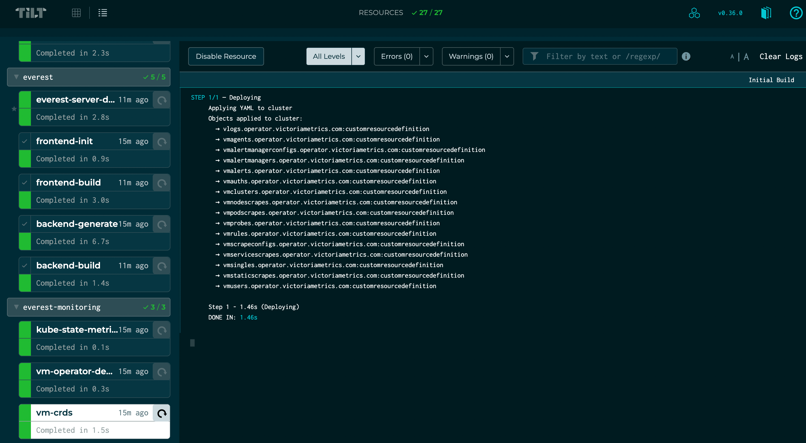
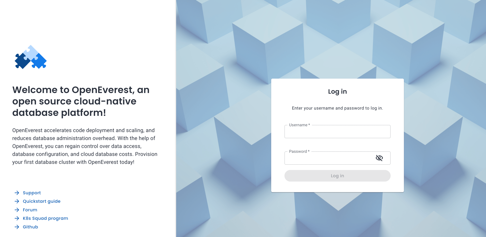

Open source projects thrive because of the community and contributors. As a developer, the workflow should be simple: change the product locally, test it, and send a pull request. If setting up the local environment is a nightmare, the project will never get any PRs.

At OpenEverest, we operate with a "public by default" mindset, and removing contribution friction is one of our biggest priorities. We aim to be the most proficient platform for open-source database management, and that starts with a smooth developer experience.

Today, I’m walking through how to set up the local environment for OpenEverest (formerly Percona Everest), enabling you to help us bridge the gap between Cloud Native ecosystems and database internals.

## 1. Prerequisites & Dependencies

I run MacOS with an M-chip (ARM), so some steps are environment-specific, but the toolset is universal. Since OpenEverest is designed to run on any Kubernetes infrastructure, our local stack reflects that flexibility.

### Tools

* **Docker:** Essential for containerization. You can install [Docker Desktop](https://docs.docker.com/desktop/setup/install/mac-install/) for simplicity. We will need docker as we will use k3d.
* **K3d:** [K3d](https://k3d.io/stable/#releases) is a lightweight wrapper to run Kubernetes in Docker.
* **Kubectl:** The command line tool to talk to your K8s cluster.
* **Helm:** OpenEverest relies heavily on [Helm](https://helm.sh/docs/v3/). **Note:** Helm v3 is currently required as we are not ready for v4 yet.
* **Tilt:** [Tilt](https://tilt.dev/) is the magic wand here. It automates building and deploying all microservices to your local cluster, providing immediate feedback.

### Language Dependencies

* **Golang:** [Go](https://go.dev/). Minimal version required is 1.25.
* **Node.js:** [Node.js](http://node.js)
* **NPM / PNPM**

## 2. GitHub Repositories

Clone the following repositories. I recommend keeping them in a single parent directory for easier path management.

* `percona/everest` [https://github.com/percona/everest]
* `percona/everest-operator` [https://github.com/percona/everest-operator]
* `percona/percona-helm-charts` [https://github.com/percona/percona-helm-charts]

## 3. Prepare the Environment

Once dependencies are installed, we start with the infrastructure.

### Kubernetes Cluster and Registry

We need a cluster that includes a local registry to store our dev images.

```bash
k3d cluster create openeverest-dev --registry-create k3d-registry
```

Verify the cluster is running:

```bash
$ kubectl get nodes
NAME                           STATUS   ROLES                  AGE    VERSION
k3d-openeverest-dev-server-0   Ready    control-plane,master   105m   v1.31.5+k3s1
```

### Configure Tilt

Navigate to the `dev` folder inside the `percona/everest` repository.

1.  Copy `config.yaml.example` to `config.yaml`.
2.  Edit the file. For a basic setup, I stick to one namespace and a single backup storage location.

```yaml
enableFrontendBuild: true
namespaces:
  # List of DB namespaces that will be created automatically
  - name: test-namespace
    backupStorages:
      - bs-1
    # List of DB operators that will be deployed into DB namespace
    operators:
      - pxc
      - psmdb
      - pg
```

3.  **Crucial Step:** Set your repository paths so Tilt knows where to look.

```bash
export EVEREST_OPERATOR_DIR=<path to [github.com/percona/everest-operator](https://github.com/percona/everest-operator) repository directory>
export EVEREST_CHART_DIR=<path to [github.com/percona/percona-helm-charts](https://github.com/percona/percona-helm-charts)>/charts/everest
```

## 4. Tilt All The Way

With preparations complete, fire up the engine. From the `percona/everest/dev` folder, run:

```bash
$ tilt up
```

You will see the startup confirmation:

```bash
Tilt started on http://localhost:10350/
v0.36.0, built 2025-11-17

(space) to open the browser
(s) to stream logs (--stream=true)
(t) to open legacy terminal mode (--legacy=true)
(ctrl-c) to exit
```

Navigate to `http://localhost:10350/`. This dashboard shows the real-time progress of building components and deploying them to your K3d cluster. Everything should turn green within a few minutes.



> **Tip:** If a task turns red, check the logs in the Tilt UI. Usually, it's a missing dependency. If tasks fail due to resource constraints (common on laptops), simply restart the task in the UI.

## 5. Connect to OpenEverest

Once Tilt is green, your instance is live.

* **URL:** `http://127.0.0.1:8080`
* **Credentials:** `admin` / `admin`



You now have a production-ready solution running out of the box on your local machine, ready for you to inspect and modify.

## 6. Frontend Development Tips

Rebuilding the frontend container via Tilt takes 30+ seconds—too slow for UI work. To iterate faster:

1.  Navigate to the `ui` folder in the `percona/everest` repo.
2.  Run `make dev`.

This starts a local NPM server on port **3000**. Changes made to the code will reflect instantly at `http://127.0.0.1:3000`, bypassing the container rebuild loop.

## 7. Tear Down and Clean Up

When you are done contributing, keep your machine clean.

**Stop microservices:**

```bash
tilt down
```

**Delete the Cluster:**

```bash
k3d cluster delete openeverest-dev
```

## 🚀 Ready to Join the Mission?

Now that your local environment is up and running, you are ready to make an impact. OpenEverest thrives on community contributions, and whether you want to fix a bug, improve the CLI, or just discuss architecture, we want you involved.

Here is how you can get started immediately:

* **💻 Dive into the Code:** Explore the core logic and start coding at [percona/everest](https://github.com/percona/everest).
* **🐞 Find an Issue:** Looking for something to work on? Check out our [Open Issues](https://github.com/percona/everest/issues) or look for "good first issue" tags.
* **💬 Chat with Us:** Don't code alone! Join the `#openeverest-users` channel on [CNCF Slack](https://cloud-native.slack.com/archives/C09RRGZL2UX) to ask questions and meet the team.
* **📅 Join the Conversation:** Tune in to our bi-weekly [Community Meetings](https://github.com/openeverest#openeverest-community-meetings) for live demos and Q&A.

For a full list of resources, contributing guides, and other ways to get involved, visit our **[Community Hub](https://openeverest.io/#community)**.