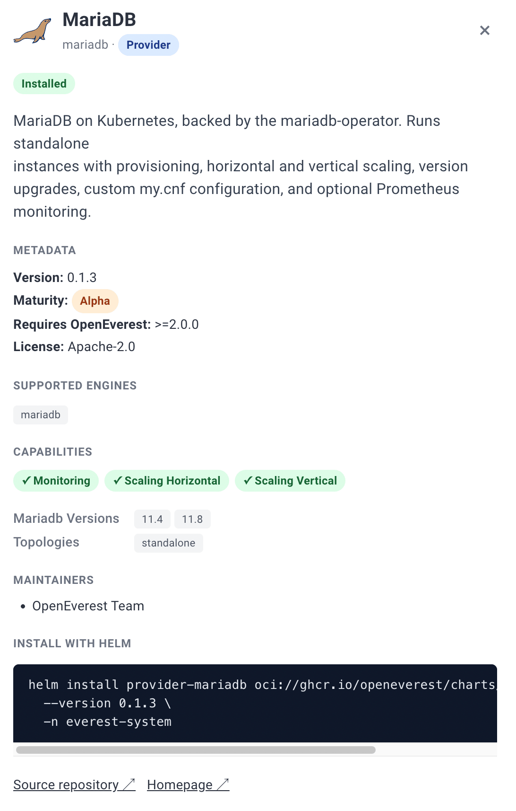

MariaDB has joined the list of databases you can run on OpenEverest. As of the [v2.0.0-dev.2](https://github.com/openeverest/openeverest/releases/tag/v2.0.0-dev.2) developer preview, there is a dedicated [`provider-mariadb`](https://github.com/openeverest/provider-mariadb) that turns a single, technology-agnostic `Instance` resource into a fully reconciled MariaDB cluster — standalone, Galera, or classic primary/replica async replication.

None of this reimplements MariaDB lifecycle management. The heavy lifting — provisioning, high availability, TLS, updates — is delegated to the excellent [`mariadb-operator`](https://github.com/mariadb-operator/mariadb-operator), a mature Kubernetes operator for MariaDB. OpenEverest sits on top of it and gives you a consistent API and UI across every database engine you run.

## Where MariaDB fits in the v2 architecture

OpenEverest v2 is built around **providers**: self-contained plugins that own the technology-specific knowledge (topologies, versions, parameters) while the core stays vendor-agnostic. You create one `Instance`, and the matching provider reconciles it into the native custom resources of an upstream operator.

For MariaDB, that flow looks like this:

<div class="oe-flow" role="img" aria-label="A user, API, or the OpenEverest UI creates an Instance resource. The MariaDB provider reconciles it into a MariaDB custom resource, which the mariadb-operator turns into workloads, services, secrets, and volumes. Status and credentials flow back to the Instance.">
  <svg viewBox="0 0 920 220" xmlns="http://www.w3.org/2000/svg" width="100%" height="auto" font-family="ui-sans-serif, system-ui, -apple-system, Segoe UI, Roboto, sans-serif">
    <defs>
      <marker id="oe-arrow" viewBox="0 0 10 10" refX="9" refY="5" markerWidth="7" markerHeight="7" orient="auto-start-reverse"><path d="M0 0 L10 5 L0 10 z" fill="#6b7280" /></marker>
    </defs>
    <rect x="16" y="80" rx="10" width="150" height="60" fill="#f3f4f6" stroke="#d1d5db" />
    <text x="91" y="106" text-anchor="middle" font-size="15" font-weight="600" fill="#111827">User / API / UI</text>
    <text x="91" y="125" text-anchor="middle" font-size="12" fill="#6b7280">creates</text>
    <rect x="216" y="70" rx="10" width="170" height="80" fill="#e8f7f0" stroke="#0aa66e" />
    <text x="301" y="100" text-anchor="middle" font-size="15" font-weight="700" fill="#0f172a">Instance</text>
    <text x="301" y="120" text-anchor="middle" font-size="11" fill="#4b5563">core.openeverest.io</text>
    <rect x="436" y="70" rx="10" width="170" height="80" fill="#f3f4f6" stroke="#d1d5db" />
    <text x="521" y="100" text-anchor="middle" font-size="15" font-weight="700" fill="#111827">provider-mariadb</text>
    <text x="521" y="120" text-anchor="middle" font-size="11" fill="#6b7280">reconciles</text>
    <rect x="656" y="70" rx="10" width="170" height="80" fill="#f3f4f6" stroke="#d1d5db" />
    <text x="741" y="98" text-anchor="middle" font-size="15" font-weight="700" fill="#111827">MariaDB CR</text>
    <text x="741" y="117" text-anchor="middle" font-size="11" fill="#6b7280">mariadb-operator</text>
    <rect x="636" y="176" rx="10" width="210" height="34" fill="#eef2ff" stroke="#c7d2fe" />
    <text x="741" y="197" text-anchor="middle" font-size="11" fill="#3730a3">Pods · Services · Secrets · PVCs</text>
    <line x1="166" y1="110" x2="212" y2="110" stroke="#6b7280" stroke-width="2" marker-end="url(#oe-arrow)" />
    <line x1="386" y1="110" x2="432" y2="110" stroke="#6b7280" stroke-width="2" marker-end="url(#oe-arrow)" />
    <line x1="606" y1="110" x2="652" y2="110" stroke="#6b7280" stroke-width="2" marker-end="url(#oe-arrow)" />
    <line x1="741" y1="150" x2="741" y2="174" stroke="#6b7280" stroke-width="2" marker-end="url(#oe-arrow)" />
    <path d="M741 68 C741 40, 301 40, 301 66" fill="none" stroke="#0aa66e" stroke-width="2" stroke-dasharray="5 4" />
    <text x="521" y="34" text-anchor="middle" font-size="11" fill="#0aa66e">status · endpoints · credentials</text>
  </svg>
</div>

The provider watches `Instance` resources whose `spec.providerRef.name` is `mariadb`, reconciles them into `MariaDB` custom resources, and reports health back onto the `Instance` status. It never touches pods directly — every lifecycle operation is delegated to `mariadb-operator`.

## What you get today

`provider-mariadb` already covers the day-to-day operations you would expect from a managed MariaDB.

**Provisioning and scaling.** Spin up a cluster in a standalone, Galera, or replication topology, then scale it horizontally (`engine.replicas`) or vertically (CPU and memory requests and limits). Version upgrades are a field change — MariaDB `11.4` and `11.8` bundles are available today.

**High availability.** Two shapes, both driven by `mariadb-operator`: synchronous multi-master Galera (odd node count, default 3) and asynchronous primary/replica replication (default 3). Failover, recovery, and promotion are handled by the operator.

**Data protection.** On-demand and scheduled backups are wired in, both logical (`mariadb-dump`) and physical (`mariadb-backup` / VolumeSnapshot), along with restore. Point-in-time recovery is the one piece still on the way.

**Security and configuration.** TLS is on by default with operator-managed certificates. Custom `my.cnf` tuning is exposed through the engine `configuration` parameter, and monitoring is a single opt-in component that deploys `mysqld-exporter` and a Prometheus `ServiceMonitor`.

**Storage.** Persistent volumes are sized per instance and can be expanded when the StorageClass allows it.

## Pick a topology

MariaDB gives you three shapes depending on how much availability you need. Switch between them below to see how the cluster is laid out.

<div class="oe-topo">
  <input type="radio" name="oe-topo" id="oe-topo-standalone" checked>
  <input type="radio" name="oe-topo" id="oe-topo-galera">
  <input type="radio" name="oe-topo" id="oe-topo-replication">
  <div class="oe-topo-tabs">
    <label for="oe-topo-standalone" class="oe-topo-tab" data-tab="standalone">Standalone</label>
    <label for="oe-topo-galera" class="oe-topo-tab" data-tab="galera">Galera</label>
    <label for="oe-topo-replication" class="oe-topo-tab" data-tab="replication">Replication</label>
  </div>
  <div class="oe-topo-panels">
    <figure class="oe-topo-panel" data-panel="standalone">
      <svg viewBox="0 0 480 200" width="100%" height="auto" font-family="ui-sans-serif, system-ui, sans-serif">
        <rect x="185" y="70" rx="10" width="110" height="60" fill="#e8f7f0" stroke="#0aa66e" stroke-width="2"/>
        <text x="240" y="95" text-anchor="middle" font-size="14" font-weight="700" fill="#0f172a">mariadb-0</text>
        <text x="240" y="114" text-anchor="middle" font-size="11" fill="#4b5563">read + write</text>
      </svg>
      <figcaption>A single node. Simplest option, no redundancy — good for development and non-critical workloads.</figcaption>
    </figure>
    <figure class="oe-topo-panel" data-panel="galera">
      <svg viewBox="0 0 480 200" width="100%" height="auto" font-family="ui-sans-serif, system-ui, sans-serif">
        <line x1="130" y1="55" x2="350" y2="55" stroke="#0aa66e" stroke-width="2"/>
        <line x1="130" y1="55" x2="240" y2="150" stroke="#0aa66e" stroke-width="2"/>
        <line x1="350" y1="55" x2="240" y2="150" stroke="#0aa66e" stroke-width="2"/>
        <g><rect x="80" y="28" rx="9" width="100" height="52" fill="#e8f7f0" stroke="#0aa66e" stroke-width="2"/><text x="130" y="50" text-anchor="middle" font-size="13" font-weight="700" fill="#0f172a">node-0</text><text x="130" y="67" text-anchor="middle" font-size="10" fill="#4b5563">read + write</text></g>
        <g><rect x="300" y="28" rx="9" width="100" height="52" fill="#e8f7f0" stroke="#0aa66e" stroke-width="2"/><text x="350" y="50" text-anchor="middle" font-size="13" font-weight="700" fill="#0f172a">node-1</text><text x="350" y="67" text-anchor="middle" font-size="10" fill="#4b5563">read + write</text></g>
        <g><rect x="190" y="128" rx="9" width="100" height="52" fill="#e8f7f0" stroke="#0aa66e" stroke-width="2"/><text x="240" y="150" text-anchor="middle" font-size="13" font-weight="700" fill="#0f172a">node-2</text><text x="240" y="167" text-anchor="middle" font-size="10" fill="#4b5563">read + write</text></g>
      </svg>
      <figcaption>Synchronous multi-master. Every node accepts writes and stays in sync; the cluster survives losing a node while it keeps quorum. Use an odd node count.</figcaption>
    </figure>
    <figure class="oe-topo-panel" data-panel="replication">
      <svg viewBox="0 0 480 200" width="100%" height="auto" font-family="ui-sans-serif, system-ui, sans-serif">
        <defs><marker id="oe-repl-arrow" viewBox="0 0 10 10" refX="9" refY="5" markerWidth="7" markerHeight="7" orient="auto-start-reverse"><path d="M0 0 L10 5 L0 10 z" fill="#6b7280"/></marker></defs>
        <rect x="185" y="18" rx="9" width="110" height="54" fill="#e8f7f0" stroke="#0aa66e" stroke-width="2"/>
        <text x="240" y="40" text-anchor="middle" font-size="13" font-weight="700" fill="#0f172a">primary</text>
        <text x="240" y="58" text-anchor="middle" font-size="10" fill="#4b5563">write</text>
        <rect x="70" y="128" rx="9" width="110" height="54" fill="#f3f4f6" stroke="#9ca3af" stroke-width="2"/>
        <text x="125" y="150" text-anchor="middle" font-size="13" font-weight="700" fill="#111827">replica</text>
        <text x="125" y="168" text-anchor="middle" font-size="10" fill="#6b7280">read</text>
        <rect x="300" y="128" rx="9" width="110" height="54" fill="#f3f4f6" stroke="#9ca3af" stroke-width="2"/>
        <text x="355" y="150" text-anchor="middle" font-size="13" font-weight="700" fill="#111827">replica</text>
        <text x="355" y="168" text-anchor="middle" font-size="10" fill="#6b7280">read</text>
        <line x1="220" y1="72" x2="135" y2="126" stroke="#6b7280" stroke-width="2" marker-end="url(#oe-repl-arrow)"/>
        <line x1="260" y1="72" x2="345" y2="126" stroke="#6b7280" stroke-width="2" marker-end="url(#oe-repl-arrow)"/>
      </svg>
      <figcaption>Asynchronous primary/replica. One node takes writes and streams changes to read replicas; the operator promotes a replica if the primary fails.</figcaption>
    </figure>
  </div>
</div>

<style>
.oe-flow{margin:1.5rem 0;padding:0.5rem 0;}
.oe-topo{margin:1.5rem 0;border:1px solid #e5e7eb;border-radius:12px;overflow:hidden;}
.oe-topo>input{position:absolute;opacity:0;pointer-events:none;}
.oe-topo-tabs{display:flex;gap:0;border-bottom:1px solid #e5e7eb;background:#f9fafb;}
.oe-topo-tab{flex:1;text-align:center;padding:12px 8px;font-size:14px;font-weight:600;color:#6b7280;cursor:pointer;user-select:none;border-bottom:2px solid transparent;transition:color .15s,border-color .15s,background .15s;}
.oe-topo-tab:hover{color:#0f172a;}
.oe-topo-panel{display:none;margin:0;padding:20px;}
.oe-topo-panel figcaption{margin-top:10px;font-size:13px;color:#4b5563;line-height:1.5;}
#oe-topo-standalone:checked~.oe-topo-tabs .oe-topo-tab[data-tab="standalone"],
#oe-topo-galera:checked~.oe-topo-tabs .oe-topo-tab[data-tab="galera"],
#oe-topo-replication:checked~.oe-topo-tabs .oe-topo-tab[data-tab="replication"]{color:#0aa66e;border-bottom-color:#0aa66e;background:#fff;}
#oe-topo-standalone:checked~.oe-topo-panels .oe-topo-panel[data-panel="standalone"],
#oe-topo-galera:checked~.oe-topo-panels .oe-topo-panel[data-panel="galera"],
#oe-topo-replication:checked~.oe-topo-panels .oe-topo-panel[data-panel="replication"]{display:block;}
</style>

## Deploy it with the v2 dev.2 release

The workflow below assumes a Kubernetes cluster you can reach with `kubectl`. I used a local cluster; the steps are identical on a managed one.

> **Note:** OpenEverest v2-dev.2 is a developer preview. It is not feature-complete and is meant for testing and feedback, not production. Expect breaking changes between preview releases.

### 1. Install OpenEverest v2

Follow the [quick install guide](https://openeverest.io/documentation/2.0.0-dev.2/quick-install.html) to get the core CRDs and controller into your cluster. The provider needs the OpenEverest core to be present — installing the provider on its own does nothing.

### 2. Install the MariaDB provider

The provider chart is published as an OCI artifact and bundles `mariadb-operator` (and its CRDs) as a dependency, so a single install brings up everything:

```bash
helm install provider-mariadb \
  oci://ghcr.io/openeverest/charts/provider-mariadb \
  --namespace everest-system
```

Confirm the provider registered itself with the core:

```bash
kubectl get providers mariadb
```



### 3. Create a MariaDB instance in the UI

Open the OpenEverest UI and start the create-database flow. MariaDB now shows up as a selectable engine.


Pick the topology (standalone, Galera, or replication), size the nodes, and set storage. The UI is generated from the provider's own schema, so the options you see are exactly what the provider supports. 

Submit the wizard and watch the instance come up on the Overview page.


### Prefer YAML? Create the Instance directly

The UI ultimately creates an `Instance` resource. You can apply the same thing yourself:

```yaml
apiVersion: core.openeverest.io/v1alpha1
kind: Instance
metadata:
  name: my-instance
spec:
  providerRef:
    name: mariadb
  topology:
    type: galera
  components:
    engine:
      type: mariadb
      replicas: 3
      resources:
        requests:
          cpu: 500m
          memory: 2G
      storage:
        size: 10Gi
```

`spec.version` and `spec.topology` are optional — the provider applies sensible defaults (MariaDB `11.4`, standalone) when you omit them.

Watch it reconcile and read the connection details:

```bash
kubectl get instance my-instance -w
kubectl get instance my-instance -o jsonpath='{.status.connectionSecretRef.name}'
```

The host, port, username, password, and connection URI all live in the connection Secret named by `.status.connectionSecretRef.name`.

## The parts worth calling out

**TLS is on by default.** The operator issues and manages certificates, and the connection Secret carries `tls: "true"` plus the CA bundle in `ca.crt` so clients can verify the server. Unencrypted connections are still accepted by default for migration compatibility; to reject them, set the engine parameter `tls.required: true`. Galera deployments also encrypt state snapshot transfers by default.

**Tuning MariaDB is a parameter, not a fork.** The engine's `configuration` parameter is passed straight through as `my.cnf`, so anything you would normally set in a MariaDB config file is available without leaving the `Instance` API.

**Monitoring is opt-in.** Enable the `monitoring` component and the provider deploys `mysqld-exporter` alongside a Prometheus `ServiceMonitor` (requires the `monitoring.coreos.com` CRD in your cluster).

## What's not there yet

The gap today is [point-in-time recovery](https://github.com/openeverest/provider-mariadb/issues/34). `mariadb-operator` already supports PITR natively through continuous binlog archival, so exposing it through the OpenEverest `Instance` API is provider wiring rather than new operator capability — it is next on the list. On-demand backups, scheduled backups (logical and physical), and restore are already available.

## Credit where it's due

The entire MariaDB lifecycle here — replication, Galera recovery, TLS, rolling updates — is powered by [`mariadb-operator`](https://github.com/mariadb-operator/mariadb-operator). It is a well-designed, actively maintained operator, and OpenEverest is a thin, technology-agnostic layer on top of it rather than a replacement. If you run MariaDB on Kubernetes, it is worth a star.

## Tell us what breaks

What the provider for MariaDB and OpenEverest v2 need today is feedback. Try it out, let us know what breaks and help us make it better.

- Provider source and issues: [openeverest/provider-mariadb](https://github.com/openeverest/provider-mariadb)
- Build your own provider: [PROVIDER_DEVELOPMENT.md](https://github.com/openeverest/provider-sdk/blob/main/PROVIDER_DEVELOPMENT.md)

## Join the Community

* **Contribute:** Check out our [Good First Issues](https://github.com/orgs/openeverest/projects/2) and [repositories](https://github.com/openeverest).
* **Chat:** Join the conversation in the CNCF Slack (channel: [#openeverest-users](https://cloud-native.slack.com/archives/C09RRGZL2UX)).
* **Explore:** See how we're simplifying databases at [openeverest.io/#community](https://openeverest.io/#community).

<div style="display:flex;gap:12px;margin-top:24px;flex-wrap:wrap;">
  <a href="https://cloud-native.slack.com/archives/C09RRGZL2UX" target="_blank" rel="noopener noreferrer" style="display:inline-flex;align-items:center;gap:8px;background-color:#4A154B;color:#fff;text-decoration:none;padding:10px 20px;border-radius:6px;font-weight:600;font-size:15px;">
    <svg xmlns="http://www.w3.org/2000/svg" width="20" height="20" viewBox="0 0 122.8 122.8"><path d="M25.8 77.6c0 7.1-5.8 12.9-12.9 12.9S0 84.7 0 77.6s5.8-12.9 12.9-12.9h12.9v12.9zm6.5 0c0-7.1 5.8-12.9 12.9-12.9s12.9 5.8 12.9 12.9v32.3c0 7.1-5.8 12.9-12.9 12.9s-12.9-5.8-12.9-12.9V77.6z" fill="#e01e5a"/><path d="M45.2 25.8c-7.1 0-12.9-5.8-12.9-12.9S38.1 0 45.2 0s12.9 5.8 12.9 12.9v12.9H45.2zm0 6.5c7.1 0 12.9 5.8 12.9 12.9s-5.8 12.9-12.9 12.9H12.9C5.8 58.1 0 52.3 0 45.2s5.8-12.9 12.9-12.9h32.3z" fill="#36c5f0"/><path d="M97 45.2c0-7.1 5.8-12.9 12.9-12.9s12.9 5.8 12.9 12.9-5.8 12.9-12.9 12.9H97V45.2zm-6.5 0c0 7.1-5.8 12.9-12.9 12.9s-12.9-5.8-12.9-12.9V12.9C64.7 5.8 70.5 0 77.6 0s12.9 5.8 12.9 12.9v32.3z" fill="#2eb67d"/><path d="M77.6 97c7.1 0 12.9 5.8 12.9 12.9s-5.8 12.9-12.9 12.9-12.9-5.8-12.9-12.9V97h12.9zm0-6.5c-7.1 0-12.9-5.8-12.9-12.9s5.8-12.9 12.9-12.9h32.3c7.1 0 12.9 5.8 12.9 12.9s-5.8 12.9-12.9 12.9H77.6z" fill="#ecb22e"/></svg>
    Join Slack
  </a>
  <a href="https://github.com/openeverest/provider-mariadb" target="_blank" rel="noopener noreferrer" style="display:inline-flex;align-items:center;gap:8px;background-color:#24292f;color:#fff;text-decoration:none;padding:10px 20px;border-radius:6px;font-weight:600;font-size:15px;">
    <svg xmlns="http://www.w3.org/2000/svg" width="20" height="20" viewBox="0 0 16 16" fill="#fff"><path d="M8 .25a7.75 7.75 0 1 0 0 15.5A7.75 7.75 0 0 0 8 .25zm0 1.5a6.25 6.25 0 0 1 1.97 12.18c-.31.06-.42-.13-.42-.3v-1.05c0-.36-.01-1.02-.49-1.4 1.62-.18 2.5-.88 2.5-2.57 0-.57-.2-1.1-.53-1.49.05-.14.23-.7-.05-1.47 0 0-.44-.14-1.44.54a5.02 5.02 0 0 0-2.62 0C5.93 6.6 5.49 6.74 5.49 6.74c-.28.77-.1 1.33-.05 1.47-.33.39-.53.92-.53 1.49 0 1.69.88 2.39 2.5 2.57-.31.27-.43.67-.47 1.04-.42.19-1.5.52-2.16-.62 0 0-.39-.71-1.13-.76 0 0-.72-.01-.05.45 0 0 .48.23.82 1.08 0 0 .43 1.32 2.49.87v.75c0 .17-.11.36-.42.3A6.25 6.25 0 0 1 8 1.75z"/></svg>
    Star the Provider
  </a>
</div>
