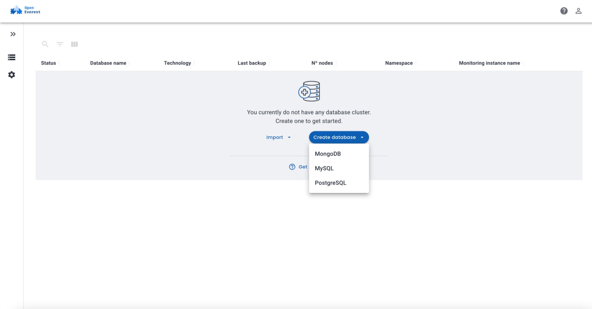
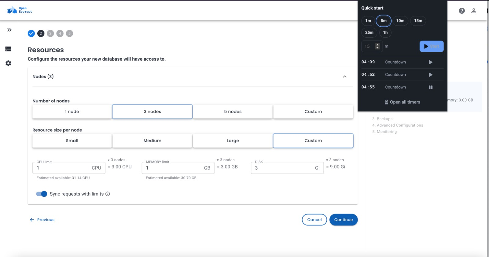
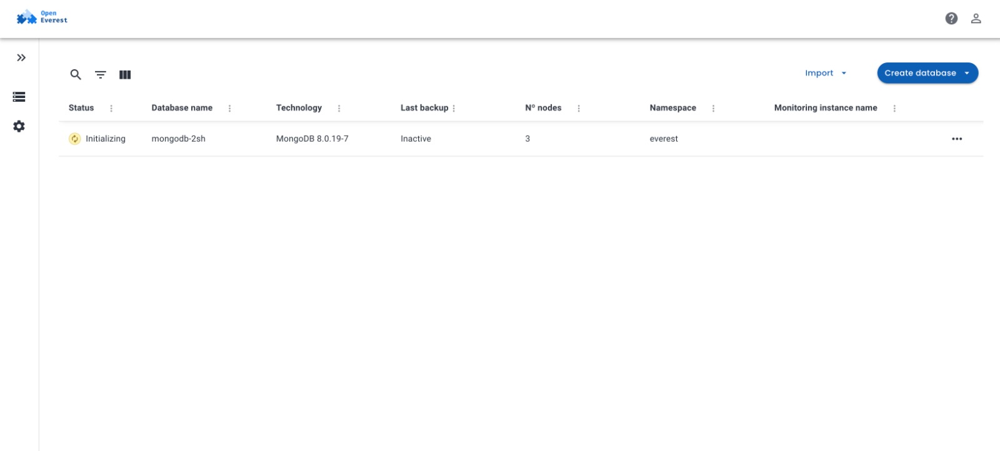
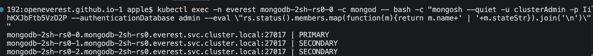
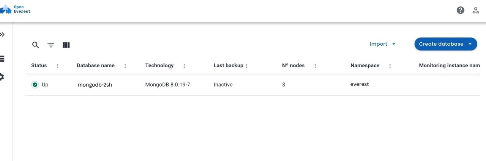
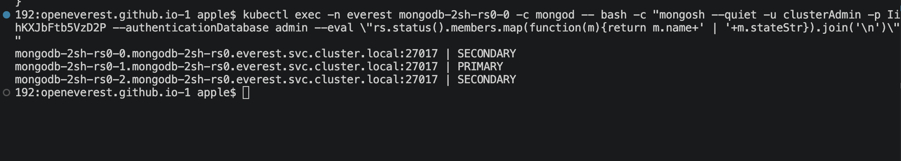

Getting a MongoDB replica set running on Kubernetes is one of those things that looks
straightforward until you are actually doing it. You need a StatefulSet with stable
network identities, a headless Service so the pods can resolve each other by DNS,
PersistentVolumeClaims that survive pod restarts, and then once all three pods are up
you still have to shell into the primary and run `rs.initiate()` with a hand-crafted
member list that matches your pod hostnames exactly. Miss any of it and MongoDB starts
as a standalone instance with no errors, which is a fun way to lose writes silently.

I wanted to see how much of that OpenEverest v2 would handle on its own. OpenEverest
itself doesn't touch any of that directly. Its job stops at creating an `Instance`
object describing what you want. The actual work happens one layer down. The MongoDB
provider's own controller watches for `Instance` objects and translates yours into a
`PerconaServerMongoDB` custom resource. Percona's own
[Percona Operator for MongoDB](https://github.com/percona/percona-server-mongodb-operator)
is what actually builds the StatefulSet, headless Service, PVC templates, and replica set
bootstrap from that. The question was whether that whole chain actually held up, or
whether you still had to go poke at things manually.

Everything here ran on a local `kind` cluster. No cloud, no pre-existing installation,
just a fresh cluster and a 5-minute timer.

**Environment:** kind v0.30.0 (4 nodes: 1 control-plane + 3 workers), kubectl v1.32.2,
Helm v3.19.0, OpenEverest **v2.0.0-dev.2**, `provider-percona-server-mongodb` **v0.1.0**.

## 1. Deploying Core Components and the Provider

OpenEverest v2 splits into two parts: the core control plane and provider charts that
add support for specific databases. You install them separately.

Add the chart repo and install the core:

```bash
helm repo add openeverest https://openeverest.github.io/helm-charts/
helm repo update
helm install everest-core openeverest/openeverest \
    --devel --version "2.0.0-dev.2" \
    --namespace everest-system --create-namespace
```

Wait until all three pods are Running:

```
NAME                                       READY   STATUS    RESTARTS   AGE
everest-controller-77c7b89cd8-rqlts        1/1     Running   0          4m31s
everest-core-plugin-hub-6b5dbb49c4-bcgdc   1/1     Running   0          4m31s
everest-server-748d76868f-fqkpm            1/1     Running   0          4m31s
```

Then install the MongoDB provider:

```bash
helm install provider-percona-server-mongodb \
    oci://ghcr.io/openeverest/charts/provider-percona-server-mongodb \
    --version 0.1.0 -n everest-system
```

Once the provider registers, MongoDB shows up as an option in the UI. That is the
signal that everything is wired up and you can create a cluster.



## 2. Defining the Cluster

I set the 5-minute timer and hit Create. The Resources step is where you pick node
count and size: 3 nodes, 1 CPU, 1 GB RAM, 3 Gi disk each.



If you prefer YAML over clicking through the wizard, the equivalent spec is:

```yaml
apiVersion: core.openeverest.io/v1alpha1
kind: Instance
metadata:
  name: mongodb-2sh
  namespace: everest
spec:
  providerRef:
    name: provider-percona-server-mongodb
  topology:
    type: cluster
  components:
    engine:
      type: mongodb
      version: "8.0.19-7"
      replicas: 3
      resources:
        requests: { cpu: "1", memory: "1Gi" }
      storage:
        size: 3Gi
```

The `topology: cluster` field is what tells the provider you want a replica set rather
than a standalone instance. The provider translates that into a `PerconaServerMongoDB`
custom resource with the correct replica set name, member configuration, and anti-affinity
rules. You never touch any of that directly.

## 3. Watching It Come Up

The instance moves to `Initializing` while the operator provisions PVCs and schedules
pods:



```
$ kubectl get pods -n everest -l app.kubernetes.io/instance=mongodb-2sh
NAME                READY   STATUS    RESTARTS   AGE
mongodb-2sh-rs0-0   2/2     Running   0          3m15s
mongodb-2sh-rs0-1   2/2     Running   0          2m50s
mongodb-2sh-rs0-2   2/2     Running   0          2m31s
```

The operator starts `rs0-0` first, waits for it to be ready, then brings up `-1` and
`-2` in order. Once all three are running it automatically calls `rs.initiate()` with
the correct member list, the part you would normally have to do by hand.

The `2/2` containers are the MongoDB process and a sidecar for backups and PMM metrics.
The operator also generates credentials and connection strings in a Kubernetes Secret
automatically.

## 4. Verifying the Replica Set

Running pods are not proof of a healthy replica set. You have to shell in and actually check.

```bash
$ kubectl exec -n everest mongodb-2sh-rs0-0 -c mongod -- \
    mongosh -u clusterAdmin --authenticationDatabase admin \
    --eval "rs.status().members.map(function(m){ return m.name + ' | ' + m.stateStr })"
```

```
mongodb-2sh-rs0-0.mongodb-2sh-rs0.everest.svc.cluster.local:27017 | PRIMARY
mongodb-2sh-rs0-1.mongodb-2sh-rs0.everest.svc.cluster.local:27017 | SECONDARY
mongodb-2sh-rs0-2.mongodb-2sh-rs0.everest.svc.cluster.local:27017 | SECONDARY
```



One primary, two secondaries, replication lag at zero. The UI confirms the same: status flips to **Up** with all 3 nodes healthy.



Total time from hitting Create to a verified, replicating cluster: **under 5 minutes.**
The timer on that second screenshot tells the story.

## 5. Failover Test

"Pods are Running" and a green UI are not proof of HA. So I forced an election by
stepping down the primary:

```bash
# rs0-0 was primary before this
$ kubectl exec -n everest mongodb-2sh-rs0-0 -c mongod -- \
    mongosh -u clusterAdmin --authenticationDatabase admin \
    --eval "rs.stepDown()"
{ ok: 1 }
```

Checked member states a few seconds later:

```bash
$ kubectl exec -n everest mongodb-2sh-rs0-0 -c mongod -- \
    mongosh -u clusterAdmin --authenticationDatabase admin \
    --eval "rs.status().members.map(function(m){ return m.name + ' | ' + m.stateStr })"
```

```
mongodb-2sh-rs0-0.mongodb-2sh-rs0.everest.svc.cluster.local:27017 | SECONDARY
mongodb-2sh-rs0-1.mongodb-2sh-rs0.everest.svc.cluster.local:27017 | PRIMARY
mongodb-2sh-rs0-2.mongodb-2sh-rs0.everest.svc.cluster.local:27017 | SECONDARY
```



`rs0-1` won the election and took over as primary. The stepdown and election resolved
in under 5 seconds, fast enough that by the time I ran the status check it had already
settled. No manual intervention, no connection string change needed. The replica set
handled it on its own.

## Takeaway

The parts that usually eat the most time when doing this manually, getting the headless
service DNS right, crafting the `rs.initiate()` payload, setting up credentials, were
all handled without any extra input. From a blank `kind` cluster to a verified,
replicating MongoDB cluster with a tested failover: under 5 minutes.

To be clear, this is a dev setup. No TLS, no authentication hardening
beyond generated credentials, and local `kind` storage means the anti-affinity rules do
not actually spread pods across real nodes. For production you would want TLS through
the provider spec, tighter resource limits, and a proper multi-node cluster. The spec
supports all of that, it is just out of scope for a 5-minute run.

OpenEverest is also not tied to Percona specifically. It is built to be
provider-agnostic, and more providers are listed in the
[OpenEverest Hub](https://github.com/openeverest/hub).
