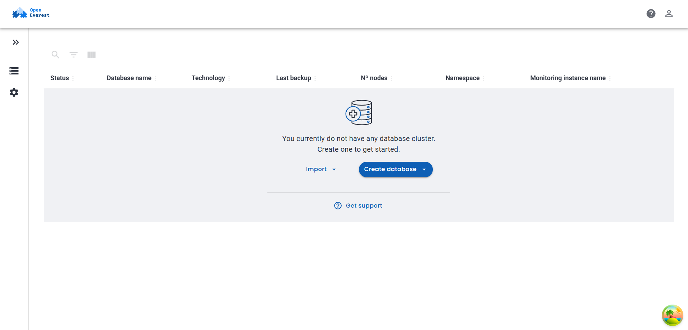
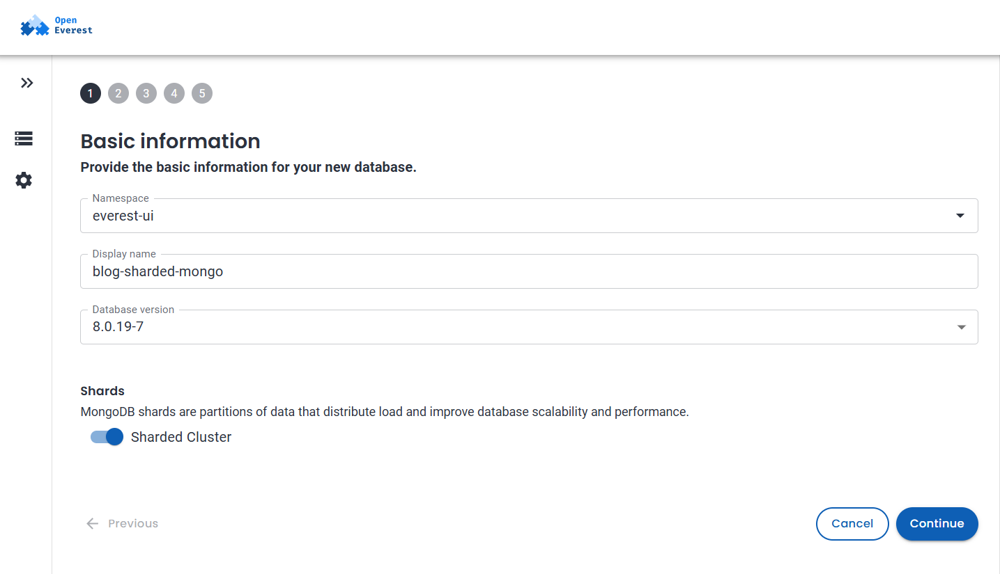
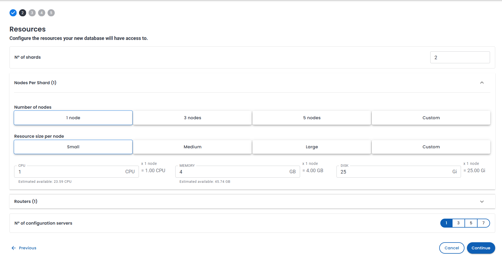
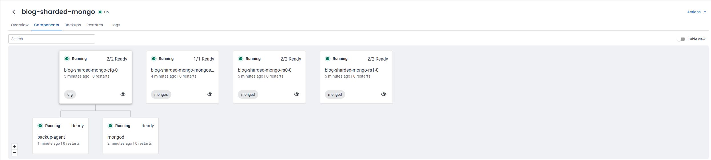
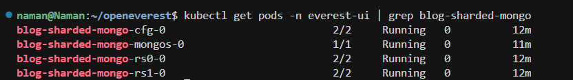
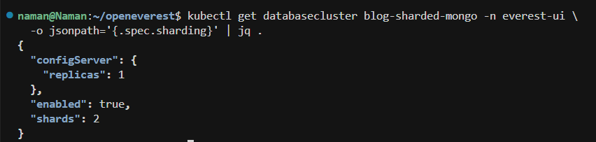
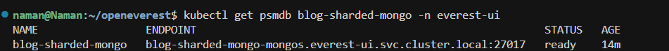
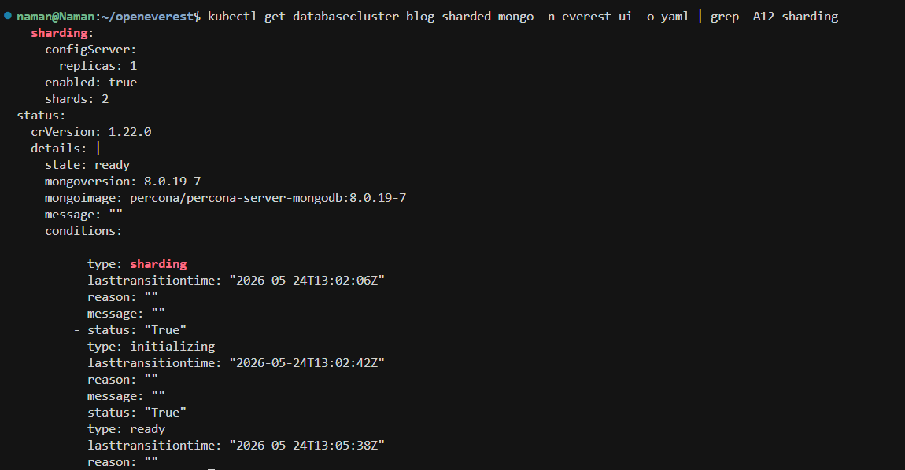
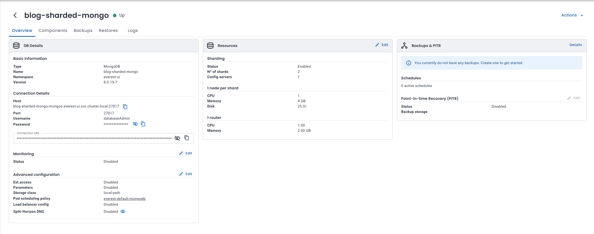

I have mostly used MongoDB as a single replica set. That works until the dataset or traffic grows and you start looking at sharding.

On Kubernetes, "enable sharding" usually turns into config servers, mongos routers, replica sets, storage classes, and a pile of YAML. I wanted to see how much of that OpenEverest could actually handle for me.

This post walks through creating a sharded MongoDB cluster from the UI, then verifying the topology with `kubectl`.

I ran everything on a local k3d cluster with OpenEverest installed via the quick install (Helm) guide on a 16 GB laptop, so the sizing here is smaller than what you would use in production. The workflow is the same.

### Prerequisites

Here is what I had ready before opening the create-database wizard:

- **OpenEverest installed in your cluster.** I used the [quick install guide](https://github.com/openeverest/everest-doc/blob/main/docs/quick-install.md) (Helm). If you prefer the CLI flow, the [everestctl install guide](https://github.com/openeverest/everest-doc/blob/main/docs/install/install_everestctl.md) covers it.
- **A namespace managed by OpenEverest with the MongoDB operator enabled.** Use the [namespace management guide](https://github.com/openeverest/everest-doc/blob/main/docs/administer/manage_namespaces.md) to add or update namespaces if needed, then pick that namespace in the wizard.
- **`kubectl` configured** for the same cluster the UI uses.
- **Enough memory on the host.** My first attempt used 2 shards with 3 nodes each, plus 3 config servers and 3 routers. Several pods stayed `Pending` with `Insufficient memory` on an 8 GB WSL VM. Increasing WSL memory to around 11 GB and using a smaller topology fixed it. More on that later.

You do not need a separate `everestctl` command for sharding. The wizard creates a `DatabaseCluster` custom resource, and the Percona Server for MongoDB operator reconciles the pods.

### Why bother with sharding?

A normal MongoDB deployment in OpenEverest is a single replica set. All data lives in that group of nodes. That works until:

- the working set no longer fits comfortably on one replica set, or
- read and write traffic grows enough that you want to distribute data across partitions.

**Sharding** spreads data across multiple replica sets, called **shards**. Clients do not connect to shards directly. They connect through **mongos** routers, which send queries to the correct shard. **Config servers** store metadata about which chunks live on which shard.

Setting this up manually on Kubernetes usually means multiple StatefulSets, services, secrets, and custom resource fields that all need to stay in sync. That is the part I wanted to avoid.

### Create a sharded cluster in the UI

Open **Databases** in the OpenEverest UI. If this is a fresh setup, you should see an empty list with a **Create database** button.



### Step 1: Basic information

Choose **MongoDB** as the engine, then fill in:

- **Namespace:** `everest-ui`
- **Display name:** `blog-sharded-mongo`
- **Database version:** `8.0.19-7` in my test run

Under **Shards**, enable **Sharded Cluster**. The summary panel on the right should show `Sharding: enabled` before continuing.



> If the summary still shows `Sharding: disabled`, double-check that the toggle is enabled.

Click **Continue**.

### Step 2: Resources

With sharding enabled, the resources step includes additional topology settings:

- **Number of shards:** `2`
- **Nodes per shard:** `1` on my laptop (production setups usually use `3` for HA)
- **Routers:** `1` mongos router
- **Number of configuration servers:** `1`
- **Resource size:** `Small` (1 CPU, 4 GB memory, 25 Gi disk per node in my setup)



The summary panel lists shards, nodes, routers, and config servers. It is a good sanity check before deploying.

I left **Backups** and **Monitoring** at their default settings and submitted the wizard. Provisioning took a few minutes, which is normal on a smaller machine.

### Under the hood: what got created?

After provisioning finished, I checked the **Components** tab to see what OpenEverest created behind the scenes.

For `blog-sharded-mongo`, I ended up with four Kubernetes components in the namespace:

| Name                          | Type   | Role                               |
| ----------------------------- | ------ | ---------------------------------- |
| `blog-sharded-mongo-cfg-0`    | cfg    | Config server for cluster metadata |
| `blog-sharded-mongo-mongos-0` | mongos | Router used by applications        |
| `blog-sharded-mongo-rs0-0`    | mongod | First shard (replica set `rs0`)    |
| `blog-sharded-mongo-rs1-0`    | mongod | Second shard (replica set `rs1`)   |



If you scale the shard replica sets, additional pods such as `rs0-1` and `rs0-2` appear automatically. The same applies to config servers and mongos routers.

### Checking the namespace from the terminal

I ran a few commands to compare what the UI showed with the actual Kubernetes resources.

### 1. List pods in `everest-ui`

```bash
kubectl get pods -n everest-ui | grep blog-sharded-mongo
```



All four pods were in the `Running` state. The `READY` column shows `2/2` for the mongod and config server pods because the operator runs a sidecar container alongside MongoDB.

### 2. Check the sharding section in the `DatabaseCluster`

```bash
kubectl get databasecluster blog-sharded-mongo -n everest-ui \
  -o jsonpath='{.spec.sharding}' | jq .
```



This matches the topology selected in the UI: `"enabled": true`, `"shards": 2`, and a single config server replica.

### 3. Verify the PSMDB endpoint

```bash
kubectl get psmdb blog-sharded-mongo -n everest-ui
```



`STATUS` shows `ready`. The `ENDPOINT` points to the mongos service:

```text
blog-sharded-mongo-mongos.everest-ui.svc.cluster.local:27017
```

That is what you want in a sharded deployment. Applications should connect through mongos, not directly to an individual shard.

### 4. Inspect the cluster status

```bash
kubectl get databasecluster blog-sharded-mongo -n everest-ui \
  -o yaml | grep -A12 sharding
```



Besides the sharding section, this output also shows the cluster moving through `initializing` and eventually reaching `ready` on MongoDB `8.0.19-7`.

### It works: overview and topology

On the **Overview** tab, the cluster status showed **Up**. Under **Resources**, sharding was enabled with:

- `2` shards
- `1` config server

The connection details also used the mongos hostname, matching the `psmdb` endpoint from earlier.



This was the rough topology:

```text
                    mongos (blog-sharded-mongo-mongos-0)
                              |
              +---------------+---------------+
              |                               |
         rs0 (shard 0)                   rs1 (shard 1)
              |                               |
         cfg-0 (config server metadata)
```

This verified the full flow end to end:

- enable sharding in the UI,
- deploy the cluster,
- confirm the expected pod types,
- connect through mongos,
- verify everything with `kubectl`.

### Sizing notes for local development

I tested this on a 16 GB Windows laptop with WSL capped at around 11 GB RAM.

The larger demo topology from the original issue did not schedule successfully on my machine:

- 3 nodes per shard
- 3 config servers
- 3 mongos routers

Kubernetes reported `Insufficient memory`, and two shard pods stayed in `Pending`.

What worked reliably:

- WSL config:
  - `memory=11GB`
  - `processors=6`
  - `swap=8GB`
- Restart WSL with:

  ```bash
  wsl --shutdown
  ```

- Cluster topology:
  - 2 shards
  - 1 node per shard
  - 1 mongos router
  - 1 config server
  - `Small` resources

For production, you would normally increase replica counts for fault tolerance. For testing the UI and validating the workflow, the smaller layout was enough.

### Cleanup

When you are done, delete the database from the **Databases** page or remove the `DatabaseCluster` and `PerconaServerMongoDB` resources manually from the `everest-ui` namespace.

Sharded clusters create multiple PVCs, so cleanup can take a minute to finish.

### Wrapping up

Sharding on Kubernetes still means config servers, mongos routers, and multiple replica sets underneath. The difference here is that OpenEverest handles most of the setup through the database creation flow.

You enable sharding, choose the topology, and let the platform plus the PSMDB operator create the resources. From there, the Components tab and a few `kubectl` commands are enough to verify everything is running as expected.

If you test this locally and run into scheduling issues, check Docker or WSL memory limits first. The smaller topology worked fine on my setup, but larger shard counts will need more resources.