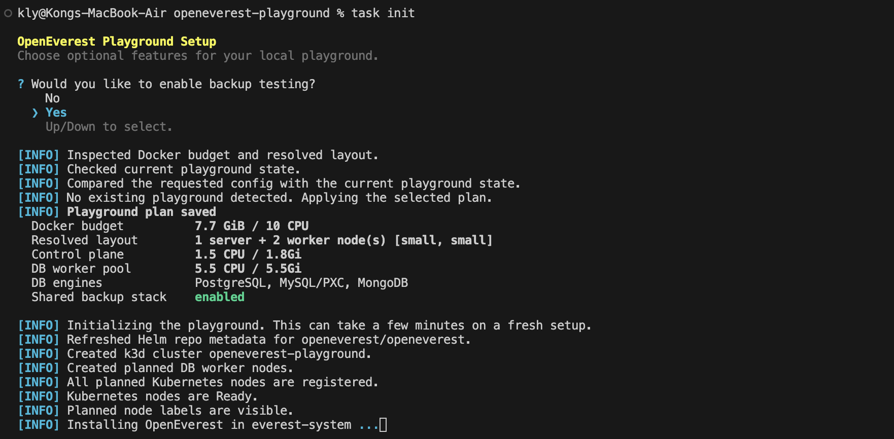

## Introduction

What would an ideal database experience look like?

For us, it would mean not having to think about operators, backups, scaling, or infrastructure wiring at all. Instead, developers could simply provision databases on demand, while the platform takes care of everything else. This is the promise of Database-as-a-Service (DBaaS) - and OpenEverest was the first time it felt real to us.

We first came across OpenEverest during the FOSSASIA Summit 2026 in Bangkok, where we had the opportunity to speak directly with the team. What they shared immediately caught our attention: a platform that enables database provisioning through a simple interface, with scaling, monitoring, backups, and restores handled out of the box. It felt close to that ideal end state, and more importantly, it reflected the challenges we face in our day-to-day work.

As platform engineers, we primarily build and maintain internal platforms, while also running a number of applications ourselves. This means we get to experience both sides of the problem: designing systems for others to use, while also being users of those systems. 

In practice, databases are at the core of nearly everything we do. We regularly work with PostgreSQL across a range of environments - from local setups to Kubernetes-based deployments. This setup comes with non-trivial overhead. Managing the full lifecycle - create, update, delete - is only the beginning. Teams still need to handle backups, ensure observability, scale reliably, and maintain configuration consistency across environments. When this responsibility is multiplied across teams, the challenges compound quickly. These are the pain points that many organizations are all too familiar with.

This is where DBaaS becomes more than a convenience - it becomes a critical platform abstraction. We’ve seen firsthand how impactful a well-designed abstraction layer can be. It reduces cognitive load for developers while standardizing best practices across teams, ultimately enabling safer and faster delivery. 

## The Ideal DBaaS Experience
That naturally led us to think more concretely about what an ideal DBaaS platform should look like in practice. 

For us, a well-designed DBaaS platform should:
- Enable self-service provisioning
- Abstract away infrastructure complexity
- Provide built-in resilience and backups
- Offer monitoring and observability
- Support secure access control (RBAC / IDP integration)
- Enable disaster recovery across kubernetes clusters

As we explored OpenEverest further, it became clear that its vision closely aligned with these expectations.

## Getting Started Isn’t Always Simple
After the conference, we were eager to try out OpenEverest for ourselves.

We dove straight into the documentation and quickly gained a better understanding of how the platform is designed to operate in a production-ready environment.

As expected for a system of this nature, getting started requires setting up several foundational components as prerequisites, such as an existing Kubernetes cluster, S3-compatible object storage, and a range of supporting services and configurations.

This architecture makes a lot of sense when you consider reliability, scalability, and real-world deployment needs. However, for first-time users looking to run a quick evaluation or proof of concept, the initial setup could feel a little heavy.

That got us thinking:
How can we make it easier for others to get hands-on with OpenEverest, without taking away from its production-ready design?

That question became the starting point for what we built next: [openeverest-playground](https://github.com/konglyyy/openeverest-playground).

## Building openeverest-playground
Rather than working around the complexity individually, we decided to build something to solve it. That’s how openeverest-playground started.

Our goal was simple:
Create a lightweight, local playground that allows anyone to evaluate OpenEverest with minimal setup.

We wanted to remove the need for external infrastructure and make the experience as close to “just run and try” as possible.

Instead of manually wiring together all dependencies, the playground bootstraps everything required to run locally. It spins up a local Kubernetes cluster with [k3d](https://k3d.io/stable/), sets up object storage via [SeaweedFS](https://github.com/seaweedfs/seaweedfs), pre-configures components needed by [OpenEverest](https://openeverest.io/), and can optionally seed some test data for quick experimentation. In other words, it removes the biggest barrier: getting started.

The setup is designed to be flexible and user-friendly, with interactive prompts for configuring options like S3-compatible storage. It also includes sensible sizing recommendations to ensure the environment runs reliably on local machines. Beyond infrastructure, the playground provides commands to seed data and includes a simple mock application frontend, making it easier to explore workflows end-to-end.

With a single setup, we can now run OpenEverest entirely on localhost and focus on what actually matters - exploring its capabilities.

## What’s Next

This is still an evolving project, and we’re continuing to expand it alongside our OpenEverest journey.

Looking ahead, there are a few areas we’re planning to dive into:
- Integration with identity providers (IDP)
- Role-based access control (RBAC)
- Evaluating developer workflows end-to-end

More broadly, we’re exploring how OpenEverest fits into a real-world platform engineering setup, not just as a tool, but as a core building block for self-service infrastructure.
If you’re looking to get hands-on with OpenEverest, check out our [openeverest-playground](https://github.com/konglyyy/openeverest-playground) repository and give it a try!
