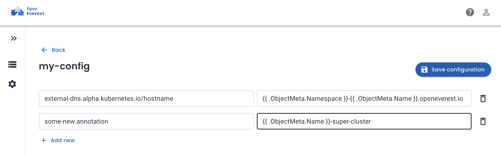

# OpenEverest 1.13: Pod Logs Viewer, Dynamic Load Balancer Annotations and Rebranding

What if you could debug database issues without leaving your browser? No more kubectl commands, no more terminal juggling, no more context switching when every second counts during a production incident.

We're excited to announce [OpenEverest 1.13](https://openeverest.io/documentation/1.13.0/release-notes/OpenEverest-1.13.0-%282026-02-04%29.html), and this release brings something special: a community contribution from Ankit Kurmi from Red Hat to ease the Load Balancer integrations, Viewing Logs directly from the UI and final rebranding from Percona Everest to OpenEverest.

## Ease debugging with Pod Log Viewer

Debugging a database in Kubernetes is usually a pain. When a cluster hits a snag—replication lag, timeouts, or a failed backup—you need the logs immediately.

For many DBAs and developers, this used to mean a frustrating loop:

* **No Access:** Many users don't have `kubectl` access or even know the underlying cluster details. They depend on someone else to "grab the logs."
* **Command Fatigue:** Even with access, nobody likes hunting for pod names or typing `kubectl logs -f ...` for the fifth time that hour.
* **Context Switching:** Jumping between the OpenEverest UI for status and a terminal for logs is a massive time sink during an incident.

If you don't live in a terminal, Kubernetes shouldn't be a barrier to fixing your own database.

In OpenEverest 1.13, we’ve built the logs directly into the UI. No terminal, no `kubeconfig`, and no specialized K8s knowledge required. If you have access to the OpenEverest UI or API, you have the logs.

<video controls width="100%" style="border-radius:8px;">
  <source src="podlog-viewer.webm" type="video/webm">
</video>

This change turns a multi-step chore into a single click. Whether you’re a K8s expert or just someone who needs to see why a query is slow, you now have everything in one place.

**Give it a try:** Head to any database cluster in OpenEverest and click the new **Logs** tab.

## Integrate easier with Dynamic Load Balancer Annotations

If you’re managing dozens of database clusters, you know the struggle of keeping Kubernetes Service annotations in sync. Whether it’s setting up ExternalDNS, AWS Load Balancers, or monitoring tags, these values usually need to be unique for every single cluster.

### The Problem: Manual Annotation Drudge

Previously, you had to manually define annotations for every database Service. If you wanted a unique DNS name like `prod-mysql.example.com`, you had to hardcode it every time.

This led to "Configuration Sprawl" - dozens of nearly identical Service configs that were a nightmare to update and prone to human error.

### The Solution: "Set it and Forget it" Automation
In OpenEverest 1.13, Service annotations now support Go templating. You can now write one policy that automatically injects the correct values based on the database’s metadata.

**How it looks in practice:** 

* Instead of hardcoding a hostname, you use a template: `external-dns.alpha.kubernetes.io/hostname: "{{ .ObjectMeta.Namespace }}-{{ .ObjectMeta.Name }}.example.org"`
* When applied to a cluster named `my-postgres` in the `production` namespace, OpenEverest automatically resolves the Service annotation to: `production-my-postgres.example.org`

### Real-World Examples

You can mix static and dynamic values to automate your entire infrastructure:

* **AWS Load Balancer Setup (Static):** `service.beta.kubernetes.io/aws-load-balancer-type: "nlb"`
* **ExternalDNS (Dynamic):** `external-dns.alpha.kubernetes.io/hostname: "{{ .ObjectMeta.Namespace }}-{{ .ObjectMeta.Name }}.example.org"`
* **Version Tracking (Dynamic):** `custom.annotation/db-version: "{{ .Spec.Engine.Version }}"`

### Behind the Feature: Ankit Kurmi

This automation was brought to life by Ankit Kurmi ([@Ankit152](https://github.com/Ankit152)), a Site Reliability Engineer at Red Hat. Ankit spotted this challenge in our [Good First Issues pool](https://github.com/orgs/openeverest/projects/2) and realized it was the key to making OpenEverest scale for large platform teams.

"Contributing to OpenEverest was surprisingly straightforward; the project’s clear architecture made it easy to plug in my code and see an immediate impact on the infra stack. It’s rare to find an open-source project where you can go from 'fork' to 'merged' with such a low barrier to entry." - Ankit Kurmi

Ankit’s work eliminates the need to create separate configurations for every cluster. Now, platform teams can define a "Golden Path," and every new database created by developers will automatically get the right DNS, SSL certificates, and metadata.

Ready to try it? Head to **Settings** > **Policies & Configurations** in the OpenEverest UI to start building your dynamic templates.

## Rebranding

As you know, OpenEverest was originally called Percona Everest. With the 1.13 release, we’ve finalized our rebranding - logos, docs, and everything in between.

OpenEverest is now a truly vendor-neutral project. We have some [big plans](https://vision.openeverest.io) and even bigger challenges ahead, and we’re looking for more collaborators to help shape the future of cloud-native databases.

### Join the Community

Whether you're a K8s pro or just starting out, there’s a place for you:

* **Contribute:** If you want to dive in like Ankit did, check out our [Good First Issues](https://github.com/orgs/openeverest/projects/2) and [repositories](https://github.com/openeverest).
* **Chat:** Join the conversation in the CNCF Slack (channel: [#openeverest-users](https://cloud-native.slack.com/archives/C09RRGZL2UX)).
* **Explore:** See how we’re simplifying databases at [openeverest.io/#community](https://openeverest.io/#community).

  <a href="https://cloud-native.slack.com/archives/C09RRGZL2UX" target="_blank" rel="noopener noreferrer" style="display:inline-flex;align-items:center;gap:8px;background-color:#4A154B;color:#fff;text-decoration:none;padding:10px 20px;border-radius:6px;font-weight:600;font-size:15px;">
    <svg xmlns="http://www.w3.org/2000/svg" width="20" height="20" viewBox="0 0 122.8 122.8"><path d="M25.8 77.6c0 7.1-5.8 12.9-12.9 12.9S0 84.7 0 77.6s5.8-12.9 12.9-12.9h12.9v12.9zm6.5 0c0-7.1 5.8-12.9 12.9-12.9s12.9 5.8 12.9 12.9v32.3c0 7.1-5.8 12.9-12.9 12.9s-12.9-5.8-12.9-12.9V77.6z" fill="#e01e5a"/><path d="M45.2 25.8c-7.1 0-12.9-5.8-12.9-12.9S38.1 0 45.2 0s12.9 5.8 12.9 12.9v12.9H45.2zm0 6.5c7.1 0 12.9 5.8 12.9 12.9s-5.8 12.9-12.9 12.9H12.9C5.8 58.1 0 52.3 0 45.2s5.8-12.9 12.9-12.9h32.3z" fill="#36c5f0"/><path d="M97 45.2c0-7.1 5.8-12.9 12.9-12.9s12.9 5.8 12.9 12.9-5.8 12.9-12.9 12.9H97V45.2zm-6.5 0c0 7.1-5.8 12.9-12.9 12.9s-12.9-5.8-12.9-12.9V12.9C64.7 5.8 70.5 0 77.6 0s12.9 5.8 12.9 12.9v32.3z" fill="#2eb67d"/><path d="M77.6 97c7.1 0 12.9 5.8 12.9 12.9s-5.8 12.9-12.9 12.9-12.9-5.8-12.9-12.9V97h12.9zm0-6.5c-7.1 0-12.9-5.8-12.9-12.9s5.8-12.9 12.9-12.9h32.3c7.1 0 12.9 5.8 12.9 12.9s-5.8 12.9-12.9 12.9H77.6z" fill="#ecb22e"/></svg>
    Join Slack
  </a>
  <a href="https://github.com/openeverest/openeverest" target="_blank" rel="noopener noreferrer" style="display:inline-flex;align-items:center;gap:8px;background-color:#24292f;color:#fff;text-decoration:none;padding:10px 20px;border-radius:6px;font-weight:600;font-size:15px;">
    <svg xmlns="http://www.w3.org/2000/svg" width="20" height="20" viewBox="0 0 16 16" fill="#fff"><path d="M8 .25a7.75 7.75 0 1 0 0 15.5A7.75 7.75 0 0 0 8 .25zm0 1.5a6.25 6.25 0 0 1 1.97 12.18c-.31.06-.42-.13-.42-.3v-1.05c0-.36-.01-1.02-.49-1.4 1.62-.18 2.5-.88 2.5-2.57 0-.57-.2-1.1-.53-1.49.05-.14.23-.7-.05-1.47 0 0-.44-.14-1.44.54a5.02 5.02 0 0 0-2.62 0C5.93 6.6 5.49 6.74 5.49 6.74c-.28.77-.1 1.33-.05 1.47-.33.39-.53.92-.53 1.49 0 1.69.88 2.39 2.5 2.57-.31.27-.43.67-.47 1.04-.42.19-1.5.52-2.16-.62 0 0-.39-.71-1.13-.76 0 0-.72-.01-.05.45 0 0 .48.23.82 1.08 0 0 .43 1.32 2.49.87v.75c0 .17-.11.36-.42.3A6.25 6.25 0 0 1 8 1.75z"/></svg>
    ⭐ Star the Repo
  </a>

