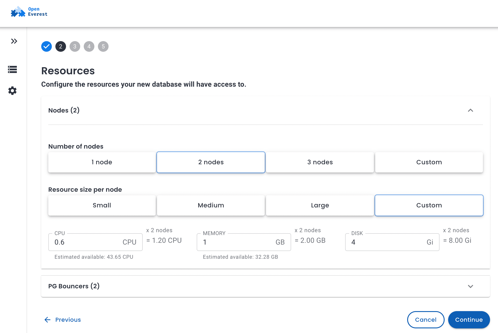
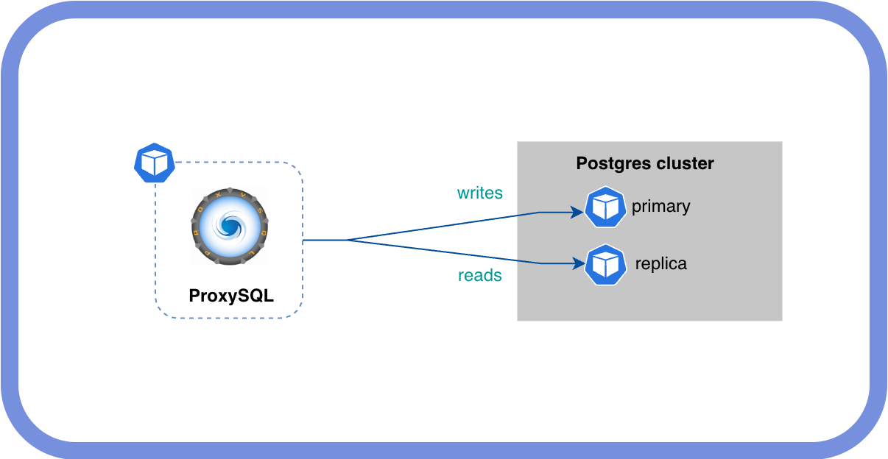

Anyone who ever worked with MySQL knows what ProxySQL is. With 10M+ downloads on DockerHub and 100+ releases, ProxySQL became a de-facto standard for a lot of MySQL deployments. It is well known for its read-write splitting capabilities and smart load balancing.

Since version 3, which had its alpha release in September 2024, ProxySQL [added support for PostgreSQL](https://proxysql.com/blog/proxysql-expands-database-support-to-postgresql-in-version-3-0-0-alpha/). It is quite interesting not only from the technical perspective, but also to see if the PostgreSQL community would start using a MySQL-first proxy as a replacement for well-established tools.

In this post I want to see how ProxySQL works for PostgreSQL clusters deployed with OpenEverest. I'm curious to understand how hard it is to configure manually and whether it is something that can be automated without changing the underlying operator's code.

## OpenEverest, ProxySQL, and Two Smoking Replicas

My goal is to test the concept. In OpenEverest v1 we deploy PostgreSQL clusters using the Percona Operator. It has built-in pgBouncer as a connection pooler and proxy. Adding ProxySQL in front of the PG cluster is either a manual process or a bigger architectural change. In v2 it will be simplified and pluggable. But for now we will do it manually to verify the concept.

Install the latest version of OpenEverest by following the [quick start guide](https://openeverest.io/documentation/current/quick-install.html).

Log into the Web UI and deploy your PostgreSQL cluster. For this experiment we need at least 2 nodes.



We want ProxySQL deployed in front of the PostgreSQL cluster, pointing to the primary and replicas to do a proper read-write split.



OpenEverest shows only the pgBouncer endpoint in the UI. To get the primary and replicas, we need `kubectl`:

```bash
$ kubectl -n everest get svc
NAME                              TYPE        CLUSTER-IP      EXTERNAL-IP   PORT(S)    AGE
...
proxysql-test-ha                  ClusterIP   10.43.94.255    <none>        5432/TCP   9m51s
proxysql-test-replicas            ClusterIP   10.43.188.147   <none>        5432/TCP   9m51s
```

These are the two services we care about. `proxysql-test-ha` points to the primary, `proxysql-test-replicas` to the replicas.

## ProxySQL Configuration

Surprisingly, there is no official Helm chart for ProxySQL. To deploy version 3 and configure it I will use plain YAML manifests.

Before we proceed, we need to create a user in PostgreSQL that ProxySQL will use to monitor backend health. It is optional, but good to have — the monitor detects unreachable backends and stops routing traffic to them before client queries start failing.

```sql
CREATE USER proxysql_monitor WITH PASSWORD '<monitor-pass>';
GRANT CONNECT ON DATABASE postgres TO proxysql_monitor;
```

> With Patroni, run this on the primary — it will replicate to all nodes automatically.

Now let's go through the Kubernetes resources one by one.

### Secret

All passwords live in a [secret.yaml](secret.yaml). Replace every `changeme-*` value before applying:

```bash
kubectl apply -f secret.yaml
```

> **Never commit real passwords.** Use a secrets manager (Vault, Sealed Secrets, External Secrets Operator) in production.

### ConfigMap

ProxySQL's config is stored as a template in a [configmap.yaml](configmap.yaml). The `${VAR}` placeholders are substituted at pod start by an init container — more on that in the Deployment section.

Key sections to understand:

**`pgsql_variables`** — core proxy settings:
- `interfaces="0.0.0.0:6133"` — where ProxySQL listens for incoming PostgreSQL client connections
- `monitor_username` / `monitor_password` — credentials for backend health checks

**`pgsql_servers`** — the two backends. `use_ssl=1` is required here because Patroni's `pg_hba.conf` only accepts SSL connections, so ProxySQL must connect to backends over TLS.

**`pgsql_users`** — every user that applications connect through the proxy with must be listed here with the matching password. ProxySQL does its own authentication check before forwarding the connection — it is not a transparent TCP proxy.

**`pgsql_query_rules`** — read/write split logic, evaluated in `rule_id` order:

| rule_id | Pattern | Hostgroup |
|---------|---------|-----------|
| 1 | `SELECT ... FOR UPDATE` | 10 (primary) |
| 2 | `SELECT` | 20 (replicas) |
| — | everything else | 10 (primary, via `default_hostgroup`) |

`SELECT ... FOR UPDATE` must go to the primary to avoid lock conflicts, so it gets its own rule before the general SELECT rule.

> **Note:** these query rules are intentionally simple — good enough to prove the concept. In production, blindly routing all `SELECT`s to replicas can cause subtle bugs: stale reads after a write, session variables not propagating, or functions with side effects landing on the wrong backend. A production ruleset should be tailored to your application's actual query patterns.

```bash
kubectl apply -f configmap.yaml
```

### Deployment

The [deployment.yaml](deployment.yaml) uses an init container to render `proxysql.cnf` from the template before ProxySQL starts. `awk`'s built-in `ENVIRON[]` does the substitution — no extra packages or network access needed:

```awk
awk '{
  gsub(/\$\{PROXYSQL_ADMIN_PASS\}/, ENVIRON["PROXYSQL_ADMIN_PASS"])
  ...
  print
}' /config-template/proxysql.cnf.tmpl > /config/proxysql.cnf
```

The `--initial` flag forces ProxySQL to rebuild its internal SQLite database from `proxysql.cnf` on every pod start. Without it, ProxySQL would ignore the ConfigMap after the first start and use whatever it last persisted to disk — which makes config changes hard to reason about in Kubernetes.

```bash
kubectl apply -f deployment.yaml
```

### Service

A [service.yaml](service.yaml) with `ClusterIP` is enough for testing. It maps port `5432` to ProxySQL's PostgreSQL listener (`6133`) and port `6132` to the admin interface:

```bash
kubectl apply -f service.yaml
```

## Testing

### Basic Connectivity

Verify the connection and confirm which backend answered:

```bash
kubectl run psql-test --rm -it --restart=Never \
  --image=postgres:17 \
  --namespace=everest \
  --env="PGPASSWORD=<your-password>" \
  -- psql -h proxysql -p 5432 -U postgres -d postgres \
     -c "SELECT inet_server_addr(), pg_is_in_recovery();"
```

`pg_is_in_recovery()` returns `false` on the primary and `true` on a replica.

To inspect ProxySQL's view of backends and query stats, connect to the admin interface:

```bash
kubectl run psql-admin --rm -it --restart=Never \
  --image=postgres:17 --namespace=everest \
  --env="PGPASSWORD=<your-radmin-pass>" \
  -- psql -h proxysql -p 6132 -U radmin -d admin
```

```sql
admin=# SELECT * FROM pgsql_servers;
 hostgroup_id |        hostname        | port | status | weight | use_ssl | comment
--------------+------------------------+------+--------+--------+---------+----------
           10 | proxysql-test-ha       | 5432 | ONLINE |   1000 |       1 | primary
           20 | proxysql-test-replicas | 5432 | ONLINE |   1000 |       1 | replicas
(2 rows)

admin=# SELECT hostgroup, digest_text, count_star
          FROM stats.stats_pgsql_query_digest
          ORDER BY count_star DESC LIMIT 10;
 hostgroup |                  digest_text                   | count_star
-----------+------------------------------------------------+------------
        20 | SELECT inet_server_addr(),pg_is_in_recovery(); |          1
(1 row)
```

The query landed in hostgroup 20 — the replicas. Working.

### Read/Write Split

```bash
# Should return pg_is_in_recovery = true (replica)
kubectl run psql-test --rm -it --restart=Never --image=postgres:17 -n everest \
  --env="PGPASSWORD=<pass>" \
  -- psql -h proxysql -p 5432 -U postgres -d postgres \
     -c "SELECT inet_server_addr(), pg_is_in_recovery();"

# Should return pg_is_in_recovery = false (primary)
kubectl run psql-test --rm -it --restart=Never --image=postgres:17 -n everest \
  --env="PGPASSWORD=<pass>" \
  -- psql -h proxysql -p 5432 -U postgres -d postgres \
     -c "CREATE TABLE IF NOT EXISTS proxysql_test (id serial); SELECT inet_server_addr(), pg_is_in_recovery();"
```

```
 inet_server_addr | pg_is_in_recovery
------------------+-------------------
 10.42.2.6        | f
```

The `CREATE TABLE` was routed to the primary (`f` = false = not in recovery). Confirm routing from the admin interface:

```sql
SELECT hostgroup, digest_text, count_star
  FROM stats.stats_pgsql_query_digest
  ORDER BY last_seen DESC LIMIT 10;
```

### Connection Multiplexing

Connection pooling (what pgBouncer does) reuses backend connections across client requests in a round-robin fashion. Connection multiplexing goes further — a single backend connection can serve multiple client sessions interleaved, as long as none of them are inside an open transaction. This means ProxySQL can serve far more concurrent clients than there are backend connections, which reduces load on PostgreSQL significantly.

To observe it in action, first initialize the pgbench schema:

```bash
kubectl run pgbench-init --rm -it --restart=Never --image=postgres:17 -n everest \
  --env="PGPASSWORD=<pass>" \
  -- pgbench -h proxysql -p 5432 -U postgres -d postgres -i
```

Then run 20 concurrent clients through ProxySQL:

```bash
kubectl run pgbench --rm -it --restart=Never --image=postgres:17 -n everest \
  --env="PGPASSWORD=<pass>" \
  -- pgbench -h proxysql -p 5432 -U postgres -d postgres \
     --client=20 --jobs=4 --time=30 --select-only
```

While that runs, check backend connection counts in a second terminal:

```bash
kubectl run psql-admin --rm -it --restart=Never --image=postgres:17 -n everest \
  --env="PGPASSWORD=<radmin-pass>" \
  -- psql -h proxysql -p 6132 -U radmin -d admin \
     -c "SELECT hostgroup, srv_host, ConnUsed, ConnFree, ConnOK FROM stats.stats_pgsql_connection_pool;"
```

`--client=20` opens 20 concurrent client connections, `--select-only` routes them all to the replica hostgroup. `ConnUsed` should be significantly less than 20 if multiplexing is working.

## Conclusion

The concept works — read/write splitting, connection multiplexing, and SSL backend connections all function correctly with ProxySQL 3 and a Patroni-managed PostgreSQL cluster on Kubernetes. But let's be honest about what it took to get here:

1. **Find the right services** — OpenEverest's UI only shows the pgBouncer endpoint. The primary and replica services have to be discovered manually via `kubectl`.
2. **Create the monitor user** — a dedicated PostgreSQL user needs to be created out-of-band before ProxySQL is deployed.
3. **Deploy and configure ProxySQL** — no official Helm chart exists, so this means writing and maintaining your own manifests, including a config template, init container, and secret management.
4. **Register every application user twice** — once in PostgreSQL, and again in the ProxySQL `pgsql_users` config. Any new user or password rotation requires updating both.
5. **Figure out SSL** — Patroni's `pg_hba.conf` requires SSL for backend connections, which is not obvious and causes confusing errors until `use_ssl=1` is set on the servers.

None of these steps is particularly hard in isolation, but together they add up to a setup that is easy to get wrong and annoying to maintain. In v2 this will be automated through a new plugin system. Stay tuned.
