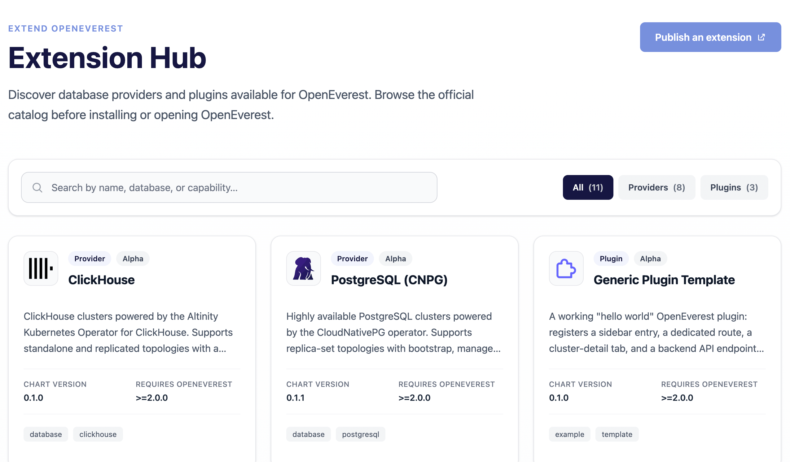

Since the introduction of the modular core in version 2, we have been moving extremely fast. Writing a separate blog post for every provider, plugin, and release update is simply too much. So we decided to start a series of blog posts called OpenEverest Pulse, where we share concise news about providers, plugins, and OpenEverest itself.

## OpenEverest 2.0.0-dev.2 release

We shipped [OpenEverest 2.0.0-dev.2](https://github.com/openeverest/openeverest/releases/tag/v2.0.0-dev.2), the second Developer Preview of v2. This release was a real community effort — 21 external contributors put their time and energy into it. Highlights:

- **`everestctl` is now a real day-2 CLI for v2.** The whole v2 resource model is drivable from the command line, with consistent `--namespace/-n`, `--wait`, and JSON output. New command groups: `auth`, `instance`, `backup`, `restore`, `backup-storage` (`bs`), `backup-class` (`bc`), and `provider` (`prov`). Contributed by [@VijetaPriya47](https://github.com/VijetaPriya47) through the [LFX Mentorship program](https://mentorship.lfx.linuxfoundation.org/).
- **Point-in-time recovery, end to end.** PITR is now a first-class part of the v2 model: an authoritative recovery window in status, and `PointInTime` as a proper data source you can use to seed a brand-new instance.
- **Instance presets.** The new `InstancePreset` CRD captures a ready-to-use instance shape (provider, version, topology, sizing, storage class) so users can pick a preset instead of filling in a form.
- **Plugin hub, built in.** The v2 UI now ships with a plugin hub by default, so users can discover and find installation instructions right from OpenEverest. The catalog is powered by [openeverest/hub](https://github.com/openeverest/hub) — the place where the community and maintainers can publish their own plugins and providers.
- **Schema-driven secrets and config maps.** Providers declare the secrets and config maps they expect, and the API validates payloads against that schema before they reach Kubernetes.
- **Auditable event stream with replay.** `GET /v1/events` no longer drops events across a reconnect — every event carries a sequence and the acting user.

> ⚠️ **Developer Preview — not for production.** 2.0.0-dev.2 is not feature-complete and contains breaking changes to every CRD, the HTTP API, and the provider-runtime SDK. There is no upgrade path from Developer Preview 1 or from v1 — install it on a fresh cluster. Installation is Helm-only for this preview. See the [release notes](https://github.com/openeverest/openeverest/releases/tag/v2.0.0-dev.2) for the full breaking-change mapping.

## Extension Hub on the website

Thanks to our contributor @amh1k, providers and plugins now show up not only in the OpenEverest Web UI, but also on the website at [openeverest.io/extensions](https://openeverest.io/extensions).

It lists the extensions added by the community and the OpenEverest maintainers.

## Provider for MariaDB updates

At the beginning of August we introduced the [Provider for MariaDB](https://github.com/openeverest/provider-mariadb), built on top of [mariadb-operator/mariadb-operator](https://github.com/mariadb-operator/mariadb-operator). The operator is so feature-rich that adding everything it offers to the provider will take a while — but we are making steady progress.

This month we added:
1. A new topology based on Galera for high availability, along with node affinity for both Galera and standalone deployments (PR #45).
2. On-demand backups and restores (PR #48).
3. Scheduled backups (PR #54).

## Introducing Provider for Cassandra

Our community [raised a request](https://github.com/openeverest/openeverest/issues/1867) for Cassandra support in OpenEverest. The [k8ssandra-operator](https://github.com/k8ssandra/k8ssandra-operator) is well known in the industry and widely used in production, so it was an easy choice as the base for the provider.

We scaffolded it just a week ago, so it is not feature-rich yet — but it is a start, and more is on the way.

## Provider for Valkey updates

The community Valkey operator is under heavy development, with new features and versions landing constantly. It is still early days, but we are keeping pace.

This week we bumped the [Provider for Valkey](https://github.com/openeverest/provider-valkey) to operator version 0.5.0 and added TLS transport encryption:

- Upgraded the underlying valkey-operator to 0.5.0.
- Added TLS transport encryption — enabled by default for all Valkey clusters.

## Provider for CloudNativePG updates

The [Provider for CloudNativePG](https://github.com/adityapimpalkar/provider-cloudnative-pg), built on [CloudNativePG](https://cloudnative-pg.io/), also moved forward this month (thanks to @adityapimpalkar):

- **Restore support.** The provider can now perform a full restore from a backup using CloudNativePG together with the Barman plugin. 
- **Integration tests migrated to Chainsaw.** Entire integration suite moved from Kuttl to Chainsaw for a cleaner assertion model and more modern end-to-end testing.
- **Releases.** v0.2.1 (Aug 14) was a packaging release; v0.2.2 (Aug 20) fixed Helm chart dependencies for release builds and test-pipeline compatibility.

## Try v2 and join the community

OpenEverest v2 is moving fast, and the best way to shape it is to get hands-on. Spin up the 2.0.0-dev.2 Developer Preview on a fresh cluster, try the new `everestctl`, instance presets, and point-in-time recovery, and tell us what works and what doesn't. Have an idea for a provider or plugin? Come build it with us.

  <a href="https://openeverest.io/documentation/2.0.0-dev.2/quick-install.html" class="inline-flex items-center justify-center px-6 py-3 rounded-full font-semibold text-white bg-[#161641] hover:bg-[#7790DE] transition-colors" target="_blank" rel="noopener">Try v2.0.0-dev.2 &rarr;</a>
  <a href="/community/" class="inline-flex items-center justify-center px-6 py-3 rounded-full font-semibold text-[#161641] border-2 border-[#161641] hover:bg-[#161641] hover:text-white transition-colors">Join the community</a>

