This walkthrough gets OpenEverest running on a GKE cluster and walks you through creating a PostgreSQL database you will connect to. By the end you'll have the platform installed, a database provisioned from the UI, and a working connection - either through port forwarding or a load balancer. Along the way we'll also cover GKE storage classes and how to keep database traffic on your private network with an internal load balancer.

You'll need a **Google Cloud account with billing enabled** and a **basic understanding of Kubernetes** for this guide to be useful. If you're just getting started, you can also try it with a [free trial account](https://cloud.google.com/free).

**In this guide:**

- [Prerequisites](#prerequisites)
- [Configure Google Cloud](#1-configure-google-cloud)
- [Create GKE cluster](#2-create-cluster)
  - [GKE storage classes](#gke-storage-classes)
- [Install OpenEverest](#3-install-openeverest)
  - [Port forwarding](#31-port-forwarding)
  - [Load balancer](#32-load-balancer)
- [Create a database instance](#4-create-a-database-instance)
- [Connect to the database](#5-connect-to-the-database)
  - [Via port forwarding](#via-port-forwarding)
  - [Via load balancer](#via-load-balancer)
    - [External load balancer](#external-load-balancer)
    - [Internal load balancer](#internal-load-balancer)
- [Cleanup](#6-cleanup)

## Prerequisites

You'll need the following tools installed:

- **[gcloud](https://cloud.google.com/cli)** - to manage your Google Cloud resources from the terminal
- **[kubectl](https://kubernetes.io/docs/tasks/tools/)** - to interact with your Kubernetes cluster
- **[everestctl](https://openeverest.io/documentation/current/quick-install.html)** - the OpenEverest CLI

Install `gcloud` on macOS:

```bash
brew install --cask gcloud-cli
export PATH=$HOMEBREW_PREFIX/share/google-cloud-sdk/bin:"$PATH"
```

Install `everestctl` on macOS:

```bash
brew tap openeverest/tap
brew install everestctl
```

On Linux or Windows, follow the [everestctl install docs](https://openeverest.io/documentation/current/quick-install.html).

A quick sanity check to see if everything is installed correctly:

```bash
gcloud version
kubectl version --client
everestctl version --client-only
```

---

## 1. Configure Google Cloud

### Log in and set up

`gcloud auth login` opens a browser window so you can pick your Google Cloud account. After that, your shell should look something like this:

```bash
gcloud auth login
Your browser has been opened to visit:
    https://accounts.google.com/o/oauth2/auth?code_challenge=...

You are now logged in as [you@example.com].
Your current project is [No project].

# To set the active project, run:
    $ gcloud config set project PROJECT_ID
```

We'll also need to install `kubectl` to create and manage our GKE clusters.

```bash
gcloud components install kubectl
```

Next, create a new project called `openeverest-test`:

```bash
gcloud projects create openeverest-test
```

Or use an existing project - list what you have with:

```bash
gcloud projects list
```

Copy the project ID you want and run:

```bash
gcloud config set project <YOUR_PROJECT_ID>
```

> ***Important!*** Whichever project you pick, make sure the Kubernetes Engine API is enabled. Here's how to [turn it on](https://docs.cloud.google.com/kubernetes-engine/docs/deploy-app-cluster#before-you-begin).

## 2. Create cluster

This creates a zonal cluster with 2 worker nodes (`e2-standard-4`, 4 vCPU / 16 GB each) in `us-central1-a`. Fine for a test run on a free trial you may need a smaller machine type or fewer nodes to stay within quota.

```bash
gcloud container clusters create <CLUSTER_NAME> \
  --project=openeverest-test \
  --zone=us-central1-a \
  --num-nodes=2 \
  --machine-type=e2-standard-4 \
  --disk-type=pd-standard \
  --disk-size=30 \
  --no-enable-autoupgrade
Creating cluster openeverest-gke-demo in us-central1-a... Cluster is being configured and may take several minutes to finish.
Use 'gcloud container clusters list' to see your clusters.

NAME                   LOCATION       MASTER_VERSION  MASTER_IP      MACHINE_TYPE   NODE_VERSION    NUM_NODES  STATUS
openeverest-gke-demo   us-central1-a  1.xx.3-gke.xxxx 35.xxx.xx.xx   e2-standard-4 1.29.3-gke.1260  2          RUNNING

```

If you're on the GCP free trial, check the quotas for the region where you want to create the cluster. A few errors I hit before getting a stable cluster running:
<details>
  <summary>Regional quota error</summary>

  > (gcloud.container.clusters.create) ResponseError: code=403, message=Insufficient project quota to satisfy request: resource "CPUS_ALL_REGIONS": request requires '36.0' and is short '24.0'. project has a quota of '12.0' with '12.0' available. View and manage quotas at https://console.cloud.google.com/iam-admin/quotas?usage=USED
</details>


<details>
  <summary>SSD quota error</summary>

  > Insufficient quota to satisfy the request: Not all instances running in IGM after 38.19512474s. Expected 3, running 1, transitioning 2. Current errors: [GCE_QUOTA_EXCEEDED]: Instance 'gke-cluster-1-default-pool-d2c0964a-2fkn' creation failed: Quota 'SSD_TOTAL_GB' exceeded. Limit: 250.0 in region us-central1.
</details>

> ***Note:*** This command doesn't guarantee a stable cluster in every region. You might need a bit of trial and error. I found tweaking `disk-type` and `disk-size` helped find a sweet spot - just ***don't set them too low***, or your database pods may struggle.

In the Cloud Console, you should see the cluster in a **READY** state.

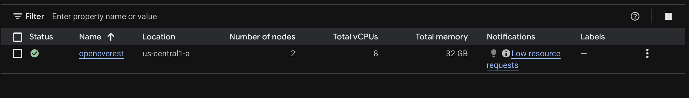

Connect to the cluster from the CLI. In the console, click **Connect**:

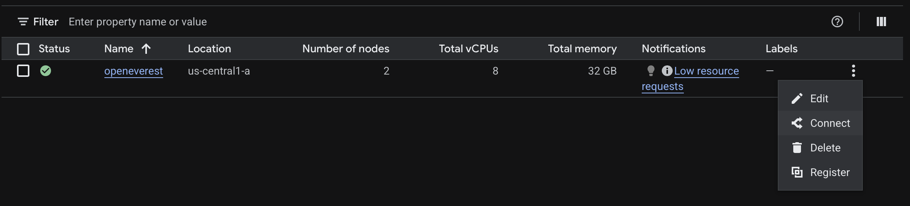

Copy the command and run it in your terminal. It configures `kubectl` to talk to your cluster (you'll see something like `kubeconfig entry generated for ...`):

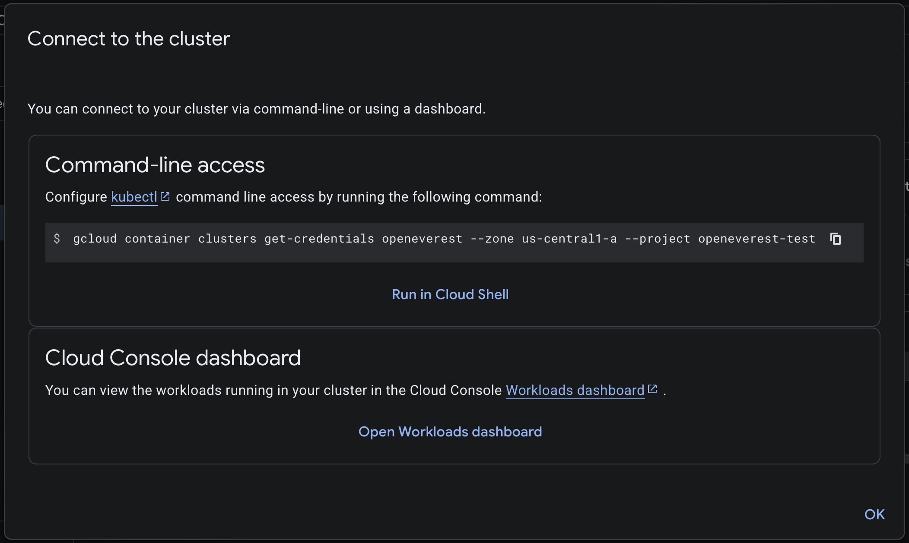

You should see the following output:

```bash
gcloud container cluster get-credentials openeverest --zone us-central1-a --project openeverest-test
Fetching cluster endpoint and auth data
kubeconfig entry generated for openeverest
```

Confirm both nodes are up:

```bash
kubectl get nodes
NAME                                    STATUS   ROLES    AGE   VERSION
gke-openeverest-gke-demo-default-pool-1a2b3cde   Ready    <none>   2m    v1.xx.3-gke.xxxx
gke-openeverest-gke-demo-default-pool-4f5g6hij   Ready    <none>   2m    v1.xx.3-gke.xxxx
```

### GKE storage classes

GKE can provision persistent disks for your database PVCs through Kubernetes StorageClasses. Before you create a database, check what's available on your cluster:

```bash
kubectl get storageclass
```

Once the [Compute Engine persistent disk CSI driver](https://cloud.google.com/kubernetes-engine/docs/how-to/persistent-volumes/gce-pd-csi-driver) is enabled, GKE installs two storage classes automatically:

- `standard-rwo`
  - Disk type: balanced persistent disk (`pd-balanced`)
  - Good for: general workloads, lower cost than SSD

- `premium-rwo`
  - Disk type: SSD persistent disk (`pd-ssd`)
  - Good for: PostgreSQL and other latency-sensitive workloads

Use `kubectl get storageclass` to verify that `standard-rwo` is available for you.

If you don't see `standard-rwo` / `premium-rwo`, enable the CSI driver:

```bash
gcloud container clusters update <CLUSTER_NAME> \
  --zone=us-central1-a \
  --update-addons=GcePersistentDiskCsiDriver=ENABLED
```

For production PostgreSQL I'd use `premium-rwo`. Also confirm volume expansion is enabled if you plan to grow disks later:

```bash
kubectl get storageclass premium-rwo -o jsonpath='{.allowVolumeExpansion}{"\n"}'
```

Need a custom class? The example below is adapted from [GKE's Compute Engine persistent disk CSI driver docs](https://cloud.google.com/kubernetes-engine/docs/how-to/persistent-volumes/gce-pd-csi-driver#create_a_storageclass) - same provisioner and structure, with `type: pd-ssd` instead of the doc's default `pd-balanced`:

```yaml
# postgres-ssd-sc.yaml
apiVersion: storage.k8s.io/v1
kind: StorageClass
metadata:
  name: postgres-ssd
provisioner: pd.csi.storage.gke.io
parameters:
  type: pd-ssd
volumeBindingMode: WaitForFirstConsumer
allowVolumeExpansion: true
```

```bash
kubectl apply -f postgres-ssd-sc.yaml
```

## 3. Install OpenEverest

There are two ways to reach the OpenEverest UI: **port forwarding** (quick, nothing extra to provision) or a **load balancer** (public IP, no tunnel to keep open). Pick one before you install - the commands are nearly identical, with one extra flag for the load balancer path.

We'll use `everestctl` in headless mode to skip the interactive wizard and keep everything reproducible from the terminal.

#### 3.1 Port forwarding

```bash
everestctl install \
  --namespaces everest \
  --operator.postgresql=true \
  --operator.mongodb=true \
  --operator.mysql=true \
  --skip-wizard
ℹ️  Installing Everest version 1.15.2

✅  Installing Everest Helm chart
✅  Ensuring Everest API deployment is ready
✅  Ensuring Everest operator deployment is ready
✅  Ensuring OLM components are ready
✅  Ensuring Everest CatalogSource is ready
✅  Ensuring monitoring stack is ready
✅  Provisioning database namespace 'everest'

🚀  Thank you for installing Everest (v1.15.2)!

Follow the steps below to get started:

1 ➜ RETRIEVE THE INITIAL ADMIN PASSWORD:
Run the following command to get the initial admin password:

      everestctl accounts initial-admin-password

⚠️  NOTE: The initial password is stored in plain text. For security, change it immediately using the following command:

      everestctl accounts set-password --username admin

2 ➜ ACCESS THE EVEREST UI:
To access the web UI, set up port-forwarding and visit http://localhost:8080 in your browser:

      kubectl port-forward -n everest-system svc/everest 8080:8080
```

This provisions OpenEverest along with database operators for PostgreSQL, MySQL, and MongoDB - specialized Kubernetes controllers that handle database lifecycle operations. It can take a few minutes while images are pulled and controllers come up.

OpenEverest creates an initial admin account during install. On a fresh cluster, you can grab the bootstrap password with:

```bash
everestctl accounts initial-admin-password
5S0HB20FHFGUIJtsyeekJotdJ2QIcqYP74jFIa2xmNqLDpMgJ45aDP8BVbzBLacn
```

That gives you the temporary password for your first login. For anything beyond a quick test, change it right away - especially in production:

```bash
everestctl accounts set-password --username admin
? Provide a new password: *********
? Confirm a new password: *********
✅ Password for user 'admin' has been set successfully
```

Port-forward the UI (leave this terminal running):

```bash
kubectl port-forward svc/everest 8080:8080 -n everest-system
```

Then open [http://localhost:8080](http://localhost:8080) in your browser.

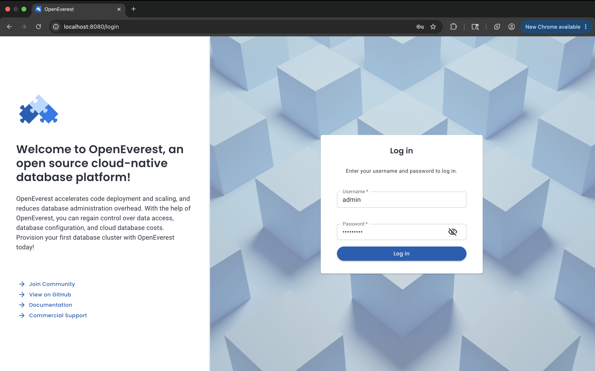

Log in with the credentials you set earlier.

#### 3.2 Load balancer

Same install as above, but add `--helm.set server.service.type=LoadBalancer` so GKE provisions an external IP for the UI:

```bash
everestctl install \
  --namespaces everest \
  --operator.postgresql=true \
  --operator.mongodb=true \
  --operator.mysql=true \
  --helm.set server.service.type=LoadBalancer \
  --skip-wizard
```

Run the same password steps from [3.1](#31-port-forwarding) (`initial-admin-password`, then `set-password`).

GKE can take a minute or two to assign an external IP. Watch until `EXTERNAL-IP` is no longer `<pending>`:

```bash
kubectl get svc everest -n everest-system -w
```

Then open `http://<EXTERNAL-IP>:8080` in your browser and log in.

## 4. Create a database instance

Click **Create database** and pick one of the three providers. For this walkthrough, I'm creating a small PostgreSQL instance.

I'll keep the auto-generated name, pick a version, and leave the namespace as the default `everest`.

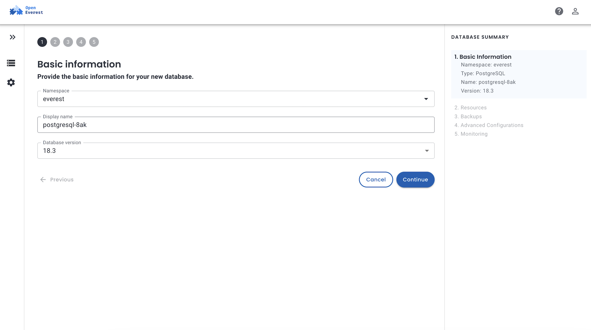

For resources, a single node with the smallest profile is plenty - we're just going to connect and verify it works. Disk size is set here on the **Resources** page (25 Gi in my screenshot).

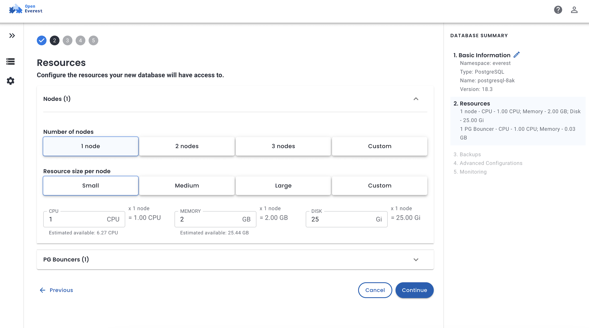

Stick with the defaults for everything else on that page unless you need load balancer or exposure settings, then click **Create database**. The [OpenEverest docs](https://openeverest.io/docs/) go deeper on tuning these if you need to.

Once the database is provisioned, you can click on the `Components` tab and view the individual Kubernetes workloads backing the PostgreSQL cluster. It should all be up and running.

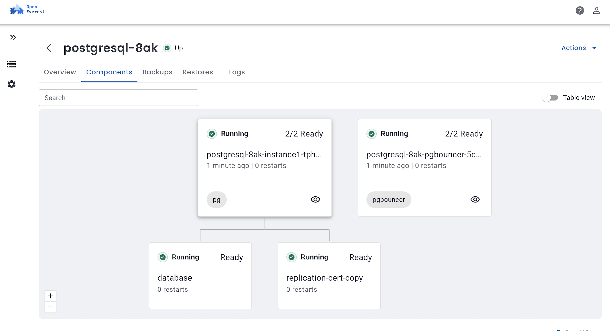

> ***Note:*** If a node gets stuck in `Pending` or `Initializing`, check the pod events:

```bash
# How many nodes?
kubectl get nodes

# Why a pod is pending (look at Events at the bottom)
kubectl describe pod <pod_name> -n <namespace>
```

## 5. Connect to the database

#### Via Port forwarding

Your PgBouncer service name will differ from mine - find yours with:

```bash
kubectl get svc -n everest | grep pgbouncer
```

Forward it to your machine (replace the service name below):

```bash
kubectl port-forward -n everest svc/<YOUR-DB>-pgbouncer 5432:5432
```

Leave that running, then copy the connection string from the **Overview** tab in the UI:

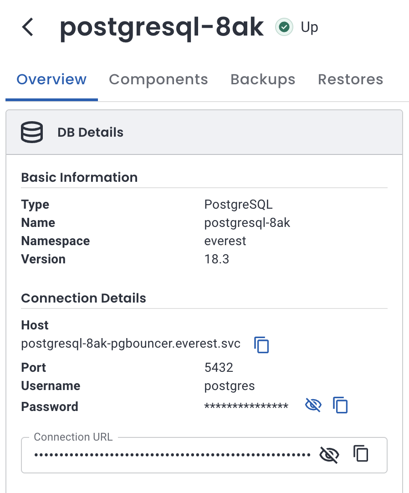

Swap the host from `postgresql-<...>-pgbouncer.everest.svc` to `localhost` - everything else (including the password) stays the same:

```bash
psql "postgres://postgres:<YOUR_PASSWORD>@localhost:5432/postgres"
psql (16.1, server 16.0)
SSL connection (protocol: TLSv1.3, cipher: TLS_AES_256_GCM_SHA384, bits: 256)
Type "help" for help.

postgres=#
```

#### Via load balancer

Exposing a database with a load balancer gives it a stable IP outside the Kubernetes cluster network. GKE supports **external** (internet-facing) and **internal** (VPC-only) passthrough Network Load Balancers. OpenEverest handles both through the same load balancer configuration - you control the behavior with Service annotations.

You can set this during database creation on the **Advanced Configurations** page, or afterward via **Edit Advanced configuration** on an existing instance. In both cases, set **Exposure method** to **Load balancer**, pick a configuration, and optionally restrict **Source range**.

> OpenEverest maps **Source range** to Kubernetes `loadBalancerSourceRanges`. On GKE, that also drives VPC firewall rules for the load balancer. Values must be CIDR blocks - use `/32` for a single IP (e.g. `203.0.113.25/32`), not a bare address.

##### External load balancer

Use this when clients outside your VPC need to reach the database - testing from your laptop, or an app on the public internet with strict IP filtering.

###### Create a load balancer config

Go to **Settings → Policies**, then in **Load Balancer Configuration** click **Configure**.

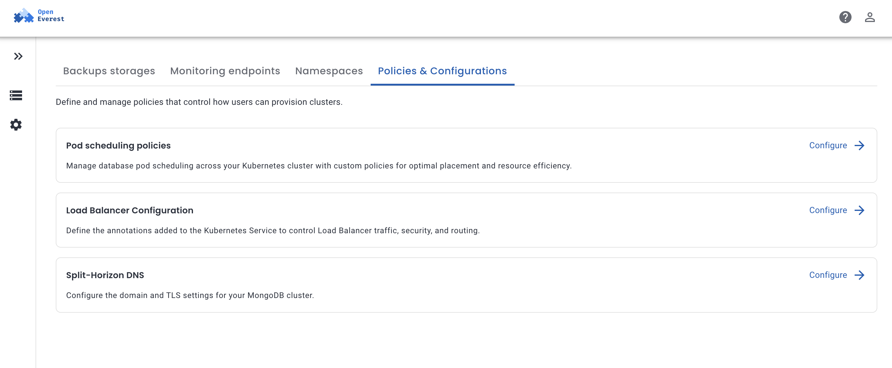

Click **Create configuration**, give it a name, and leave annotations empty for a default external LB on GKE. If you need a reserved static IP, first create one in the same region as your cluster:

```bash
gcloud compute addresses create everest-db-ip --region=us-central1
```

Then add this annotation (the value is the **address resource name**, not the IP itself):

```
networking.gke.io/load-balancer-ip-addresses: everest-db-ip
```

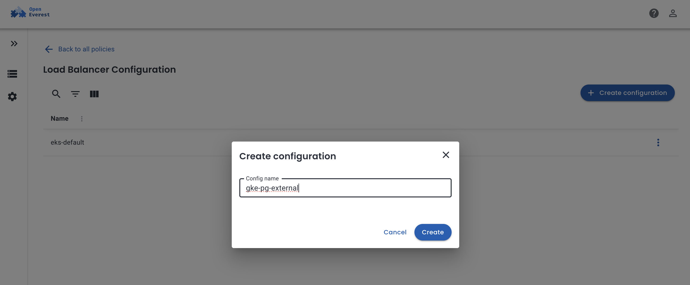

Go back to your database and open **Edit Advanced configuration** (or set this on the **Advanced Configurations** page during creation):

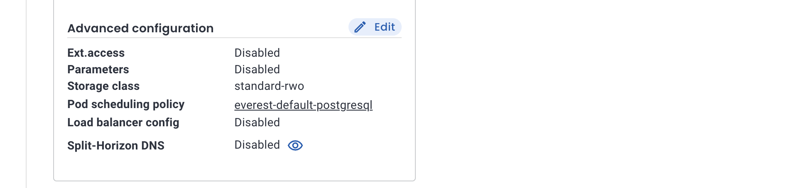

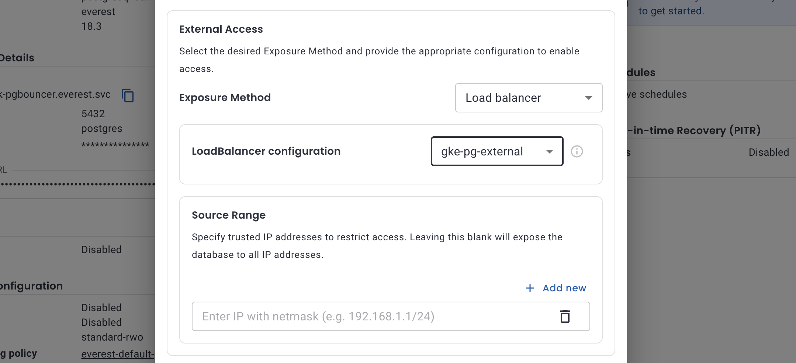

Set **Exposure method** to **Load balancer** and pick the configuration you just created.

> Restrict **Source range** to your public IP (e.g. `203.0.113.25/32`).

Click **Save** and wait for the operator to reconcile (usually 1–5 minutes).

###### Get the external IP

```bash
kubectl get svc <YOUR-DB>-pgbouncer -n everest -w
NAME                TYPE           CLUSTER-IP      EXTERNAL-IP    PORT(S)          AGE
<YOUR-DB>-pgbouncer   LoadBalancer   10.xx.x.xxx    35.xxx.xx.xx   5432:32713/TCP,   4m33s
```

Wait until `EXTERNAL-IP` is a public IP (not `pending`):

The Everest UI **Host** should also update from `*.everest.svc` to that IP once ready.

Copy the connection string from **Overview** - the host will already point at the external IP:

```bash
psql "postgres://postgres:<YOUR_PASSWORD>@<EXTERNAL-IP>:5432/postgres"
SSL connection (protocol: TLSv1.3, cipher: TLS_AES_256_GCM_SHA384, bits: 256, compression: off)
Type "help" for help.

postgres=# 
```

##### Internal load balancer

If your apps run in the same VPC - another GKE cluster, a GCE VM, Cloud Run with a VPC connector, an internal load balancer keeps the database off the public internet. The IP is still outside the Kubernetes cluster, but only routable within your VPC.

Create a load balancer configuration the same way, but add:

```
networking.gke.io/load-balancer-type: Internal
```


Attach it the same way - **Exposure method → Load balancer**, pick your internal config, and save.

> Set **Source range** to your VPC subnet (e.g. `10.128.0.0/20`) so only in-network clients can connect. Same CIDR format rules apply.

After reconciliation:

```bash
kubectl get svc <YOUR-DB>-pgbouncer -n everest -w
```

The `EXTERNAL-IP` column will show a **private** address (e.g. `10.128.0.5`) - that's expected for internal LBs in Kubernetes. Connect from a VM in the same VPC:

```bash
psql "postgres://postgres:<YOUR_PASSWORD>@<INTERNAL-IP>:5432/postgres"
```

SSH into the VM inside the network to reach this (`gcloud compute ssh` works well for a quick test).

The [OpenEverest load balancer docs](https://openeverest.io/documentation/current/networking/load_balancer_config.html) cover annotations in more detail, including Go templates for multi-cluster setups. For GKE-specific networking (Shared VPC, cross-region access), see Google's guide on [internal load balancing](https://cloud.google.com/kubernetes-engine/docs/how-to/internal-load-balancing).

## 6. Cleanup

A running GKE cluster can cost around $1/hour, plus Compute Engine charges for the underlying nodes. If you're done experimenting, tear it down:

```bash
everestctl uninstall
gcloud container clusters delete <CLUSTER_NAME> --zone=us-central1-a
```

Deleting the cluster alone won't remove everything - persistent disks, load balancers, and external IPs can linger and keep billing. Double-check these before you walk away:

1. ***Persistent Disks (Storage):*** Go to Compute Engine > Storage > Disks, locate the disks associated with your GKE cluster, and delete them.
2. ***Network Load Balancers:*** Go to Network Services > Load Balancing. Inspect the list for load balancers dynamically created for your cluster and delete them.
3. ***External IP Addresses:*** VPC Network > IP addresses, look for IPs that are no longer associated with any resource, and release them.


## Join the Community

* **Contribute:** If you want to dive in, check out our [Good First Issues](https://github.com/orgs/openeverest/projects/2) and [repositories](https://github.com/openeverest).
* **Chat:** Join the conversation in the CNCF Slack (channel: [#openeverest-users](https://cloud-native.slack.com/archives/C09RRGZL2UX)).
* **Explore:** See how we're simplifying databases at [openeverest.io/#community](https://openeverest.io/#community).
<div style="display:flex;gap:12px;margin-top:24px;flex-wrap:wrap;">
  <a href="https://cloud-native.slack.com/archives/C09RRGZL2UX" target="_blank" rel="noopener noreferrer" style="display:inline-flex;align-items:center;gap:8px;background-color:#4A154B;color:#fff;text-decoration:none;padding:10px 20px;border-radius:6px;font-weight:600;font-size:15px;">
    <svg xmlns="http://www.w3.org/2000/svg" width="20" height="20" viewBox="0 0 122.8 122.8"><path d="M25.8 77.6c0 7.1-5.8 12.9-12.9 12.9S0 84.7 0 77.6s5.8-12.9 12.9-12.9h12.9v12.9zm6.5 0c0-7.1 5.8-12.9 12.9-12.9s12.9 5.8 12.9 12.9v32.3c0 7.1-5.8 12.9-12.9 12.9s-12.9-5.8-12.9-12.9V77.6z" fill="#e01e5a"/><path d="M45.2 25.8c-7.1 0-12.9-5.8-12.9-12.9S38.1 0 45.2 0s12.9 5.8 12.9 12.9v12.9H45.2zm0 6.5c7.1 0 12.9 5.8 12.9 12.9s-5.8 12.9-12.9 12.9H12.9C5.8 58.1 0 52.3 0 45.2s5.8-12.9 12.9-12.9h32.3z" fill="#36c5f0"/><path d="M97 45.2c0-7.1 5.8-12.9 12.9-12.9s12.9 5.8 12.9 12.9-5.8 12.9-12.9 12.9H97V45.2zm-6.5 0c0 7.1-5.8 12.9-12.9 12.9s-12.9-5.8-12.9-12.9V12.9C64.7 5.8 70.5 0 77.6 0s12.9 5.8 12.9 12.9v32.3z" fill="#2eb67d"/><path d="M77.6 97c7.1 0 12.9 5.8 12.9 12.9s-5.8 12.9-12.9 12.9-12.9-5.8-12.9-12.9V97h12.9zm0-6.5c-7.1 0-12.9-5.8-12.9-12.9s5.8-12.9 12.9-12.9h32.3c7.1 0 12.9 5.8 12.9 12.9s-5.8 12.9-12.9 12.9H77.6z" fill="#ecb22e"/></svg>
    Join Slack
  </a>
  <a href="https://github.com/openeverest/openeverest" target="_blank" rel="noopener noreferrer" style="display:inline-flex;align-items:center;gap:8px;background-color:#24292f;color:#fff;text-decoration:none;padding:10px 20px;border-radius:6px;font-weight:600;font-size:15px;">
    <svg xmlns="http://www.w3.org/2000/svg" width="20" height="20" viewBox="0 0 16 16" fill="#fff"><path d="M8 .25a7.75 7.75 0 1 0 0 15.5A7.75 7.75 0 0 0 8 .25zm0 1.5a6.25 6.25 0 0 1 1.97 12.18c-.31.06-.42-.13-.42-.3v-1.05c0-.36-.01-1.02-.49-1.4 1.62-.18 2.5-.88 2.5-2.57 0-.57-.2-1.1-.53-1.49.05-.14.23-.7-.05-1.47 0 0-.44-.14-1.44.54a5.02 5.02 0 0 0-2.62 0C5.93 6.6 5.49 6.74 5.49 6.74c-.28.77-.1 1.33-.05 1.47-.33.39-.53.92-.53 1.49 0 1.69.88 2.39 2.5 2.57-.31.27-.43.67-.47 1.04-.42.19-1.5.52-2.16-.62 0 0-.39-.71-1.13-.76 0 0-.72-.01-.05.45 0 0 .48.23.82 1.08 0 0 .43 1.32 2.49.87v.75c0 .17-.11.36-.42.3A6.25 6.25 0 0 1 8 1.75z"/></svg>
    Star the Repo
  </a>
</div>
