For most developers, running databases on Kubernetes feels more jarring than it should. 

You either write custom operators for each cloud-native database with an operator SDK, or use existing operators and still spend time wiring storage, configuring services, handling backups, and managing a lot of YAML files. We all know deploying the database is just day one job but the real burden comes from day two where teams need to think about lifecycle management, backups, monitoring and maintaining consistent configs across environments.

In this blog, we will walk through the OpenEverest project and see how we can spin up databases on a local machine in just a few steps. Along the way we will try to cover some of the issues we encounter while managing resource bottlenecks and what all we learn by debugging it locally.

The goal of this guide is not just to get OpenEverest running, but also to provide a practical introduction to how Kubernetes native database platforms and operators behave in real environments, even on a lightweight local cluster using everestctl.

## Prerequisites

I am using macOS, but the flow will be similar for other operating systems like Linux and Windows. There are a few prerequisite tools you need:

1. Docker Desktop or another Docker-compatible runtime like orbstack.
2. Homebrew (only for macOS users)
3. Enough local resources for Kubernetes and a database workload.

For a smoother run, I recommend giving Docker at least 6 CPUs and 12 GB of memory. A single local database can run with less, but operators, control plane components, and database pods all need room.

## 1. Install the Required CLI Tools

For this setup you need to install kind, kubectl and helm. You can install it via Homebrew with just one single command like:

```bash
brew install kind kubectl helm
```

Then comes the real hero of this setup i.e., `everestctl` CLI, which OpenEverest provides to make installing and managing the platform much simpler. To install the CLI for Linux, refer to the documentation at [https://openeverest.io/documentation/1.15.2/install/install_everestctl.html#__tabbed_1_2](https://openeverest.io/documentation/1.15.2/install/install_everestctl.html#__tabbed_1_2)

To install the CLI from the OpenEverest Homebrew tap you should run:

```bash
brew tap openeverest/tap
brew install everestctl
```

Verify the tools are available:

```bash
kind version
kubectl version --client
helm version
everestctl --help
```

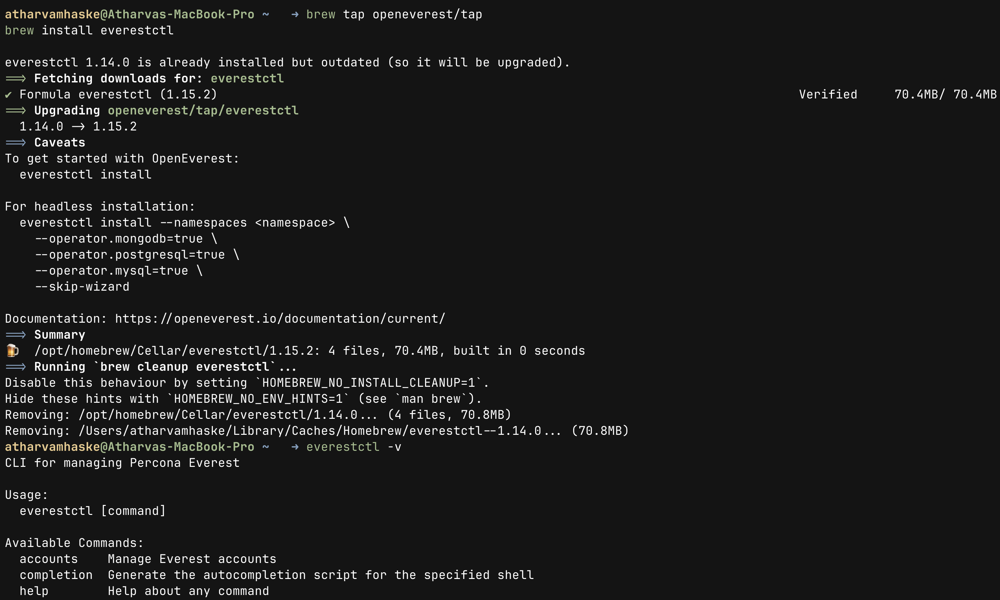

It should look like the above screenshot, but before running the commands in the **Installation** section, note that OpenEverest will search for the kubeconfig file in the `~/.kube/config` path. If your file is located elsewhere, use the export command below to set the `KUBECONFIG` environment variable

```bash
export KUBECONFIG=~/.kube/config
```

Then, when you try the command

```bash
everestctl install 
```

or the command from docs as:

```bash
everestctl install --skip-db-namespace
```

you may see both commands failing like in the image below

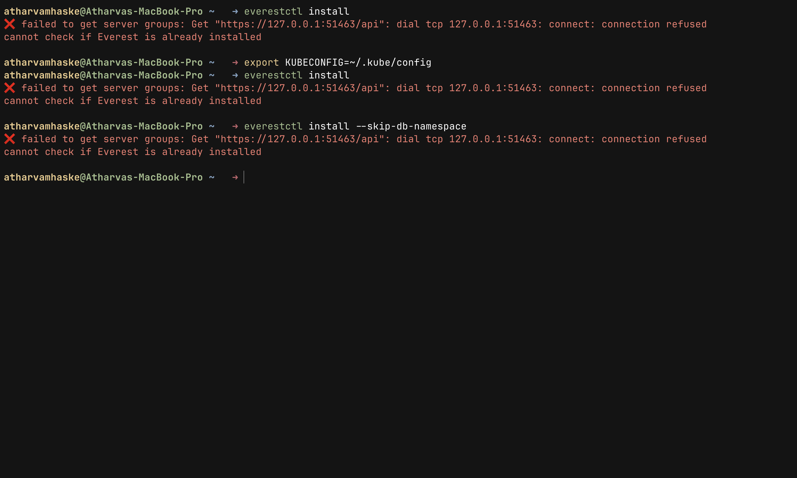

but you do not need to worry this happens because there is no active Kubernetes cluster available yet, or the current kubeconfig is pointing to an old cluster endpoint.

> Note: OpenEverest requires a running Kubernetes cluster before installation can begin.
> 
## 2. Create a New kind Cluster

As we have seen that OpenEverest needs a Kubernetes cluster. For local testing, I like using a named kind cluster so it is obvious which context I am working with:

```bash
kind create cluster --name openeverest

```

This command will create a new Kubernetes cluster named `openeverest` using docker containers as kubernetes nodes. Once the cluster is up and running tools like `kubectl` and `everestctl` can communicate with Kubernetes API server.

We can confirm that kubectl is pointing at new cluster using following commands:

```bash
kubectl config current-context
kubectl get nodes
```

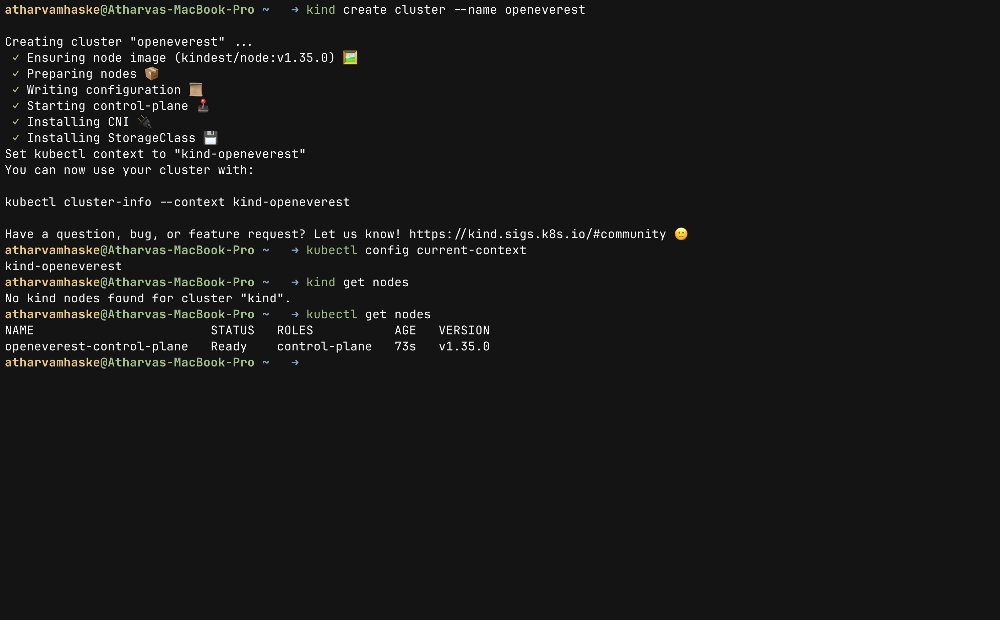

This is how your Kubernetes cluster is ready for `everestctl` to install and work. Your output should be like the image shown above. At this stage we are ready to install OpenEverest.

If your terminal still says that it failed to get server groups after the steps above, then you can diagnose it using the commands:

```bash
docker ps
kubectl describe node openeverest-control-plane
```

## 3. Install OpenEverest with `everestctl` CLI

The next step is installing OpenEverest itself. OpenEverest is deployed directly inside Kubernetes and relies heavily on Kubernetes native concepts such as operators, CRDs, namespaces, services, and controllers to manage database workloads.

In this setup, we will use the `everestctl` CLI in headless mode to avoid the interactive installation wizard and keep the installation process fully reproducible from the terminal.

```bash
everestctl install \
--namespaces everest \
--operator.mongodb=true \
--operator.postgresql=true \
--operator.mysql=true \
--skip-wizard
```

This command provisions OpenEverest along with database operators for PostgreSQL, MySQL, and MongoDB. These operators are specialized Kubernetes controllers made by OpenEverest to handle various database lifecycle operations. The step sometimes can take several minutes on a laptop because it pulls images and starts multiple controllers.

Then you can see the following thing on the terminal window, this confirms that `everestctl` is installed successfully:

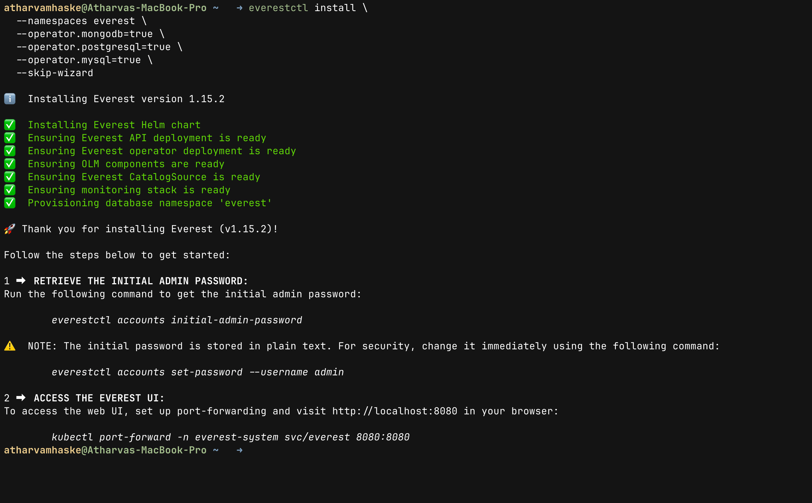

Then after getting cleaned installation you can follow steps mentioned in the guide which is shown in terminal or you can just follow along with me.

## 4. Get Initial Admin Credentials

OpenEverest automatically creates an initial admin account for accessing the platform. Since this is a fresh local setup, the generated bootstrap password can be retrieved directly using the `everestctl` CLI.

```bash
everestctl accounts initial-admin-password
```

This command prints the temporary password generated during installation, which is enough for logging into the OpenEverest UI locally for the first time. The bootstrap credentials are mainly intended for initial access and quick local testing.

For anything long-lived, update it right away. This is a must-do step when using OpenEverest in production. We can simply set custom password via CLI command:

```bash
everestctl accounts set-password --username admin

```

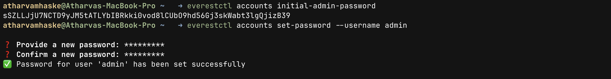

Do not publish the generated password. Blur or crop it from screenshots before sharing the post, and never share it with anyone.

## 5. Run and Open the OpenEverest UI

On kind, the cleanest access method is port-forwarding. It avoids LoadBalancer setup and keeps everything bound to localhost. Although you can check other ways in the docs. I am going with port forwarding way for this blog. Run this in a separate terminal:

```bash
kubectl port-forward svc/everest 8080:8080 -n everest-system

```

Then open the frontend web UI of OpenEverest by visiting [http://localhost:8080](http://localhost:8080)

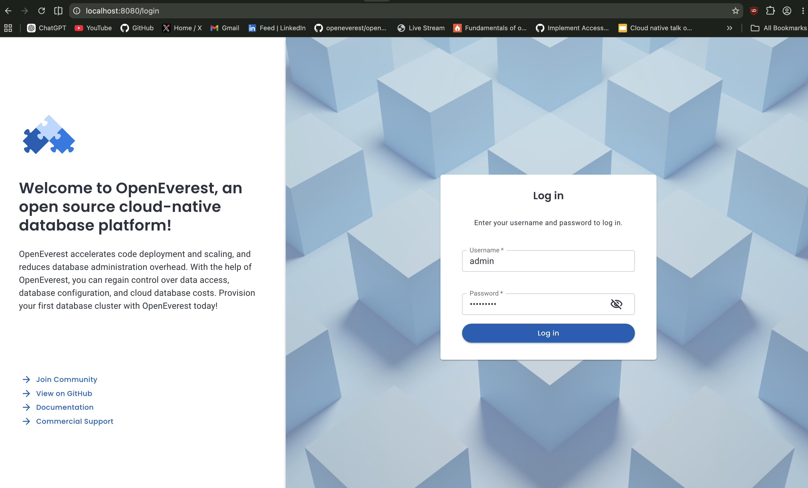

After logging in with the password you changed, or the initial password you can see something like this:

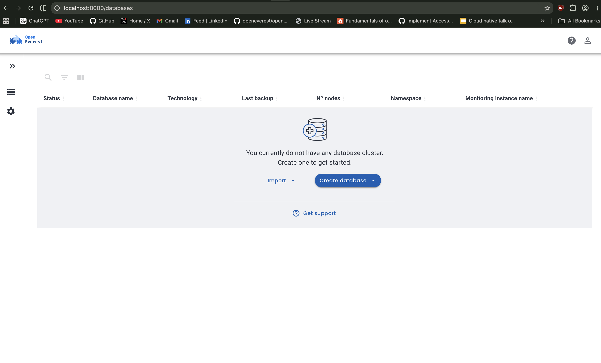

At this point, OpenEverest is running locally on a kind cluster. The interesting part is that we did not manually install each database operator or wire custom manifests together. `everestctl` handled the platform bootstrap and namespace preparation.

## 6. Create Your First Database on OpenEverest

From the UI, click Create Database and choose a small configuration that fits your laptop. For my first local run, I recommend PostgreSQL with the smallest available resource profile.

I am setting name as local-postgres, select the version you want and keep namespace as default everest.

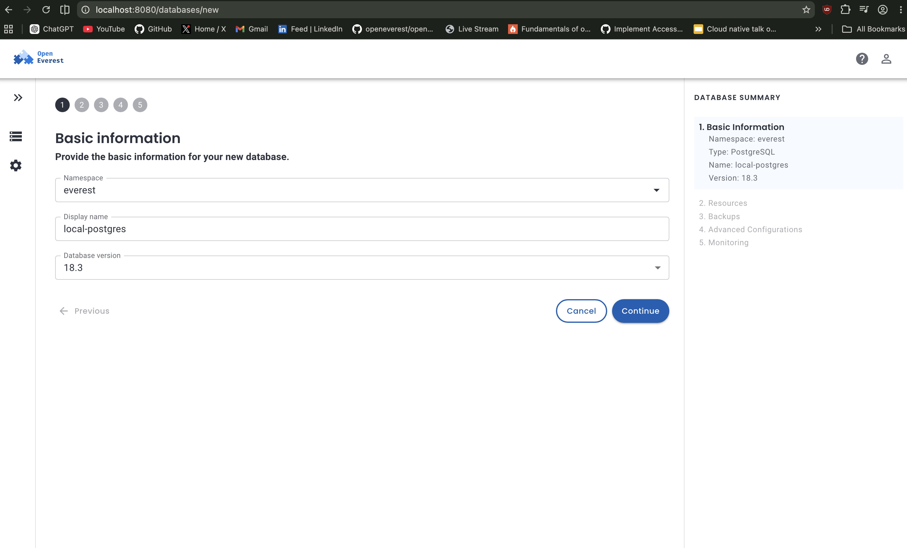

In this case, selecting a single database node with the smallest resource profile is more than enough to get PostgreSQL running smoothly on a laptop environment. Select the lowest options for both nodes and PgBouncers.

Choosing number of nodes:

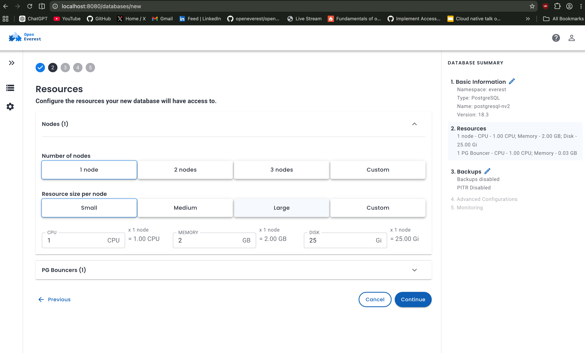

Choosing number of PG Bouncers:

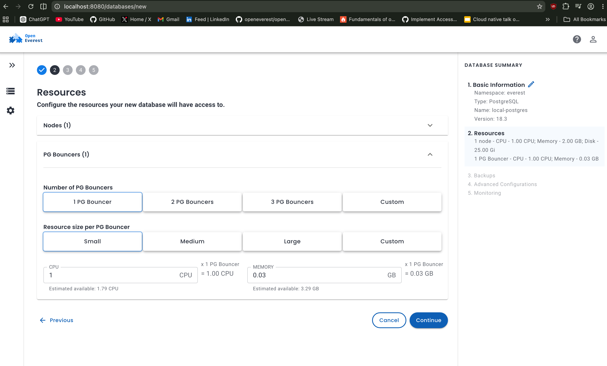

If you want scheduled backups you can configure from the UI options, currently it supports Amazon S3. Currently, I am skipping this step for local testing.

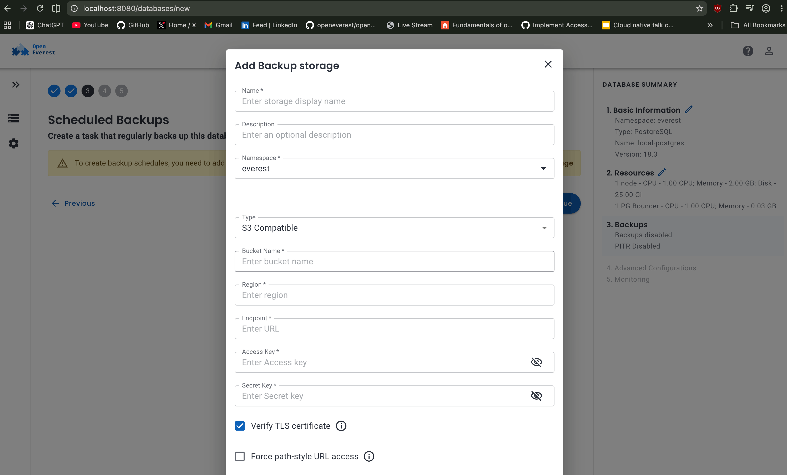

The advanced configuration section exposes a few Kubernetes-native networking and scheduling options for the database. For this local setup, I mostly kept the default values to keep the deployment lightweight and simple. Pod scheduling policy should also be kept by default.

OpenEverest supports three external access modes:

- `ClusterIP` keeps the database accessible only inside the Kubernetes cluster.
- `NodePort` exposes the database through a port on the Kubernetes node.
- `LoadBalancer` creates an external load balancer, commonly used in cloud environments.

> Since this setup was running locally on `kind`, I kept the exposure method as `ClusterIP`, which is sufficient for internal cluster access and local testing.
> 

OpenEverest also supports database monitoring integration by configuring monitoring endpoints such as PMM. For this setup, I skipped monitoring for now and continued with the default configuration. You can configure your production monitoring endpoint URL here. 

Under the hood OpenEverest integrates with Percona Monitoring and Management (PMM) to monitor your database clusters. refer to the docs here: [https://openeverest.io/documentation/1.15.2/crd/crd_monitoring.html?h=monitoring](https://openeverest.io/documentation/1.15.2/crd/crd_monitoring.html?h=monitoring)

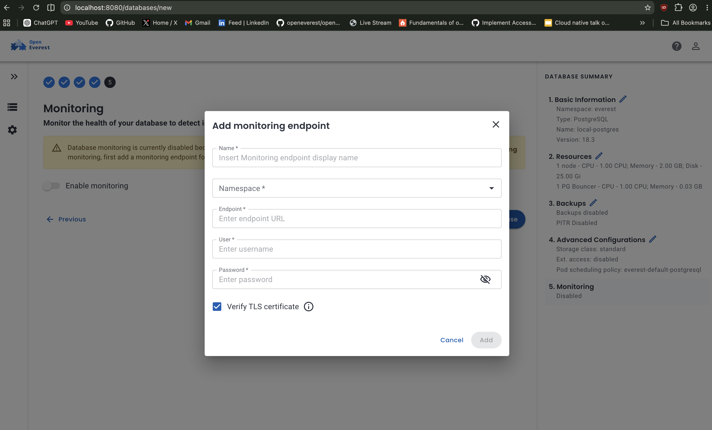

Once the database was provisioned, OpenEverest exposed a detailed component view showing the individual Kubernetes workloads backing the PostgreSQL cluster. This made it much easier to understand what was happening internally instead of treating the database as a black box.

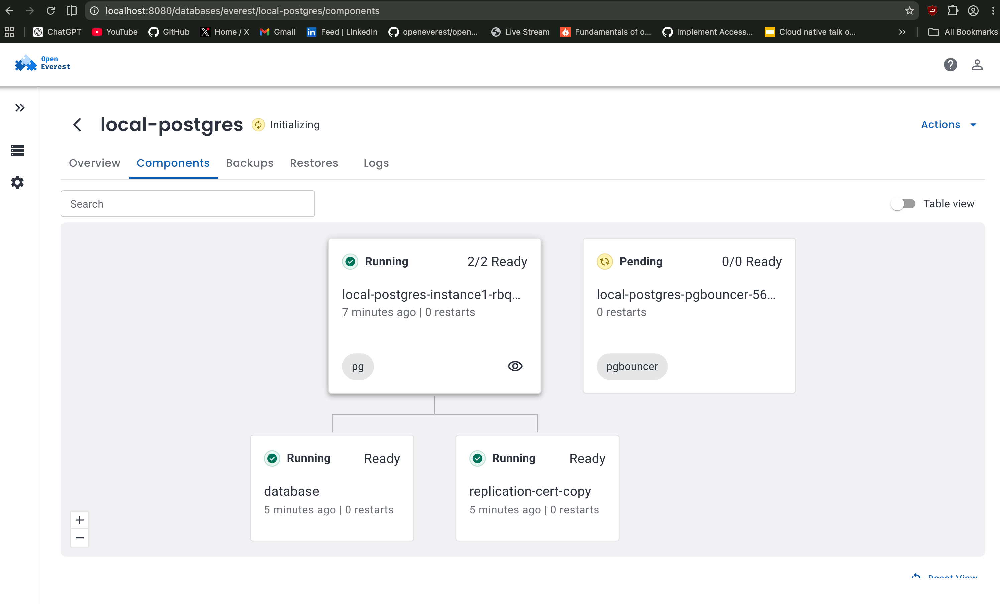

In the screenshot above, the main PostgreSQL instance is already running successfully, while the `pgbouncer` component is still stuck in the `Pending` / `Initializing` state. After debugging with `kubectl describe pod`, it turned out that PgBouncer could not be scheduled because the node lacked sufficient allocatable CPU resources.

This mainly happened because the cluster was running with limited resources in a laptop environment. In larger Kubernetes clusters with sufficient node capacity, PgBouncer would typically schedule without issues.

This overview page also provides visibility into individual components, logs, backups, restores, and overall database health, which is extremely useful when debugging operator managed workloads. You can check logs like these:

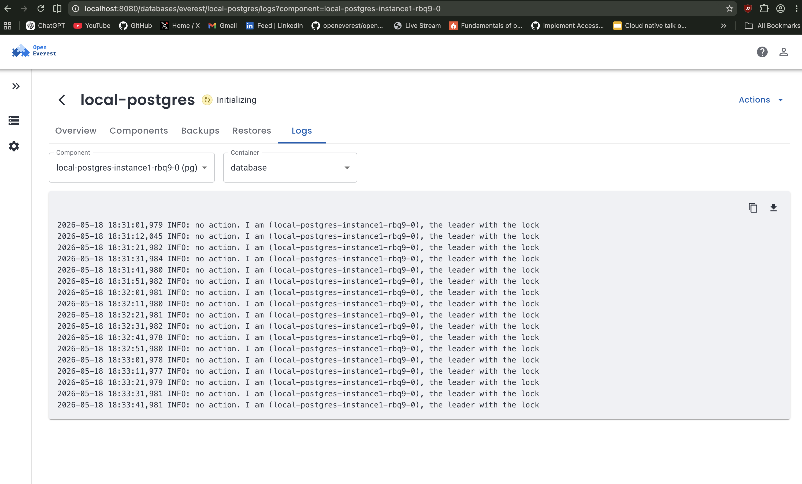

OpenEverest also provides a clean workflow for deleting database clusters directly from the UI. Before removing the database, it asks for explicit confirmation by requiring the database name to be typed manually, helping prevent accidental deletions.

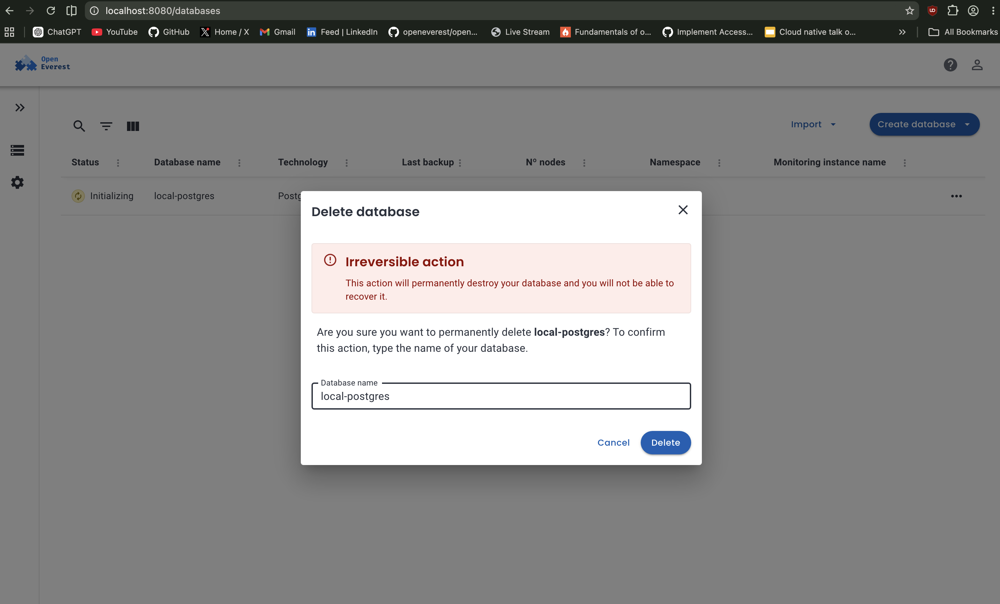

Behind the scenes, deleting the database triggers the operator managed cleanup workflow inside Kubernetes, which removes the associated database resources, pods, services, and related components created for the cluster.

## 7. Clean Up

Once you are done experimenting with the setup, OpenEverest can be removed cleanly using the same `everestctl` CLI that was used during installation.

```bash
everestctl uninstall
```

After uninstalling OpenEverest, the entire Kubernetes cluster itself can also be deleted using `kind`.

```bash
kind delete cluster --name openeverest
```

Since `kind` runs Kubernetes nodes as Docker containers, deleting the cluster removes the complete environment and frees the allocated resources from the system. If you ever want to start fresh again, simply recreate the cluster and repeat the installation workflow.

This is how you can run various databases locally using `everestctl` CLI with just few commands, without manually doing boring stuff. Hope you enjoyed this blog!
Happy shipping databases on Kubernetes with OpenEverest.

If you run into issues, discover interesting behavior, or want to contribute, feel free to join the OpenEverest Slack community and explore the project further. 

Also, do not forget to star the [OpenEverest GitHub repository](https://github.com/openeverest/openeverest) if you found the project interesting.

Join the OpenEverest community on CNCF Slack (#openeverest-users):
https://communityinviter.com/apps/cloud-native/cncf

Star on GitHub: [https://github.com/openeverest/openeverest?](https://github.com/openeverest/openeverest?utm_source=chatgpt.com)
