# Introduction

Managing database operators across multiple Kubernetes clusters can be a complex and fragmented experience. Database administrators and platform engineers often juggle various command-line tools, YAML files, and dashboards just to deploy and maintain a single database instance. This complexity multiplies when dealing with different database technologies like MySQL, MongoDB, and PostgreSQL.
Enter [OpenEverest](https://openeverest.io/documentation/1.13.0/index.html) —the first open-source platform designed to be a unified control panel for your database operators. Built on the robust foundation of Percona Operators, OpenEverest provides a streamlined, GUI-driven experience for provisioning and managing databases on any Kubernetes cluster, whether in the cloud or on-premises.
In this blog post, we'll take OpenEverest for a test drive. Using the latest version, we will demonstrate how easy it is to install the platform and deploy fully functional Percona XtraDB Cluster (PXC) and PostgreSQL clusters, all from a single, intuitive interface. We'll also explore its core features, showing how OpenEverest truly simplifies database operations.

# What is OpenEverest?

As highlighted on the official OpenEverest documentation site, it is the first open-source platform for automated database provisioning and management. Its primary goal is to eliminate vendor lock-in and the need for complex, in-house platform development. By sitting on top of your existing Kubernetes infrastructure, OpenEverest abstracts the underlying complexity of operators, giving you a "DBaaS-like" experience with the freedom and control of open-source software.

## Prerequisites

TBefore we begin, ensure you have the following:
- A running Kubernetes cluster (e.g., k3d, Amazon EKS, Google GKE).
- kubectl configured to communicate with your cluster.
- helm installed on your local machine.

## Effortless Installation

Installing OpenEverest is surprisingly simple, thanks to its Helm chart. In just a few commands, we can have the core platform up and running.

```bash
bash
# Add the Percona Helm repository
$ helm repo add percona https://percona.github.io/percona-helm-charts/
"percona" has been added to your repositories

# Update your Helm repositories
$ helm repo update

# Install Everest Core in a dedicated namespace
$ helm install everest-core percona/everest \
  --namespace everest-system \
  --create-namespace
```

Within seconds, the deployment is complete. The install notes provide the next steps: retrieving the initial admin password and accessing the web UI.

```bash
bash
# Retrieve the auto-generated admin password
$ kubectl get secret everest-accounts -n everest-system -o jsonpath='{.data.users\.yaml}' | base64 --decode | yq '.admin.passwordHash'
"rr7ud9IVW8unjrggmfwSJfGTvu6H6XnauCacfWFoDex0tmohSeaSvNrIzpWhb2fm"

# Port-forward to access the UI locally
$ kubectl port-forward svc/everest 8080:8080 -n everest-system
```

With the port forward active, navigating to http://localhost:8080 presents the OpenEverest login screen. Using the admin username and the retrieved password hash, we log in to a clean, welcoming dashboard.

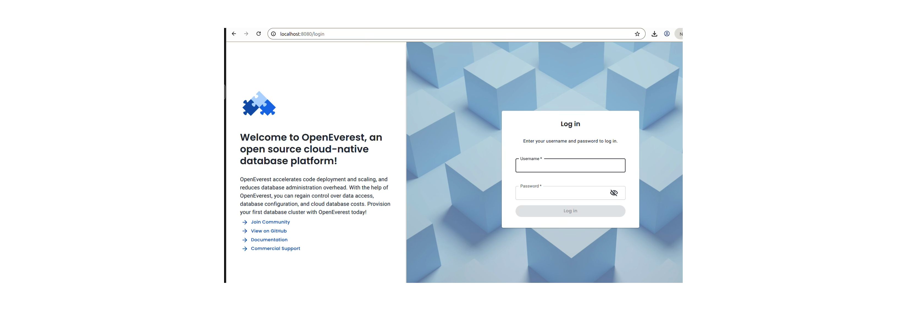

From the dashboard, we can immediately see that the platform has automatically installed the necessary Percona Operators for MySQL (PXC), MongoDB, and PostgreSQL in the background.

```bash
bash
$ kubectl get pods -n everest
NAME                                                   READY   STATUS    RESTARTS   AGE
percona-postgresql-operator-7df74487b5-hwdr2          1/1     Running   0          54m
percona-server-mongodb-operator-fbddd87c6-xj77v       1/1     Running   0          54m
percona-xtradb-cluster-operator-68d9597dc-qt696       1/1     Running   0          54m
```

This is a key benefit: OpenEverest bootstraps the entire operator ecosystem for you. You no longer need to install and manage each operator individually.

## Deploying Your First Database Cluster (Percona XtraDB Cluster)

With the platform ready, let's deploy a highly available MySQL database using the Percona Operator for MySQL based on XtraDB Cluster (PXC).

From the OpenEverest UI, we click on the "Create Database" button. The wizard guides us through the entire process:

1. Select Database Type: We choose "MySQL" (powered by PXC).

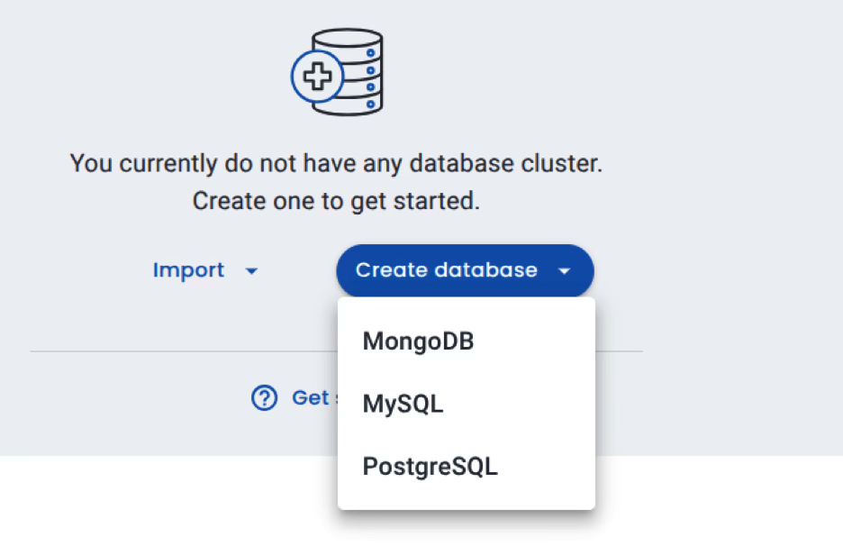

2. Configure Cluster: We give our cluster a name (e.g., mysql-nb6), select the Kubernetes namespace (everest), and define the resources (CPU, Memory) for our nodes.

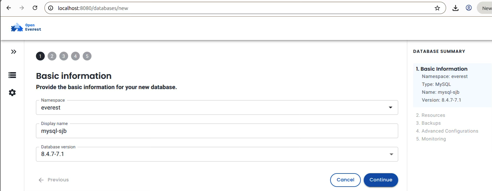

3. Define Topology: We specify we want a 3-node PXC cluster with a 3-node HAProxy setup for load balancing.

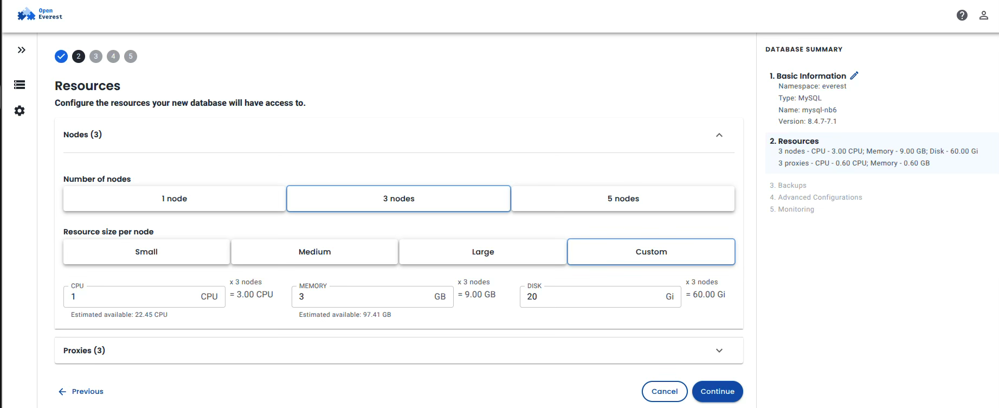

4. Storage & Backup: We configure persistent storage and set up a basic backup schedule.

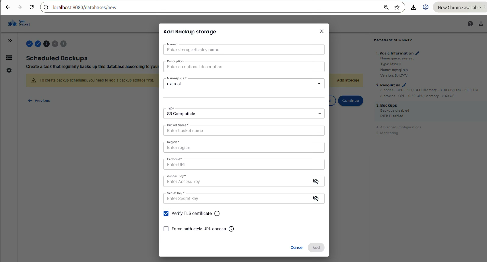

5. Advance Config

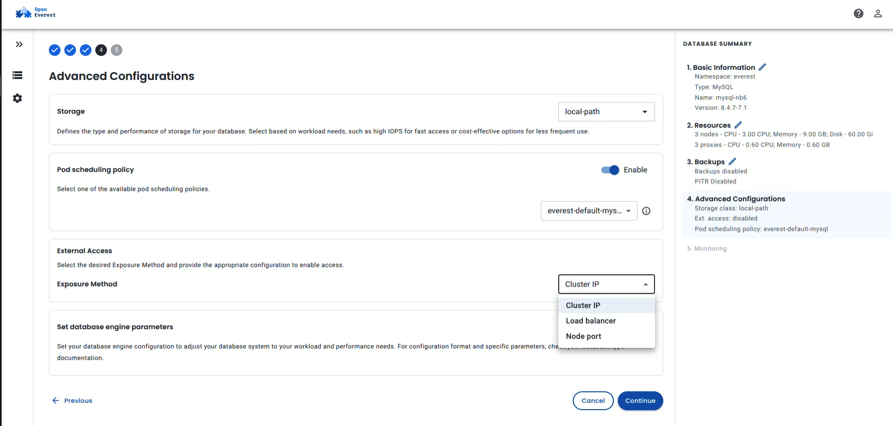

6. PMM monitoring 

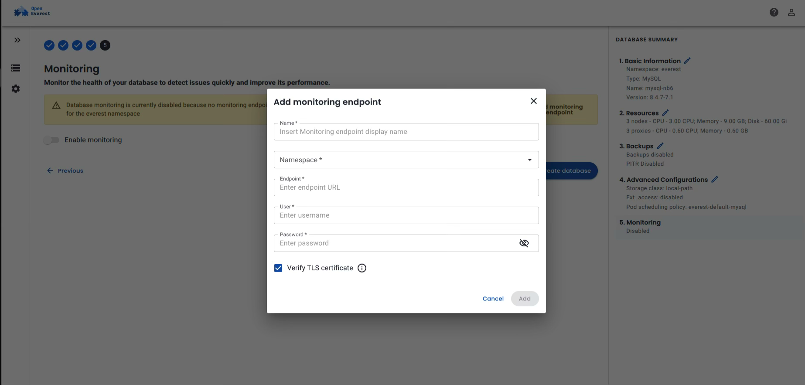

Finally, Create Cluster.

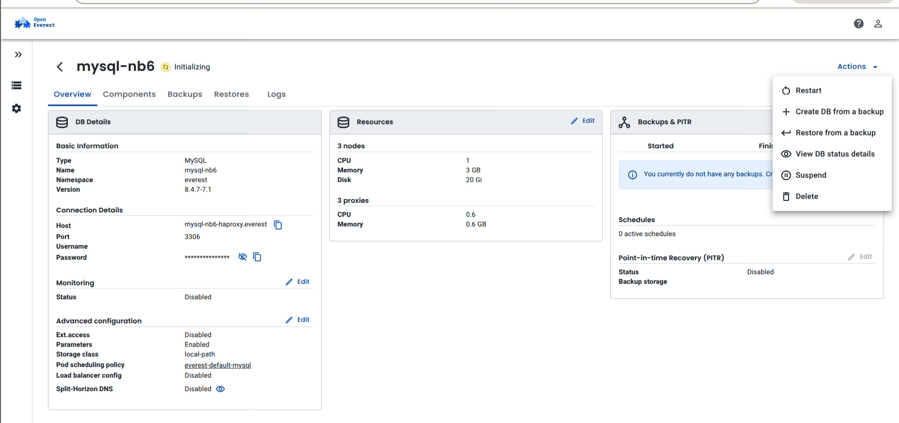

After reviewing our settings, we click "Create". Within minutes, the OpenEverest dashboard shows our new mysql-nb6 cluster as healthy and running.

```bash
bash
$ kubectl get pods -n everest | grep mysql-nb6
mysql-nb6-haproxy-0                                  2/2     Running   0          6m37s
mysql-nb6-haproxy-1                                  2/2     Running   0          5m25s
mysql-nb6-haproxy-2                                  2/2     Running   0          5m5s
mysql-nb6-pxc-0                                      1/1     Running   0          6m37s
mysql-nb6-pxc-1                                      1/1     Running   0          5m32s
mysql-nb6-pxc-2                                      1/1     Running   0          4m29s
```

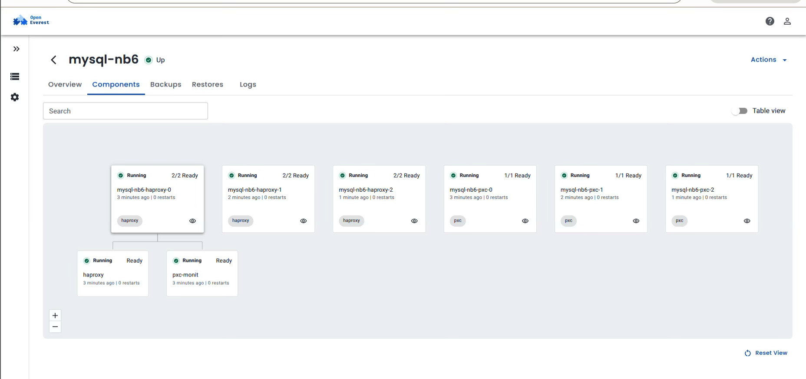

## Checking logs from OpenEverest:

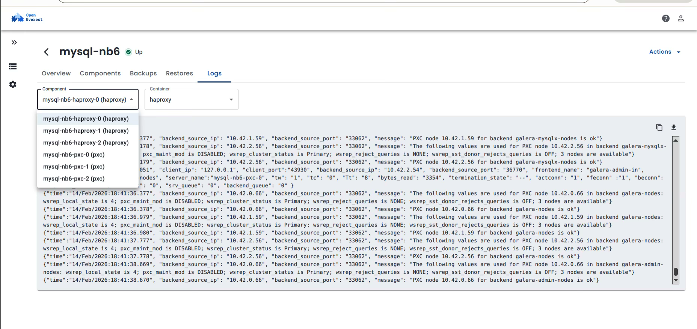

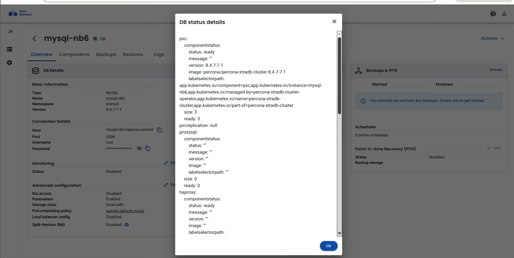

To prove the cluster is operational, we can exec into the HAProxy pod and connect to the database.

```bash
bash
$ kubectl -n everest exec -it mysql-nb6-haproxy-0 -- bash
bash-5.1$ mysql -h mysql-nb6-haproxy -u root -p
Enter password: 
Welcome to the MySQL monitor.  Commands end with ; or \g.
...
mysql> select @@hostname;
+------------------+
| @@hostname       |
+------------------+
| mysql-nb6-pxc-0  |
+------------------+
1 row in set (0.00 sec)

mysql> select user,host from mysql.user;
+----------------------------------+-----------+
| user                             | host      |
+----------------------------------+-----------+
| monitor                          | %         |
| operator                         | %         |
| replication                      | %         |
| root                             | %         |
| xtrabackup                       | %         |
| mysql.infoschema                 | localhost |
| mysql.pxc.internal.session       | localhost |
| mysql.pxc.sst.role               | localhost |
| mysql.session                    | localhost |
| mysql.sys                        | localhost |
| percona.telemetry                | localhost |
| root                             | localhost |
+----------------------------------+-----------+
12 rows in set (0.00 sec)
```
Our PXC cluster is live, accessible, and fully functional—all without writing a single line of YAML.

## Multi-Namespace Management with PostgreSQL

OpenEverest also excels at organizing resources. Let's create a dedicated namespace for our specific operator workloads and deploy a cluster there. We can do this directly from the CLI using the everestctl command-line tool.

```bash
bash
$ everestctl namespaces add everest-pg
❓ Which operators do you want to install?
  [X] MySQL
  [X] MongoDB
> [X] PostgreSQL
✅ Provisioning database namespace 'everest-pg'
```

This command does two things: it creates the everest-pg namespace and ensures all the necessary operators are configured to manage databases within it.
Now, back in the OpenEverest UI, we can create a new PostgreSQL cluster in this namespace. The process is just as simple. We select PostgreSQL, name our cluster (e.g., postgresql-a08), choose the everest-pg namespace, and define our instance size and replica count. OpenEverest handles the rest, deploying the PostgreSQL cluster along with PgBouncer for connection pooling.

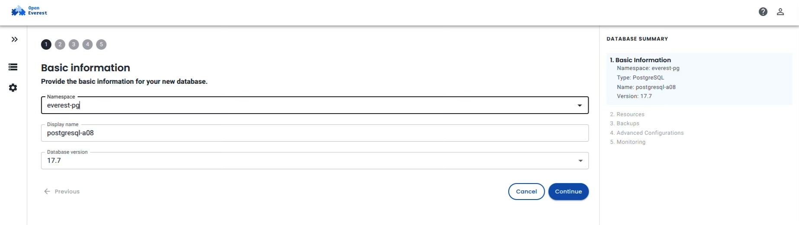

Shortly after, we have a fully operational PostgreSQL cluster.

```bash
bash
$ kubectl get pods -n everest-pg
NAME                                                   READY   STATUS    RESTARTS   AGE
percona-postgresql-operator-d9bb8d6c5-s68qp           1/1     Running   0          7m42s
percona-server-mongodb-operator-778db44cd-7864h       1/1     Running   0          7m50s
percona-xtradb-cluster-operator-54c9d674d7-ksjfc      1/1     Running   0          7m47s
postgresql-a08-instance1-2ldl-0                       2/2     Running   0          2m35s
postgresql-a08-instance1-xl48-0                       2/2     Running   0          2m35s
postgresql-a08-pgbouncer-67c86c4c44-7vmzk             2/2     Running   0          2m35s
postgresql-a08-pgbouncer-67c86c4c44-8kfkr             2/2     Running   0          2m35s

$ kubectl get svc -n everest-pg
NAME                                   TYPE        CLUSTER-IP      EXTERNAL-IP   PORT(S)    AGE
postgresql-a08-ha                      ClusterIP   10.43.144.104   <none>        5432/TCP   2m40s
postgresql-a08-pgbouncer                ClusterIP   10.43.38.17     <none>        5432/TCP   2m40s
postgresql-a08-primary                  ClusterIP   None            <none>        5432/TCP   2m40s
postgresql-a08-replicas                 ClusterIP   10.43.230.226   <none>        5432/TCP   2m40s
```
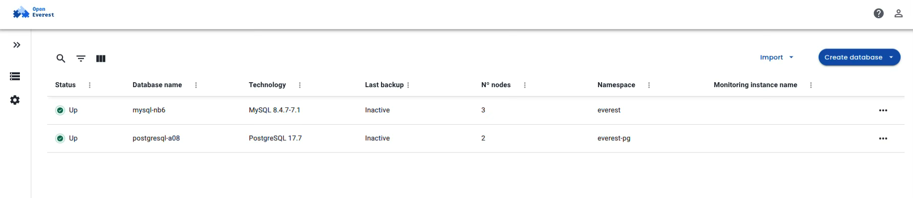

We can quickly verify access by spinning up a temporary client pod.

```bash
bash
$ kubectl run psql-client -it --rm --image=postgres:17 --restart=Never -n everest-pg -- /bin/bash
root@psql-client:/# psql -h postgresql-a08-pgbouncer -U postgres -d postgres
Password for user postgres: 
psql (17.8, server 17.7 - Percona Server for PostgreSQL)
SSL connection (protocol: TLSv1.3, cipher: TLS_AES_256_GCM_SHA384, compression: off)
Type "help" for help.

postgres=# \l
                                          List of databases
   Name    |  Owner   | Encoding | Locale Provider |  Collate   |   Ctype    | Locale | ICU Rules | Access privileges 
-----------+----------+----------+-----------------+------------+------------+--------+-----------+-------------------
 postgres  | postgres | UTF8     | libc            | en_US.utf-8 | en_US.utf-8 |        |           | =Tc/postgres      +
           |          |          |                 |            |            |        |           | postgres=CTc/postgres
 template0 | postgres | UTF8     | libc            | en_US.utf-8 | en_US.utf-8 |        |           | =c/postgres        +
           |          |          |                 |            |            |        |           | postgres=CTc/postgres
 template1 | postgres | UTF8     | libc            | en_US.utf-8 | en_US.utf-8 |        |           | =c/postgres        +
           |          |          |                 |            |            |        |           | postgres=CTc/postgres
(3 rows)
```

# Beyond Deployment

The true power of OpenEverest shines in its operational capabilities. The intuitive GUI simplifies tasks that would otherwise require deep Kubernetes knowledge:
- Backup & Restore: Easily configure scheduled backups to storage destinations (like S3-compatible storage) and restores with just a few clicks.
- Monitoring & Alerts: Each database cluster comes with integrated monitoring. The UI provides built-in dashboards for key metrics like CPU/Memory usage, query performance, and connection pool status.
- Log Streaming: No more kubectl logs gymnastics. You can view and filter live logs for any database pod/container directly within the OpenEverest web interface, making troubleshooting instantaneous.
- Operator Operation :  View status of a cluster, Stop start cluster , Backup and Restore , Delete a cluster.database

# Conclusion

OpenEverest delivers on its promise to simplify database operator management on Kubernetes. As we've demonstrated, it transforms complex, command-line driven tasks into a streamlined, visual experience.
From the initial easy installation, to the one-click deployment of a complex PXC cluster, and finally to the organized provisioning of a PostgreSQL cluster in a dedicated namespace, OpenEverest proves that you don't need to be a Kubernetes expert to run production-grade, open-source databases.
By providing a unified roof for all your Percona Operators, complete with robust backup, monitoring, and log viewing capabilities, OpenEverest empowers teams to focus on what matters most: their data and their applications.
Ready to take control of your database operators? Visit the [OpenEverest documentation](https://openeverest.io/documentation/1.13.0/index.html) to get started today.