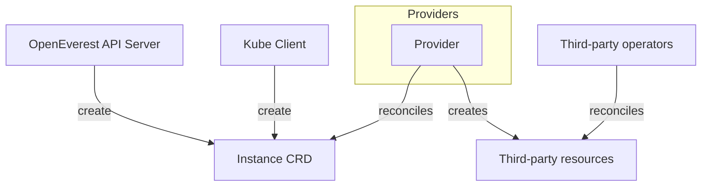
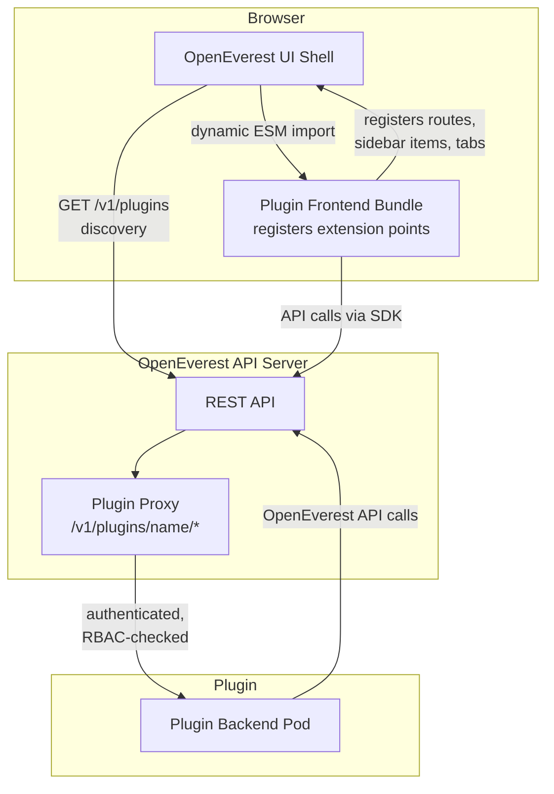
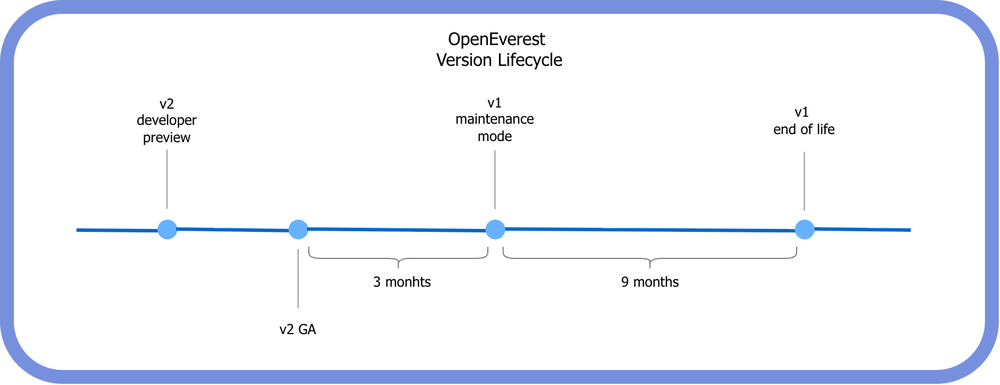

Since the rebranding of OpenEverest (formerly Percona Everest), our north star has been a transition from a monolithic architecture to a truly modular one. We first shared this roadmap in our [evolution blog post](/blog/from-monolith-to-modular/) and our [vision statement](https://vision.openeverest.io).

Today, we are announcing a major milestone in that journey: **OpenEverest v2 Developer Preview**.

Our goal is to make OpenEverest vendor-agnostic and infinitely flexible. By moving to a modular architecture, developers can integrate new database technologies in days rather than months — all without compromising the robustness of the underlying operators.

> **⚠️ Important Note:** OpenEverest v2 Developer Preview is an early-look release and is **not feature-complete**. It is intended for testing and feedback only. It is not for production, and we expect to introduce breaking changes, including API updates, as we move toward General Availability.

Here is the video that describes the release and talks about the most important changes in version 2.

HERE WILL BE THE VIDEO

## v2 Highlights and Architectural Changes

### Modular Core: Providers

The shift to modularity is the soul of v2. We have introduced a custom [Provider SDK](https://github.com/openeverest/provider-sdk) that allows you to craft your own database plugins. This decouples the database logic from the OpenEverest core, ensuring the platform remains lightweight and extensible.

To prove the power of this new SDK, we chose to launch this release with a single plugin: the MongoDB Provider.

We intentionally selected MongoDB as our first provider because it is one of the most complex operators, featuring numerous "moving parts" and intricate components. By successfully modularizing MongoDB first, we have ensured that the OpenEverest core is robust enough to handle any database technology.

The high-level flow of the new architecture is as follows:



The benefits of this decoupling include:

- **Independent Release Cycles:** Updating a database plugin no longer requires a full release of the OpenEverest server or operator.
- **Rapid Feature Parity:** When an underlying operator (like CloudNativePG) adds a new feature, it can be exposed in OpenEverest with minimal changes to the plugin. Previously, this would have required manual updates across the API, UI, CLI, and core logic.

#### How to Create a Provider Plugin

Ready to bring a new technology to OpenEverest? The basic steps to build and integrate a new plugin are:

1. Scaffold your provider using the Go-based [Provider SDK](https://github.com/openeverest/provider-sdk).
2. Add components and topologies definitions to the provider. Components are the features of the provider such as engine, proxy, and backup agent. A topology groups a set of components.
3. Implement your operator logic in the provider.
4. Write a UI schema which generates the OpenEverest UI for creating and editing an Instance.
5. Run your provider locally for a quick check or install using the Helm instructions within the scaffold.

### Modular Core: Generic Plugins

Generic Plugins is another v2 feature that enables even more modularity and unlocks additional use cases. Users and contributors can create plugins that extend existing features of the OpenEverest UI and functionality. Some possible examples:

- A **SQL query browser** (DBeaver-like experience) directly in the OpenEverest UI.
- An **AI data copilot** that can introspect schemas, suggest queries, and answer questions about your data.
- An **AWS RDS discovery** plugin that imports visibility of databases managed outside the cluster.
- A **data migration tool** to move data between clusters — potentially across providers, versions, or cloud regions.
- A **compliance/audit plugin** that enforces tagging policies and scans for exposed credentials.


If in Linux everything is a file, then in OpenEverest anything can be a plugin. Even some core features can be rewritten and added as plugins.

In its simplest form, a plugin consists of two parts — backend and frontend. The backend is a Pod that exposes an API embedded into the OpenEverest API endpoints. The frontend is an extension of the OpenEverest UI that represents the results of the plugin's activities.



You can install plugins with Helm charts and they will immediately appear in the UI.

#### How to Create a Generic Plugin

We created the [generic-plugin-template](https://github.com/openeverest/generic-plugin-template) repository that has a basic working plugin, plus the skeleton and GitHub workflows to create plugin releases and Helm charts.

Additional instructions can be found in that repository. Generic Plugins' spec can be found in our [spec repository](https://github.com/openeverest/specs/blob/main/specs/003-generic-plugins.md).

### Streamlined User Experience

We believe you shouldn't need to be a DBA to deploy a database. We have overhauled the deployment flow to cater to both power users and those who just want to get up and running:

- **1-Click Rollouts:** Deploy a database instantly using sensible defaults.
- **Granular Control:** For those who need it, every configuration setting remains accessible and tweakable.

The UI is no longer hardcoded per database. Each provider ships a schema that auto-generates the creation/edit forms. A single provider can offer multiple deployment architectures natively (e.g., MongoDB's replica set vs. sharded cluster). Users pick a topology, and the provider handles the complexity.

Install, upgrade, or rollback a provider with standard Helm workflows.

## Installing v2

OpenEverest v2 is installed via Helm. You will need a running Kubernetes cluster and `helm` installed.

```bash
helm repo add openeverest https://openeverest.github.io/helm-charts/
helm repo update
helm install everest-core openeverest/openeverest \
  --devel \
  --version "2.0.0-dev.1" \
  --namespace everest-system \
  --create-namespace

```

Once the core is up, install the MongoDB provider:

```bash
helm repo add provider-percona-server-mongodb https://openeverest.github.io/provider-percona-server-mongodb/
helm repo update
helm install provider-percona-server-mongodb provider-percona-server-mongodb/provider-percona-server-mongodb \
  --namespace everest-system
```

> **⚠️ No upgrade path from v1:** There is currently no supported migration or upgrade path from OpenEverest v1 to v2. The two versions have fundamentally different architectures and data models. Running v1 and v2 side by side in the same cluster is not supported. An upgrade path will be introduced before or shortly after v2 reaches General Availability.

## Timeline

While v2 is currently in the Developer Preview stage, we want to provide transparency regarding the future of v1. We recognize that v1 is currently powering production environments, so we will not be sunsetting it immediately.



Our phased transition timeline is as follows:

| Stage | Description |
|-------|-------------|
| **Current** | OpenEverest v2 Developer Preview release (testing & feedback). |
| **v2 General Availability (GA)** | Expected in a few months. |
| **GA + 3 Months** | v1 enters Maintenance Mode. No new features will be added; support will be limited to security patches and critical bug fixes. |
| **GA + 12 Months** | v1 reaches End of Life (EOL). No more releases will happen for v1. |

## Get Involved

We invite you to take the v2 Developer Preview for a spin, test the MongoDB provider, and share your feedback. Your input is vital as we build the next generation of open-source database orchestration.
